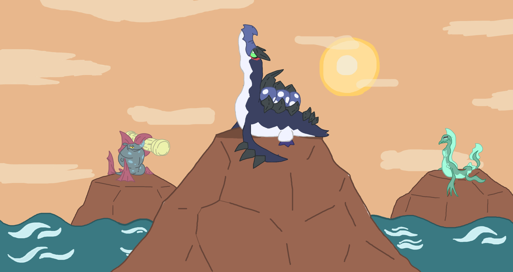

    
    
<em>Illustrazione di Ciatongo</em>

 
 

# Abilità indedite della regione di Itia
Le abilità inedite di Pokémon Requiem introducono **nuove meccaniche** e **strategie** per arricchire le lotte e dare maggiore personalità ai Pokémon della regione di Itia.  
Dalle abilità difensive a quelle offensive, ogni nuova capacità è stata pensata per offrire **opzioni uniche in battaglia**.  
Le abilità qui elencate potrebbero **subire variazioni e aggiustamenti**, poiché il gioco è in costante sviluppo e miglioramento.  

| New Abilities | Effect |
                    | :--: | :-- |
                    | Capobranco | Quando il Pokémon viene sostituito recupera un'ottavo di vita e i suoi problemi di stato vengono curati. Il Pokémon che entra in battaglia al suo posto viene anch'esso curato dai problemi di stato. |
| Teatralità | Quando entra in battaglia sceglie una delle sue due maschere: se sceglie la maschera da Commedia la sua statistica più alta viene aumentata di uno stadio, se sceglie quella della Tragedia la statistica più alta dell'avversario viene diminuita. |
| Inventiva | Se il Pokémon viene colpito da una mossa fisica questo si carica e il suo attacco speciale viene aumentato. Ha un solo utilizzo che viene recuperato lasciando il campo di battaglia. |
| Candipiuma | Se il Pokémon viene colpito da mosse di tipo ACQUA o FUOCO, il manto di neve che ricopre il suo corpo si scioglie e il Pokémon cambia forma. Sotto la neve riesce a recuperare il suo manto. |
| Cambiogelo | Il Pokémon cambia forma tra il giorno e la notte. |
| Agomantello | Se il Pokémon è colpito da un attacco diretto, grazie al suo particolare pelo spinoso infligge danni a sua volta. |
| Furia Del Tempio | Quando la salute del Pokémon è bassa, questo ottiene un aumento della sua statistica di ATTACCO SPECIALE e le sue mosse FUOCO o ACCIAIO possono spaventare. |
| Dazio Dell'aldilà | Quando il Pokémon causa un KO, l'avversario paga un dazio e il Pokémon guarisce del 25% dei suoi PS massimi. Se la mossa che causa il KO è di tipo Spettro o Acqua, guarisce invece il 50%. |
| Stella Alpina | Se grandina in Pokémon ha la velocità aumentata e le mosse di tipo erba sono potenziate. |
| Malizia | Gli attacchi del Pokémon possono infatuare. |
| Ebrezza | Gli attacchi del Pokémon possono confondere. |
| Ozbell | Se il Pokémon si sente minacciato, chiama in combattimento un suo GROSSO amico. |
| Protettore | Aumenta la durata di Schermoluce e Riflesso di un turno e riduce il danno ricevuto da mosse superefficaci. |
| Canguardia | Le sue statistiche non diminuiscono, se colpito da mosse superefficaci aumenta ATTACCO e DIFESA. |
| Simbolismo | Quando il Pokémon o l'alleato utilizzano mosse di tipo Psico o Terra, vengono tracciati dei "simboli nel terreno". Dopo la creazione di 5 simboli, tutti gli alleati in campo vanno a +3 in tutte le statistiche. Il numero di simboli si resetta. |
| Controllo | Gli attacchi infliggono più danni al bersaglio se questo ha subito una riduzione alle statistiche questo turno o lo scorso. |
| Simbiosi Tossica | Ogni volta che il Pokémon subisce un attacco, rigenera il 10% dei suoi PS massimi se l'avversario è avvelenato o sta subendo danni da una condizione di stato. Inoltre, le mosse di tipo VELENO guadagnano il 20% di potenza se il Pokémon è sotto il 50% dei PS. |
| Atrocità | Quando il Pokémon entra in campo, vengono resettate tutte le modifiche alle statistiche. Nessun Pokémon può aumentare le proprie statistiche. |
| Dualità | Questo Pokémon colpisce 2 volte per turno. Con ogni attacco il primo colpo ha il 30% del potere ma ha le probabilità che gli effetti secondari si attivino è aumentata del 50%, invece il secondo colpo ha il 60% del potere originale, non fa mai attivare gli effetti secondari e ha la probabilità dei crit aumentata. Non può usare mosse di stato. |
| Rombo Litico | Le sue mosse basate sul suono diventano di tipo ROCCIA, utilizzarle aumenta l'ATTACCO del Pokémon. |
| Melodia Ancestrale | Le sue mosse basate sul suono diventano di tipo FOLLETTO, utilizzarle aumenta l'ATTACCO SPECIALE del Pokémon. |
| Crioquiete | E' immune alle mosse sonore, che gli permettono di recuperare salute. |
| Recupero | A fine turno recupera un po' di salute. |
| Velenaccumulo | Aumenta le difese durante la Pioggia Acida. |
| Nottambulo | Aumenta l'ELUSIONE durante la Brezza Tetra. |
| Corrente Alterna | Aumenta la VELOCITA' durante il Campo Magnetico. |
| Acque Reflue | Quando entra in campo piove acido. |
| Atmosfera Sinistra | Quando entra in campo si percepisce una brezza tetra. |
| Elettromagnetismo | Quando entra in campo si percepisce uno strano campo magnetico. |
| Perdente | Quando al Pokémon rimangono pochi PS, la potenza delle sue mosse di tipo LOTTA aumenta. |
| Pilota | Quando al Pokémon rimangono pochi PS, la potenza delle sue mosse di tipo VOLANTE aumenta. |
| Calcificazione | Quando al Pokémon rimangono pochi PS, la potenza delle sue mosse di tipo ROCCIA aumenta. |
| Militalizzarsi | Le mosse di tipo NORMALE diventano di tipo LOTTA e la loro potenza aumenta un po'. |
| Pellecielo | Le mosse di tipo NORMALE diventano di tipo VOLANTE e la loro potenza aumenta un po'. |
| Cristallizazione | Le mosse di tipo NORMALE diventano di tipo ROCCIA e la loro potenza aumenta un po'. |
| Pellerba | Le mosse di tipo NORMALE diventano di tipo ERBA e la loro potenza aumenta un po'. |
| Spettralità | Potenzia le mosse di tipo SPETTRO. |
| Mezzanotte | Il Pokémon è immune alle mosse di tipo FOLLETTO. |
| Schema Mentale | Aumenta l'ATTACCO SPECIALE ma costringe il Pokémon a usare solo la prima mossa selezionata. |
| Fastidio | Quando il Pokémon entra in campo, riduce l'ATTACCO SPECIALE dei nemici infastiditi. |

