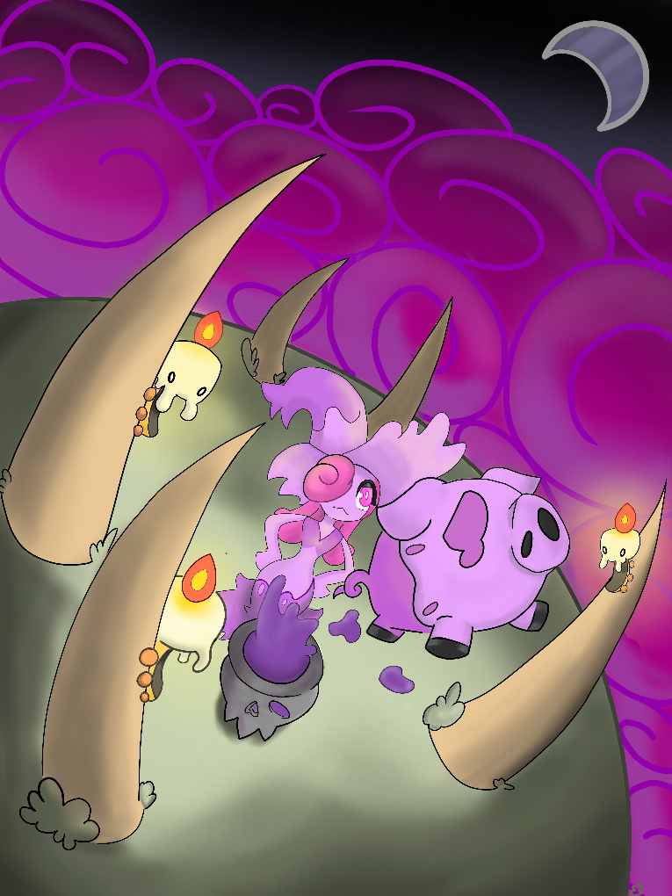

# Contatti

Hai idee, suggerimenti o vuoi dare una mano nello sviluppo di **Pokémon Requiem**? Sei nel posto giusto!  

Siamo sempre alla ricerca di **appassionati e creativi** pronti a contribuire alla realizzazione di Itia.  
Che tu voglia proporre **nuove idee per Pokémon, abilità, mosse o meccaniche**, oppure semplicemente **segnalare problemi o errori**, il tuo contributo è prezioso per rendere questa avventura ancora più unica e coinvolgente.  

Se hai qualcosa da dirci, non esitare a scriverci!  
**Ogni feedback è importante per migliorare il gioco e far crescere insieme il progetto.**  

## 📩 Contattaci  
Puoi inviarci un’email per:  
✅ **Proporre idee e suggerimenti**  
✅ **Segnalare errori e problemi**  
✅ **Contribuire alla crescita di Itia**  

✉️ **Email:** [avventureaditia@gmail.com](mailto:avventureaditia@gmail.com)   

Ti risponderemo il prima possibile! Grazie per il tuo supporto e per aiutarci a costruire la regione di Itia! 💙

  
  
<em>Illustrazione di Gabry-taz</em>

