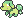
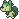

  <strong>001 - Timolino</strong> 
  
  <a href="https://avventureaditia.github.io/itia-wiki/pokemon/002-thymad/">002 - Thymad
    
  </a>
  ➡️

## Pokédex

=== "Classificazione"
    ### Classificazione
    

      
      

        

          
Class

          

            
Cucciolo

          

        

        

          
Types

          

            
          

        

        

          
Ability

          

            <a href='' title="When this Pokemon has 1/3 or less of its HP remaining, its grass-type moves inflict 1.5x as much regular damage.">Overgrow</a>
          

        

        

          
Hidden Ability

          

            <a href='' title="Quando il Pokémon viene sostituito recupera un'ottavo di vita e i suoi problemi di stato vengono curati. Il Pokémon che entra in battaglia al suo posto viene anch'esso curato dai problemi di stato.">Capobranco</a>
          

        

      

    

=== "Allevamento"
    ### Allevamento
    

      
      

        

          

            

            
87.5% ♂ / 12.5% ♀

          

        

        

          
Shape

          

            
          

        

      

    

## Generali

=== "Descrizione Pokedex"
    ### Descrizione

    Sono Pokémon molto diffidenti nei confronti degli altri umani e pokémon.  
    Si affidano principalmente all'aiuto degli esemplari adulti che sono soliti donare ai propri cuccioli un po del loro pelo per adornare le quattro zampe.  
    Il pelo degli adulti aiuta i piccoli ad ottenere coraggio e a crescere come forti e vigorosi guerrieri.  

    Per maggiori informazioni il [video completo](https://www.youtube.com/watch?v=tR_uukAGO7I&t=464s).

=== "Ispirazioni"

    ### Ispirazioni
    Le ispirazioni alla base di Timolino e della sua catena evolutiva sono:
    
    - **Lupo siciliano**: una specie endemica propria dell'isola, dichiarata estinta nel 1920. La figura del lupo ha portato gli abitanti dell'isola a creare delle superstizioni, come quella di indossare la testa di un lupo per ottenere coraggio o far indossare scarpe con peli di lupo ai bambini, per farli crescere come forti guerrieri.
    - **Timo**: Pianta presente in varie parti del mondo, tra cui l'Italia. Gli antichi romani erano soliti preparare intrugli con questa pianta e dell'acqua per accrescere il proprio vigore e la propria forza.
    - **Lupunari**: Credenza siciliana, simile a quella dei lupi mannari, dove vi erano persone affette da disturbi della psiche, che credevano di essere delle bestie.
    - **Leggenda del Monachello**: Creatura leggendaria del folklore del Sud-Italia. Si tratta di uno spirito di natura benevola e dispettosa, solitamente rappresentato come un ragazzino deforme.

    Al fine di creare un filo comune per i tre leggendari si è scelto di rappresentare tre discipline artistiche.  
    Per lo starter d'erba si è optato per la letteratura, con dei riferimenti a **Dante Alighieri**.  
    Con un richiamo a una delle tre fiere incontrate nel primo canto dell'Inferno, con il tipo **Buio** che richiama la Selva Oscura e con la corona d'alloro che adorna il capo dell'ultimo stadio evolutivo.  
    Il lupo siciliano come animale di partenza è stato scelto per creare un collegamento con gli starter dei giochi originali, che si basano su animali estinti.

=== "Vincitore del contest"
    ### Vincitore

    Il Vincitore di Itia che ha dato origine a Timolino è **Alvise**.

## Base Stats
<table style="width: 100%">
  <tbody style="width: 100%;">
    <tr style="display: flex; align-items: center;">
      <th style="color: #737373;" >HP</th>
      <td style="border-top: none; width: 70px">45</td>
      <td style="width: 100%; min-width: 450px; border-top: none;">
        

        

      </td>
    </tr>
    <tr style="display: flex; align-items: center;">
      <th style="color: #737373;">Attack</th>
      <td style="border-top: none; width: 70px">55</td>
      <td style="width: 100%; min-width: 450px; border-top: none;">
        

        

      </td>
    </tr>
    <tr style="display: flex; align-items: center;">
      <th style="color: #737373;">Defense</th>
      <td style="border-top: none; width: 70px">45</td>
      <td style="width: 100%; min-width: 450px; border-top: none;">
        

        

      </td>
    </tr>
    <tr style="display: flex; align-items: center;">
      <th style="color: #737373;">SP Attack</th>
      <td style="border-top: none; width: 70px">55</td>
      <td style="width: 100%; min-width: 450px; border-top: none;">
        

        

      </td>
    </tr>
    <tr style="display: flex; align-items: center;">
      <th style="color: #737373;">SP Defense</th>
      <td style="border-top: none; width: 70px">45</td>
      <td style="width: 100%; min-width: 450px; border-top: none;">
        

        

      </td>
    </tr>
    <tr style="display: flex; align-items: center;">
      <th style="color: #737373;">Speed</th>
      <td style="border-top: none; width: 70px">63</td>
      <td style="width: 100%; min-width: 450px; border-top: none;">
        

        

      </td>
    </tr>
  </tbody>
</table>

##Evolution Change
| Method | Item/Level/Note | Evolved Pokemon |
        | :--: | :--: | :--: |
        | Level Up | 16 | [Thymad](https://avventureaditia.github.io/itia-wiki/pokemon/002-thymad/) |
        

## Moveset

=== "Level Up Moves"
    | Level | Name | Power | Accuracy | PP | Type | Damage Class |
        | -- | -- | -- | -- | -- | -- | -- |
        	| 1 | Tackle | 40 | 100 | 35 |  |  |
	| 1 | Growl | - | 100 | 40 |  |  |
	| 3 | Fairy-lock | - | - | 10 |  |  |
	| 4 | Secret-power | 70 | 100 | 20 |  |  |
	| 5 | Vine-whip | 45 | 100 | 25 |  |  |
	| 9 | Leech-seed | - | 90 | 10 |  |  |
	| 14 | Sleep-powder | - | 75 | 15 |  |  |
	| 14 | Poison-powder | - | 75 | 35 |  |  |
	| 18 | Take-down | 90 | 85 | 20 |  |  |
	| 21 | Sweet-scent | - | 100 | 20 |  |  |
	| 23 | Razor-leaf | 55 | 95 | 25 |  |  |
	| 27 | Growth | - | - | 20 |  |  |
	| 31 | Worry-seed | - | 100 | 10 |  |  |
	| 32 | Double-edge | 120 | 100 | 15 |  |  |
	| 33 | Synthesis | - | - | 5 |  |  |
	| 37 | Seed-bomb | 80 | 100 | 15 |  |  |

        

=== "Machine Moves"
    | Machine | Name | Power | Accuracy | PP | Type | Damage Class |
        | -- | -- | -- | -- | -- | -- | -- |
        	| TM27 | Toxic | - | 90 | 10 |  |  |
	| TM100 | Confide | - | - | 20 |  |  |
	| TM27 | Return | - | 100 | 20 |  |  |
	| TM87 | Swagger | - | 85 | 15 |  |  |
	| TM09 | Venoshock | 65 | 100 | 10 |  |  |
	| TM05 | Rest | - | - | 5 |  |  |
	| TM36 | Sludge-bomb | 90 | 100 | 10 |  |  |
	| TM01 | Headbutt | 70 | 100 | 15 |  |  |
	| TM88 | Sleep-talk | - | - | 10 |  |  |
	| TM32 | Double-team | - | - | 15 |  |  |
	| TM86 | Grass-knot | - | 100 | 20 |  |  |
	| TM10 | Hidden-power | 60 | 100 | 15 |  |  |
	| TM21 | Frustration | - | 100 | 20 |  |  |
	| TM53 | Energy-ball | 90 | 100 | 10 |  |  |
	| TM45 | Attract | - | 100 | 15 |  |  |
	| TM45 | Solar-beam | 120 | 100 | 10 |  |  |
	| TM11 | Sunny-day | - | - | 5 |  |  |
	| TM08 | Substitute | - | - | 10 |  |  |
	| TM16 | Light-screen | - | - | 30 |  |  |
	| TM39 | Outrage | 120 | 100 | 10 |  |  |
	| TM20 | Safeguard | - | - | 25 |  |  |
	| TM07 | Protect | - | - | 10 |  |  |
	| TM12 | Facade | 70 | 100 | 20 |  |  |
	| TM01 | Work-up | - | - | 30 |  |  |
	| TM96 | Nature-power | - | - | 20 |  |  |
	| TM48 | Round | 60 | 100 | 15 |  |  |
	| TM49 | Echoed-voice | 40 | 100 | 15 |  |  |
	| TM53 | Mega-drain | 40 | 100 | 15 |  |  |
	| TM33 | Reflect | - | - | 20 |  |  |
	| TM75 | Swords-dance | - | - | 20 |  |  |

        
