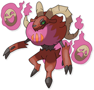

  

  

    

      
Categoria

      

        
Capra

      

    

    

      
Types

      

        
        
      

    

    

      
Abilities

      

        <a href='' title="When this Pokemon has 1/3 or less of its HP remaining, its fire-type moves inflict 1.5x as much regular damage.">Blaze</a>
        /<a href='' title="Quando entra in battaglia sceglie una delle sue due maschere: se sceglie la maschera da Commedia la sua statistica più alta viene aumentata di uno stadio, se sceglie quella della Tragedia la statistica più alta dell'avversario viene diminuita.">Teatralità</a>
      

    

    

      
Hidden Ability

      

        
      

    

  

## Generali

=== "Descrizione Pokedex"
    ### Descrizione

    Phyries è un Pokémon inedito introdotto nella regione di Itia.  
    Si evolve da [Yulot](https://avventureaditia.github.io/itia-wiki/pokemon/005-yulot/) una volta raggiunto il livello 36 ed è l'evoluzione finale di [Flammid](https://avventureaditia.github.io/itia-wiki/pokemon/004-flammid/).  
    Vive in alta montagna e raramente entra a contatto con l'essere umano.  
    Nonostante la sua tipologia è riconducibile al tipo Buio, in quanto risulta particolarmente aggressivo e violento.  
    Ha imparato ad assorbire energia naturale per sopravvivere e usarla per dare vita a delle maschere spettrali che tormentino chiunque si avvicini.  

    Per maggiori informazioni il [video completo](https://www.youtube.com/watch?v=tR_uukAGO7I&t=464s).

=== "Ispirazioni"

    ### Ispirazioni
    Le ispirazioni alla base di Phyries e della sua catena evolutiva sono:
    
    - **Capra**: Animale molto diffuso nell'allevamento italiano, in particolare sulle alpi.
    - **Krampus**: Un demone strettamente legato a Satana e alla festa di San Nicola presente nei racconti dell'Alto Adige. Viene descritto come aggressivo e malevolo.
    - **Yule**: Festa collegata al solstizio d'Inverno e che ha alcune somiglianze con il nostro Natale.

    Al fine di creare un filo comune per i tre leggendari si è scelto di rappresentare tre discipline artistiche.  
    Per lo starter d'erba si è optato per la scultura, in particolare alla lavorazione della terracotta, che prevede l'uso del fuoco e delle alte temperature.  
    Si lega dunque al teatro romano per via delle sue maschere fatte di questo materiale e alla figura di Plauto, l'autore teatrale che più influenzo il teatro occidentale.  
    La capra come animale di partenza è stata scelta per creare un collegamento con gli starter dei giochi originali, che si basano su animali presenti nel calendario giapponese.

=== "Vincitore del contest"
    ### Vincitore

    Il Vincitore di Itia che ha dato origine al Phyries è **Samuele**.

## Base Stats
<table style="width: 100%">
  <tbody style="width: 100%;">
    <tr style="display: flex; align-items: center;">
      <th style="color: #737373;" >HP</th>
      <td style="border-top: none; width: 70px">75</td>
      <td style="width: 100%; min-width: 450px; border-top: none;">
        

        

      </td>
    </tr>
    <tr style="display: flex; align-items: center;">
      <th style="color: #737373;">Attack</th>
      <td style="border-top: none; width: 70px">69</td>
      <td style="width: 100%; min-width: 450px; border-top: none;">
        

        

      </td>
    </tr>
    <tr style="display: flex; align-items: center;">
      <th style="color: #737373;">Defense</th>
      <td style="border-top: none; width: 70px">72</td>
      <td style="width: 100%; min-width: 450px; border-top: none;">
        

        

      </td>
    </tr>
    <tr style="display: flex; align-items: center;">
      <th style="color: #737373;">SP Attack</th>
      <td style="border-top: none; width: 70px">114</td>
      <td style="width: 100%; min-width: 450px; border-top: none;">
        

        

      </td>
    </tr>
    <tr style="display: flex; align-items: center;">
      <th style="color: #737373;">SP Defense</th>
      <td style="border-top: none; width: 70px">100</td>
      <td style="width: 100%; min-width: 450px; border-top: none;">
        

        

      </td>
    </tr>
    <tr style="display: flex; align-items: center;">
      <th style="color: #737373;">Speed</th>
      <td style="border-top: none; width: 70px">104</td>
      <td style="width: 100%; min-width: 450px; border-top: none;">
        

        

      </td>
    </tr>
  </tbody>
</table>

## Moveset

=== "Level Up Moves"
    | Level | Name | Power | Accuracy | PP | Type | Damage Class |
        | -- | -- | -- | -- | -- | -- | -- |
        	| 1 | Scratch | 40 | 100 | 35 |  |  |
	| 4 | Growl | - | 100 | 40 |  |  |
	| 9 | Smokescreen | - | 100 | 20 |  |  |
	| 13 | Ember | 40 | 100 | 25 |  |  |
	| 18 | Fury-swipes | 18 | 80 | 15 |  |  |
	| 19 | Scary-face | - | 100 | 10 |  |  |
	| 22 | Dragon-rage | - | 100 | 10 |  |  |
	| 25 | Fire-fang | 65 | 95 | 15 |  |  |
	| 27 | Fire-spin | 35 | 85 | 15 |  |  |
	| 28 | Flame-burst | 70 | 100 | 15 |  |  |
	| 31 | Slash | 70 | 100 | 20 |  |  |
	| 36 | Maschere-del-destino | 50 | 85 | 20 |  |  |
	| 46 | Inferno | 100 | 50 | 5 |  |  |

        

=== "Machine Moves"
    | Machine | Name | Power | Accuracy | PP | Type | Damage Class |
        | -- | -- | -- | -- | -- | -- | -- |
        	| TM22 | Rock-slide | 75 | 90 | 10 |  |  |
	| TM27 | Toxic | - | 90 | 10 |  |  |
	| TM100 | Confide | - | - | 20 |  |  |
	| TM27 | Return | - | 100 | 20 |  |  |
	| TM87 | Swagger | - | 85 | 15 |  |  |
	| TM31 | Fire-punch | 75 | 100 | 15 |  |  |
	| TM05 | Rest | - | - | 5 |  |  |
	| TM56 | Fling | - | 100 | 10 |  |  |
	| TM01 | Headbutt | 70 | 100 | 15 |  |  |
	| TM61 | Will-o-wisp | - | 85 | 15 |  |  |
	| TM88 | Sleep-talk | - | - | 10 |  |  |
	| TM65 | Shadow-claw | 70 | 100 | 15 |  |  |
	| TM32 | Double-team | - | - | 15 |  |  |
	| TM39 | Rock-tomb | 60 | 95 | 15 |  |  |
	| TM13 | Brick-break | 75 | 100 | 15 |  |  |
	| TM10 | Dig | 80 | 100 | 10 |  |  |
	| TM38 | Fire-blast | 110 | 85 | 5 |  |  |
	| TM50 | Overheat | 130 | 90 | 5 |  |  |
	| TM43 | Flame-charge | 50 | 100 | 20 |  |  |
	| TM10 | Hidden-power | 60 | 100 | 15 |  |  |
	| TM21 | Frustration | - | 100 | 20 |  |  |
	| TM19 | Iron-tail | 100 | 75 | 15 |  |  |
	| TM40 | Aerial-ace | 60 | - | 20 |  |  |
	| TM45 | Attract | - | 100 | 15 |  |  |
	| TM02 | Dragon-claw | 80 | 100 | 15 |  |  |
	| TM11 | Sunny-day | - | - | 5 |  |  |
	| TM08 | Substitute | - | - | 10 |  |  |
	| TM23 | Thunder-punch | 75 | 100 | 15 |  |  |
	| TM39 | Outrage | 120 | 100 | 10 |  |  |
	| TM07 | Protect | - | - | 10 |  |  |
	| TM12 | Facade | 70 | 100 | 20 |  |  |
	| TM15 | Seismic-toss | - | 100 | 20 |  |  |
	| TM01 | Work-up | - | - | 30 |  |  |
	| TM48 | Round | 60 | 100 | 15 |  |  |
	| TM49 | Echoed-voice | 40 | 100 | 15 |  |  |
	| TM34 | Dragon-pulse | 85 | 100 | 10 |  |  |
	| TM35 | Flamethrower | 90 | 100 | 15 |  |  |
	| TM33 | Reflect | - | - | 20 |  |  |
	| TM75 | Swords-dance | - | - | 20 |  |  |

        
