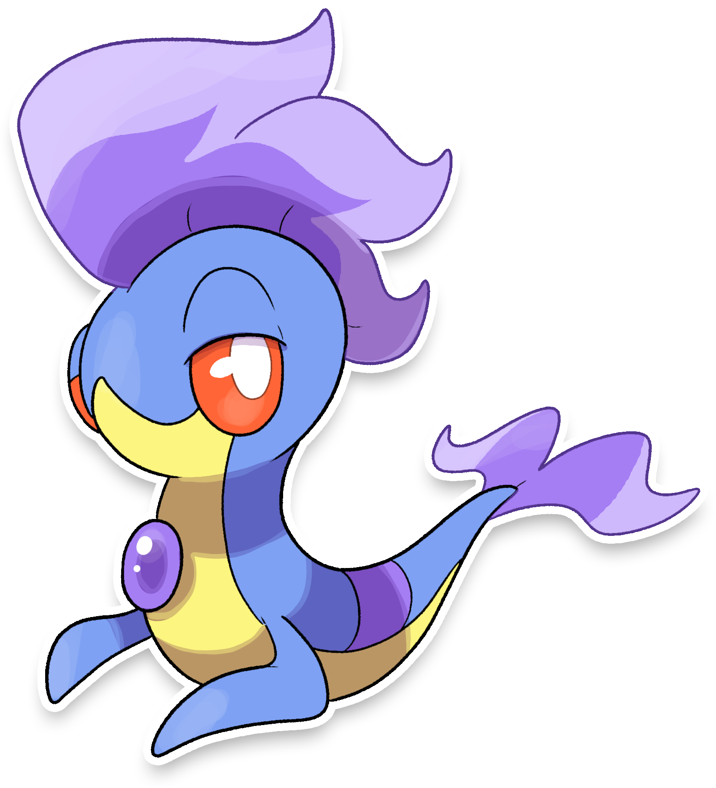

  

  

    

      
Categoria

      

        
Gemma

      

    

    

      
Types

      

        
        
      

    

    

      
Abilities

      

        <a href='' title="When this Pokemon has 1/3 or less of its HP remaining, its water-type moves inflict 1.5x as much regular damage.">Torrent</a>
        /<a href='' title="Se il Pokémon viene colpito da una mossa fisica questo si carica e il suo attacco speciale viene aumentato. Ha un solo utilizzo che viene recuperato lasciando il campo di battaglia.">Inventiva</a>
      

    

    

      
Hidden Ability

      

        
      

    

  

## Generali

=== "Descrizione Pokedex"
    ### Descrizione

    Badaliz è uno degli starter inediti della regione di Itia.  
    Si evolve in [Propellisk](https://avventureaditia.github.io/itia-wiki/pokemon/008-propellisk/) a partire dal livello 16 e in [Badalinci](https://avventureaditia.github.io/itia-wiki/pokemon/009-badalinci/) a partire dal livello 36.  
    E'molto vanitoso ed esibisce la gemma incastonata sul petto che assieme al suo sguardo ha la capacità di intimidire il nemico al tal punto da immobilizzarlo.  
    Questo può essere provocato anche dal liquido tossico che produce, pericoloso ma non mortale.  

    Per maggiori informazioni il [video completo](https://www.youtube.com/watch?v=tR_uukAGO7I&t=464s).

=== "Ispirazioni"

    ### Ispirazioni
    Le ispirazioni alla base di Badaliz e della sua catena evolutiva sono:
    
    - **Badalischio**: mostro simile al Basilisco, si dice sia nato dalla Gorga Nera, un piccolo laghetto in prossimita della fonte del Borbotto. E' descritto come uno strano serpente grande quanto un'uomo e in grado di paralizzare le sue prede.
    Ha una corona con un diadema sulla fronte, ali e testa di uccello e sembra essere estremamente velenoso.

    Al fine di creare un filo comune per i tre leggendari si è scelto di rappresentare tre discipline artistiche.  
    Per lo starter d'erba si è optato per l'architettura o la pittura, il pokémon secerne un liquido che gli permette di cambiare colore a seconda del suo umore e usa le sue pinne per dipingere e creare dei motivi in grado di mandare in trance chiunque li osservi.  
    La forma del secondo e terzo stadio evolutivo sono ispirate alle macchine volanti di **Leonardo Da Vinci** delle quali esistono due versioni.  
    L'idea di utilizzare la balestra come arma di partenza è stato scelta per creare un collegamento con gli starter dei giochi originali, che si basano su armi.

=== "Vincitore del contest"
    ### Vincitore

    Il Vincitore di Itia che ha dato origine al Badaliz è **Diego**.

## Base Stats
<table style="width: 100%">
  <tbody style="width: 100%;">
    <tr style="display: flex; align-items: center;">
      <th style="color: #737373;" >HP</th>
      <td style="border-top: none; width: 70px">50</td>
      <td style="width: 100%; min-width: 450px; border-top: none;">
        

        

      </td>
    </tr>
    <tr style="display: flex; align-items: center;">
      <th style="color: #737373;">Attack</th>
      <td style="border-top: none; width: 70px">32</td>
      <td style="width: 100%; min-width: 450px; border-top: none;">
        

        

      </td>
    </tr>
    <tr style="display: flex; align-items: center;">
      <th style="color: #737373;">Defense</th>
      <td style="border-top: none; width: 70px">32</td>
      <td style="width: 100%; min-width: 450px; border-top: none;">
        

        

      </td>
    </tr>
    <tr style="display: flex; align-items: center;">
      <th style="color: #737373;">SP Attack</th>
      <td style="border-top: none; width: 70px">66</td>
      <td style="width: 100%; min-width: 450px; border-top: none;">
        

        

      </td>
    </tr>
    <tr style="display: flex; align-items: center;">
      <th style="color: #737373;">SP Defense</th>
      <td style="border-top: none; width: 70px">82</td>
      <td style="width: 100%; min-width: 450px; border-top: none;">
        

        

      </td>
    </tr>
    <tr style="display: flex; align-items: center;">
      <th style="color: #737373;">Speed</th>
      <td style="border-top: none; width: 70px">54</td>
      <td style="width: 100%; min-width: 450px; border-top: none;">
        

        

      </td>
    </tr>
  </tbody>
</table>

## Moveset

=== "Level Up Moves"
    | Level | Name | Power | Accuracy | PP | Type | Damage Class |
        | -- | -- | -- | -- | -- | -- | -- |
        	| 1 | Tackle | 40 | 100 | 35 |  |  |
	| 5 | Tail-whip | - | 100 | 30 |  |  |
	| 9 | Bubble | 40 | 100 | 30 |  |  |
	| 14 | Withdraw | - | - | 40 |  |  |
	| 18 | Water-gun | 40 | 100 | 25 |  |  |
	| 19 | Rapid-spin | 50 | 100 | 40 |  |  |
	| 23 | Bite | 60 | 100 | 25 |  |  |
	| 25 | Water-pulse | 60 | 100 | 20 |  |  |
	| 27 | Bubble-beam | 65 | 100 | 20 |  |  |
	| 28 | Aqua-tail | 90 | 90 | 10 |  |  |
	| 34 | Iron-defense | - | - | 15 |  |  |
	| 41 | Hydro-pump | 110 | 80 | 5 |  |  |
	| 45 | Skull-bash | 130 | 100 | 10 |  |  |

        

=== "Machine Moves"
    | Machine | Name | Power | Accuracy | PP | Type | Damage Class |
        | -- | -- | -- | -- | -- | -- | -- |
        	| TM22 | Rock-slide | 75 | 90 | 10 |  |  |
	| TM27 | Toxic | - | 90 | 10 |  |  |
	| TM100 | Confide | - | - | 20 |  |  |
	| TM27 | Return | - | 100 | 20 |  |  |
	| TM87 | Swagger | - | 85 | 15 |  |  |
	| TM05 | Rest | - | - | 5 |  |  |
	| TM56 | Fling | - | 100 | 10 |  |  |
	| TM01 | Headbutt | 70 | 100 | 15 |  |  |
	| TM88 | Sleep-talk | - | - | 10 |  |  |
	| TM32 | Double-team | - | - | 15 |  |  |
	| TM39 | Rock-tomb | 60 | 95 | 15 |  |  |
	| TM13 | Brick-break | 75 | 100 | 15 |  |  |
	| TM10 | Dig | 80 | 100 | 10 |  |  |
	| TM35 | Ice-punch | 75 | 100 | 15 |  |  |
	| TM07 | Hail | - | - | 10 |  |  |
	| TM10 | Hidden-power | 60 | 100 | 15 |  |  |
	| TM21 | Frustration | - | 100 | 20 |  |  |
	| TM19 | Iron-tail | 100 | 75 | 15 |  |  |
	| TM74 | Gyro-ball | - | 100 | 5 |  |  |
	| TM55 | Scald | 80 | 100 | 15 |  |  |
	| TM45 | Attract | - | 100 | 15 |  |  |
	| TM55 | Ice-beam | 90 | 100 | 10 |  |  |
	| TM08 | Substitute | - | - | 10 |  |  |
	| TM39 | Outrage | 120 | 100 | 10 |  |  |
	| TM07 | Protect | - | - | 10 |  |  |
	| TM12 | Facade | 70 | 100 | 20 |  |  |
	| TM15 | Seismic-toss | - | 100 | 20 |  |  |
	| TM01 | Work-up | - | - | 30 |  |  |
	| TM48 | Round | 60 | 100 | 15 |  |  |
	| TM14 | Blizzard | 110 | 70 | 5 |  |  |
	| TM18 | Rain-dance | - | - | 5 |  |  |
	| TM34 | Dragon-pulse | 85 | 100 | 10 |  |  |
	| TM33 | Reflect | - | - | 20 |  |  |
	| TM98 | Waterfall | 80 | 100 | 15 |  |  |
	| TM94 | Surf | 90 | 100 | 15 |  |  |

        
