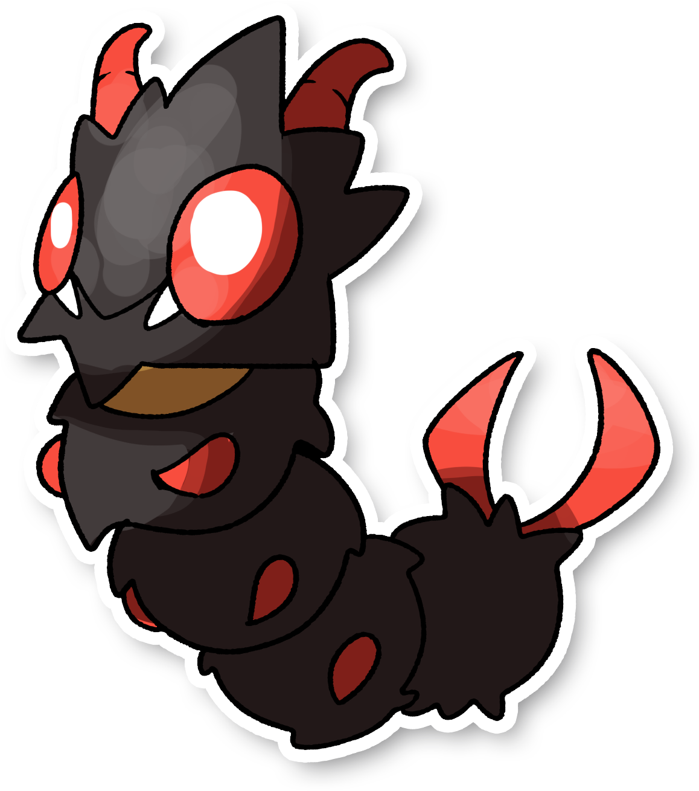

  

  

    

    
Categoria

    

      
Pelarva

    

  

    

      
Types

      

         

      

    

    

      
Abilities

      

        <a href='' title="This Pokemon's moves have 1.3x their accuracy.  This ability has no effect on the one-hit KO moves (fissure, guillotine, horn drill, and sheer cold).  Overworld: If the first Pokemon in the party has this ability, the chance of a wild Pokemon holding a particular item is raised from 50%, 5%, or 1% to 60%, 20%, or 5%, respectively.">Compound-eyes</a> 
      

    

    

      
Hidden Ability

      
  

      

    

  

## Generali

=== "Descrizione Pokedex"
    ### Descrizione

    Gli Amath amano trascorrere il tempo insieme ai Wooloo, selvatici o meno.  
    Data la loro peculiare coda a forma di forbici, vengono spesso usati dai pastori per la tosatura del gregge.  
    La notte dormono sui Wooloo al caldo e protetti.  

    Per maggiori informazioni il [video completo](https://www.youtube.com/watch?v=BzvbrsnNmLY&list=PLniAakFPn_t9I5zqlYAwZ_iSzJmgu5Nqd&index=2).

=== "Ispirazioni"

    ### Ispirazioni
    Le ispirazioni alla base di Amath e della sua catena evolutiva sono:
    
    - **Lepidottero**: sono un vasto ordine di insetti a cui appartengono oltre 158 000 specie, note come farfalle e falene;
    - **Amata phegea**: è un lepidottero comune e molto diffuso in Italia. Uno dei suoi soprannomi è "Picuraro", poichè solito avvistarlo presso greggi di pecore. Uno dei nomi più comuni con cui è conosciuto questo insetto è "Prete" a causa del singolare colletto che è presente sul suo corpo.

=== "Vincitore del contest"
    ### Vincitore

    Il Vincitore di Itia che ha dato origine a Amath è **Samuele**.

## Base Stats
<table style="width: 100%">
  <tbody style="width: 100%;">
    <tr style="display: flex; align-items: center;">
      <th style="color: #737373;" >HP</th>
      <td style="border-top: none; width: 70px">47</td>
      <td style="width: 100%; min-width: 450px; border-top: none;">
        

        

      </td>
    </tr>
    <tr style="display: flex; align-items: center;">
      <th style="color: #737373;">Attack</th>
      <td style="border-top: none; width: 70px">62</td>
      <td style="width: 100%; min-width: 450px; border-top: none;">
        

        

      </td>
    </tr>
    <tr style="display: flex; align-items: center;">
      <th style="color: #737373;">Defense</th>
      <td style="border-top: none; width: 70px">45</td>
      <td style="width: 100%; min-width: 450px; border-top: none;">
        

        

      </td>
    </tr>
    <tr style="display: flex; align-items: center;">
      <th style="color: #737373;">SP Attack</th>
      <td style="border-top: none; width: 70px">55</td>
      <td style="width: 100%; min-width: 450px; border-top: none;">
        

        

      </td>
    </tr>
    <tr style="display: flex; align-items: center;">
      <th style="color: #737373;">SP Defense</th>
      <td style="border-top: none; width: 70px">45</td>
      <td style="width: 100%; min-width: 450px; border-top: none;">
        

        

      </td>
    </tr>
    <tr style="display: flex; align-items: center;">
      <th style="color: #737373;">Speed</th>
      <td style="border-top: none; width: 70px">46</td>
      <td style="width: 100%; min-width: 450px; border-top: none;">
        

        

      </td>
    </tr>
  </tbody>
</table>

##Evolution Change
| Method | Item/Level/Note | Evolved Pokemon |
        | :--: | :--: | :--: |
        | Level Up | 13 | [Pecuru](https://avventureaditia.github.io/itia-wiki/pokemon/011-pecuru/) |
        

## Moveset

=== "Level Up Moves"
    | Level | Name | Power | Accuracy | PP | Type | Damage Class |
        | -- | -- | -- | -- | -- | -- | -- |
        
        

=== "Machine Moves"
    | Machine | Name | Power | Accuracy | PP | Type | Damage Class |
        | -- | -- | -- | -- | -- | -- | -- |
        
        
