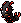
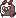

  ⬅️ 
  <a href="https://avventureaditia.github.io/itia-wiki/pokemon/010-amath/">010 - Amath
    
  </a>
  <strong>011 - Pecuru</strong> 
  
  <a href="https://avventureaditia.github.io/itia-wiki/pokemon/012-phegea/">012 - Phegea
    
  </a>
  ➡️

## Pokédex

=== "Tassonomia"
    

      
      

        

          
Class

          

            
Pecobozzolo

          

        

        

          
Types

          

            
          

        

        

          
Ability

          

          <a href='' title="This Pokemon's moves have 1.3x their accuracy.  This ability has no effect on the one-hit KO moves (fissure, guillotine, horn drill, and sheer cold).  Overworld: If the first Pokemon in the party has this ability, the chance of a wild Pokemon holding a particular item is raised from 50%, 5%, or 1% to 60%, 20%, or 5%, respectively.">Compound-eyes</a>
          

        

        

          
Hidden Ability

          

          <a href='' title="This Pokemon's moves have 1.3x their accuracy.  This ability has no effect on the one-hit KO moves (fissure, guillotine, horn drill, and sheer cold).  Overworld: If the first Pokemon in the party has this ability, the chance of a wild Pokemon holding a particular item is raised from 50%, 5%, or 1% to 60%, 20%, or 5%, respectively.">Compound-eyes</a>
          

        

        

          
Cry

          

            <audio controls>
              <source src="../../audio/pecuru.mp3" type="audio/mpeg">
            </audio>
          

        

      

    

=== "Aspetto"
    

      
      

        

          
Height

          

            
0,38 m

          

        

        

          
Weight

          

            
5,12 kg

          

        

        

          
Pokédex Color

          

            
Verde

          

        

        

          
Shape

          

            
          

        

      

    

=== "Allevamento"
    

      
      

        

          

            
Catch rate

            

              
120

            

          

          

            
Gender Ratio

            

              
50.0%

              
/

              
50.0%

            

          

        

        

          

            
Egg Groups

            

              
Bug

            

          

          

            
Hatch Time

            

              
15 Cycles

            

          

        

        

          

            
Base experience yield

            

              
72

            

          

          

            
Leveling rate

            

              
Medium fast

            

          

        

        

          

            
Base friendship

            

              
70

            

          

          

            
EV yield

            

              
1 - Attack / 1 - Defense

            

          

        

      

    

## Generali

=== "Descrizione Pokedex"
    ### Descrizione

    A quanto pare, per evolversi gli Amath hanno bisogno della speciale lana dei Wooloo, come una sorta di simbiosi.  
    Le piccole larve avvolgono il loro corpo con questo materiale: a causa di ciò, spesso vengono confusi con veri e propri bestiami.  

    Per maggiori informazioni il [video completo](https://www.youtube.com/watch?v=BzvbrsnNmLY&list=PLniAakFPn_t9I5zqlYAwZ_iSzJmgu5Nqd&index=2).

=== "Ispirazioni"

    ### Ispirazioni
    Le ispirazioni alla base di Pecuru e della sua catena evolutiva sono:
    
    - **Lepidottero**: sono un vasto ordine di insetti a cui appartengono oltre 158 000 specie, note come farfalle e falene;
    - **Amata phegea**: è un lepidottero comune e molto diffuso in Italia. Uno dei suoi soprannomi è "Picuraro", poichè solito avvistarlo presso greggi di pecore. Uno dei nomi più comuni con cui è conosciuto questo insetto è "Prete" a causa del singolare colletto che è presente sul suo corpo.

=== "Vincitore del contest"
    ### Vincitore

    Il Vincitore di Itia che ha dato origine a Pecuru è **Samuele**.

## Base Stats
<table style="width: 100%">
  <tbody style="width: 100%;">
    <tr style="display: flex; align-items: center;">
      <th style="color: #737373;" >HP</th>
      <td style="border-top: none; width: 70px">57</td>
      <td style="width: 100%; min-width: 450px; border-top: none;">
        

        

      </td>
    </tr>
    <tr style="display: flex; align-items: center;">
      <th style="color: #737373;">Attack</th>
      <td style="border-top: none; width: 70px">82</td>
      <td style="width: 100%; min-width: 450px; border-top: none;">
        

        

      </td>
    </tr>
    <tr style="display: flex; align-items: center;">
      <th style="color: #737373;">Defense</th>
      <td style="border-top: none; width: 70px">95</td>
      <td style="width: 100%; min-width: 450px; border-top: none;">
        

        

      </td>
    </tr>
    <tr style="display: flex; align-items: center;">
      <th style="color: #737373;">SP Attack</th>
      <td style="border-top: none; width: 70px">55</td>
      <td style="width: 100%; min-width: 450px; border-top: none;">
        

        

      </td>
    </tr>
    <tr style="display: flex; align-items: center;">
      <th style="color: #737373;">SP Defense</th>
      <td style="border-top: none; width: 70px">65</td>
      <td style="width: 100%; min-width: 450px; border-top: none;">
        

        

      </td>
    </tr>
    <tr style="display: flex; align-items: center;">
      <th style="color: #737373;">Speed</th>
      <td style="border-top: none; width: 70px">46</td>
      <td style="width: 100%; min-width: 450px; border-top: none;">
        

        

      </td>
    </tr>
  </tbody>
</table>

## Aspetto di gioco

=== "Base"
    

      

        
      

      

        
      

    

=== "Base Shiny"
    

      

        
      

      

        
      

    

##Evolution Change
| Method | Item/Level/Note | Evolved Pokemon |
        | :--: | :--: | :--: |
        | Level Up | 26 | [Phegea](https://avventureaditia.github.io/itia-wiki/pokemon/012-phegea/) |
        

## Moveset

=== "Level Up Moves"
    | Level | Name | Power | Accuracy | PP | Type | Damage Class |
        | -- | -- | -- | -- | -- | -- | -- |
        
        

=== "Machine Moves"
    | Machine | Name | Power | Accuracy | PP | Type | Damage Class |
        | -- | -- | -- | -- | -- | -- | -- |
        
        
