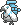

  ⬅️ 
  <a href="https://avventureaditia.github.io/itia-wiki/pokemon/013-azuerla/">013 - Azuerla
    
  </a>
  <strong>014 - Albeste</strong> 
  
  <a href="https://avventureaditia.github.io/itia-wiki/pokemon/015-yawnouse/">015 - Yawnouse
    
  </a>
  ➡️

## Pokédex - Forma Base

=== "Tassonomia"
    

      
      

        

          
Class

          

            
Inverno

          

        

        

          
Types

          

            
            
          

        

        

          
Ability

          

          <a href='' title="Se il Pokémon viene colpito da mosse di tipo Acqua o Fuoco, il manto di neve che ricopre il suo corpo si scioglie e il Pokémon cambia forma.
            Sotto la neve riesce a recuperare il suo manto.">Candipiuma</a>
          

        

        

          
Cry

          

            <audio controls>
              <source src="../../audio/albeste.mp3" type="audio/mpeg">
            </audio>
          

        

      

    

=== "Aspetto"
    

      
      

        

          
Height

          

            
1,18 m

          

        

        

          
Weight

          

            
6,76 kg

          

        

        

          
Pokédex Color

          

            
Blue

          

        

        

          
Shape

          

            
          

        

      

    

=== "Allevamento"
    

      
      

        

          

            
Catch rate

            

              
90

            

          

          

            
Gender Ratio

            

              
00.0%

              
/

              
100.0%

            

          

        

        

          

            
Egg Groups

            

              
Flying

            

          

          

            
Hatch Time

            

              
15 Cycles

            

          

        

        

          

            
Base experience yield

            

              
155

            

          

          

            
Leveling rate

            

              
Medium fast

            

          

        

        

          

            
Base friendship

            

              
70

            

          

          

            
EV yield

            

              
2 - Speed

            

          

        

      

    

## Pokédex - Forma Manto Sciolto

=== "Tassonomia"
    

      
      

        

          
Class

          

            
Inverno

          

        

        

          
Types

          

            
            
          

        

        

          
Ability

          

          <a href='' title="Se il Pokémon viene colpito da mosse di tipo Acqua o Fuoco, il manto di neve che ricopre il suo corpo si scioglie e il Pokémon cambia forma.
            Sotto la neve riesce a recuperare il suo manto.">Candipiuma</a>
          

        

        

          
Cry

          

            <audio controls>
              <source src="../../audio/albeste.mp3" type="audio/mpeg">
            </audio>
          

        

      

    

=== "Aspetto"
    

      
      

        

          
Height

          

            
1,16 m

          

        

        

          
Weight

          

            
18,26 kg

          

        

        

          
Pokédex Color

          

            
Blue

          

        

        

          
Shape

          

            
          

        

      

    

=== "Allevamento"
    

      
      

        

          

            
Catch rate

            

              
90

            

          

          

            
Gender Ratio

            

              
00.0%

              
/

              
100.0%

            

          

        

        

          

            
Egg Groups

            

              
Flying

            

          

          

            
Hatch Time

            

              
15 Cycles

            

          

        

        

          

            
Base experience yield

            

              
155

            

          

          

            
Leveling rate

            

              
Medium fast

            

          

        

        

          

            
Base friendship

            

              
70

            

          

          

            
EV yield

            

              
2 - Speed

            

          

        

      

    

    

## Generali

=== "Descrizione Pokedex"
    ### Descrizione

    Questo pokémon è molto particolare.  
    Ricopre il suo corpo di neve per nascondere le sue vere sembianze.  
    Va molto fiero del suo manto di ghiaccio, ma se viene colpito da mosse d'acqua o di fuoco, esso si scioglie rivelando il suo piumaggio grigio e sporco, diventando di tipo acqua.  
    Quando nevica, il corpo torna bianco.  

    Per maggiori informazioni il [video completo](https://www.youtube.com/watch?v=BzvbrsnNmLY&list=PLniAakFPn_t9I5zqlYAwZ_iSzJmgu5Nqd&index=2).

=== "Ispirazioni"

    ### Ispirazioni
    Le ispirazioni alla base di Azuerla e della sua catena evolutiva sono:
    
    - **Giorni della merla**: si fa riferimento agli ultimi tre giorni del mese di Gennaio, che secondo la tradizione italiana sarebbero i più freddi di tutto l'anno;
    - **Azzurrina**: protagonista di una leggenda Emiliana, si tratta di una bambina albina che fu costretta sin dalla giovane età a tingersi i capelli per non essere perseguitata, ma morì in una ghiacciaia e si dica infesti tutt'ora il castello del padre.

=== "Vincitore del contest"
    ### Vincitore

    Il Vincitore di Itia che ha dato origine a Azuerla e la sua catena evolutiva è **Tommaso**.

## Base Stats
<table style="width: 100%">
  <tbody style="width: 100%;">
    <tr style="display: flex; align-items: center;">
      <th style="color: #737373;" >HP</th>
      <td style="border-top: none; width: 70px">60</td>
      <td style="width: 100%; min-width: 450px; border-top: none;">
        

        

      </td>
    </tr>
    <tr style="display: flex; align-items: center;">
      <th style="color: #737373;">Attack</th>
      <td style="border-top: none; width: 70px">75</td>
      <td style="width: 100%; min-width: 450px; border-top: none;">
        

        

      </td>
    </tr>
    <tr style="display: flex; align-items: center;">
      <th style="color: #737373;">Defense</th>
      <td style="border-top: none; width: 70px">70</td>
      <td style="width: 100%; min-width: 450px; border-top: none;">
        

        

      </td>
    </tr>
    <tr style="display: flex; align-items: center;">
      <th style="color: #737373;">SP Attack</th>
      <td style="border-top: none; width: 70px">85</td>
      <td style="width: 100%; min-width: 450px; border-top: none;">
        

        

      </td>
    </tr>
    <tr style="display: flex; align-items: center;">
      <th style="color: #737373;">SP Defense</th>
      <td style="border-top: none; width: 70px">60</td>
      <td style="width: 100%; min-width: 450px; border-top: none;">
        

        

      </td>
    </tr>
    <tr style="display: flex; align-items: center;">
      <th style="color: #737373;">Speed</th>
      <td style="border-top: none; width: 70px">125</td>
      <td style="width: 100%; min-width: 450px; border-top: none;">
        

        

      </td>
    </tr>
  </tbody>
</table>

## Aspetto di gioco

=== "Base"
    

      

        
      

      

        
      

    

=== "Base Shiny"
    

      

        
      

      

        
      

    

=== "Forma Bagnata"
    

      

        
      

      

        
      

    

=== "Forma Bagnata Shiny"
    

      

        
      

      

        
      

    

## Moveset

=== "Level Up Moves"
    | Level | Name | Power | Accuracy | PP | Type | Damage Class |
        | -- | -- | -- | -- | -- | -- | -- |
        
        

=== "Machine Moves"
    | Machine | Name | Power | Accuracy | PP | Type | Damage Class |
        | -- | -- | -- | -- | -- | -- | -- |
        
        
