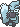

  ⬅️ 
  <a href="https://avventureaditia.github.io/itia-wiki/pokemon/015-mousleep/">015 - mousleep
    
  </a>
  <strong>016 - Mousleep</strong> 
  
  <a href="https://avventureaditia.github.io/itia-wiki/pokemon/017-skitty-itia/">017 - Skitty di Itia
    
  </a>
  ➡️

## Pokédex - Forma Base

=== "Tassonomia"
    

      
      

        

          
Class

          

            
Dormiveglia

          

        

        

          
Types

          

            
          

        

        

          
Ability

          

            <a href='' title="Increases super-effective damage dealt to 1.25x.">Hunger-switch</a>
          

        

        

          
Cry

          

            <audio controls>
              <source src="../../audio/mousleep.mp3" type="audio/mpeg">
            </audio>
          

        

      

    

=== "Aspetto"
    

      
      

        

          
Height

          

            
0,89 m

          

        

        

          
Weight

          

            
56,65 kg

          

        

        

          
Pokédex Color

          

            
Grigio

          

        

        

          
Shape

          

            
          

        

      

    

=== "Allevamento"
    

      
      

        

          

            
Catch rate

            

              
90

            

          

          

            
Gender Ratio

            

              
50.0%

              
/

              
50.0%

            

          

        

        

          

            
Egg Groups

            

              
Field

            

          

          

            
Hatch Time

            

              
15 Cycles

            

          

        

        

          

            
Base experience yield

            

              
155

            

          

          

            
Leveling rate

            

              
Fast

            

          

        

        

          

            
Base friendship

            

              
70

            

          

          

            
EV yield

            

              
2 - HP

            

          

        

      

    

## Pokédex - Forma Risveglio

=== "Tassonomia"
    

      
      

        

          
Class

          

            
Dormiveglia

          

        

        

          
Types

          

            
             
          

        

        

          
Ability

          

            <a href='' title="Increases super-effective damage dealt to 1.25x.">Hunger-switch</a>
          

        

        

          
Cry

          

            <audio controls>
              <source src="../../audio/mousleep.mp3" type="audio/mpeg">
            </audio>
          

        

      

    

=== "Aspetto"
    

      
      

        

          
Height

          

            
0,94 m

          

        

        

          
Weight

          

            
56,66 kg

          

        

        

          
Pokédex Color

          

            
Grigio

          

        

        

          
Shape

          

            
          

        

      

    

=== "Allevamento"
    

      
      

        

          

            
Catch rate

            

              
90

            

          

          

            
Gender Ratio

            

              
50.0%

              
/

              
50.0%

            

          

        

        

          

            
Egg Groups

            

              
Field

            

          

          

            
Hatch Time

            

              
15 Cycles

            

          

        

        

          

            
Base experience yield

            

              
155

            

          

          

            
Leveling rate

            

              
Fast

            

          

        

        

          

            
Base friendship

            

              
70

            

          

          

            
EV yield

            

              
2 - HP

            

          

        

      

    

## Generali

=== "Descrizione Pokedex"
    ### Descrizione

    Preferiscono dormire tutto il giorno, rimanendo delle creature abbastanza innocue.  
    Quando sono in preda alla fame però, cambiano forma, diventando fuoco-normale e vagano alla ricerca di cibo distruggendo tutto ciò che trovano di fronte.  

    Per maggiori informazioni il [video completo](https://www.youtube.com/watch?v=BzvbrsnNmLY&list=PLniAakFPn_t9I5zqlYAwZ_iSzJmgu5Nqd&index=2).

=== "Ispirazioni"

    ### Ispirazioni
    Le ispirazioni alla base di Mousleep e della sua catena evolutiva sono:
    
    - **Ghiro sardo**: una specie endemica propria dell'isola;
    - **Letargo**: è un comportamento caratteristico di alcuni animali che durante la stagione fredda riducono le proprie funzioni vitali e rimangono in stato di quiescenza;
    - **Caldarroste**: Castagne arrostite al fuoco, piatto tipico dell'area mediterranea.

=== "Vincitore del contest"
    ### Vincitori

    I Vincitori di Itia che ha dato origine a Mousleep sono **Santo** e **Nicolas**.

## Base Stats
<table style="width: 100%">
  <tbody style="width: 100%;">
    <tr style="display: flex; align-items: center;">
      <th style="color: #737373;" >HP</th>
      <td style="border-top: none; width: 70px">120</td>
      <td style="width: 100%; min-width: 450px; border-top: none;">
        

        

      </td>
    </tr>
    <tr style="display: flex; align-items: center;">
      <th style="color: #737373;">Attack</th>
      <td style="border-top: none; width: 70px">95</td>
      <td style="width: 100%; min-width: 450px; border-top: none;">
        

        

      </td>
    </tr>
    <tr style="display: flex; align-items: center;">
      <th style="color: #737373;">Defense</th>
      <td style="border-top: none; width: 70px">95</td>
      <td style="width: 100%; min-width: 450px; border-top: none;">
        

        

      </td>
    </tr>
    <tr style="display: flex; align-items: center;">
      <th style="color: #737373;">SP Attack</th>
      <td style="border-top: none; width: 70px">55</td>
      <td style="width: 100%; min-width: 450px; border-top: none;">
        

        

      </td>
    </tr>
    <tr style="display: flex; align-items: center;">
      <th style="color: #737373;">SP Defense</th>
      <td style="border-top: none; width: 70px">75</td>
      <td style="width: 100%; min-width: 450px; border-top: none;">
        

        

      </td>
    </tr>
    <tr style="display: flex; align-items: center;">
      <th style="color: #737373;">Speed</th>
      <td style="border-top: none; width: 70px">20</td>
      <td style="width: 100%; min-width: 450px; border-top: none;">
        

        

      </td>
    </tr>
  </tbody>
</table>

## Aspetto di gioco

=== "Base"
    

      

        
      

      

        
      

    

=== "Base Shiny"
    

      

        
      

      

        
      

    

=== "Forma Risveglio"
    

      

        
      

      

        
      

    

=== "Forma Risveglio Shiny"
    

      

        
      

      

        
      

    

## Moveset

=== "Level Up Moves"
    | Level | Name | Power | Accuracy | PP | Type | Damage Class |
        | -- | -- | -- | -- | -- | -- | -- |
        
        

=== "Machine Moves"
    | Machine | Name | Power | Accuracy | PP | Type | Damage Class |
        | -- | -- | -- | -- | -- | -- | -- |
        
        
