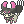
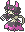
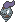
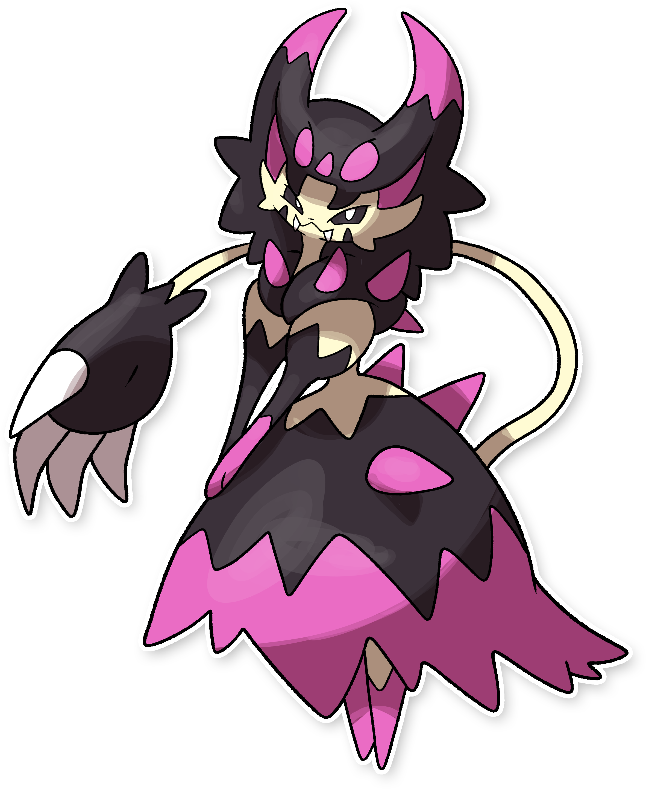
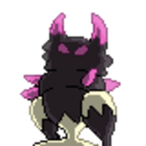
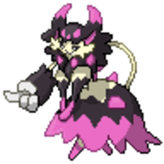
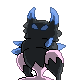
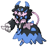

  ⬅️ 
  <a href="https://avventureaditia.github.io/itia-wiki/pokemon/018-delcatty-itia/">018 - Delcatty di Itia
    
  </a>
  <strong>019 - Dresscatty</strong> 
  
  <a href="https://avventureaditia.github.io/itia-wiki/pokemon/020-spoink-itia/">020 - Spoink di Itia
    
  </a>
  ➡️

## Pokédex

=== "Tassonomia"
    

      
      

        

          
Class

          

            
Inganno

          

        

        

          
Types

          

            
            
          

        

        

          
Ability

          

            <a herf='' title="Gli attacchi del Pokémon possono infatuare.">Malizia</a>/
            <a href='' title="Whenever a move makes contact with this Pokemon, the move's user has a 30% chance of being infatuated.  Overworld: If the first Pokemon in the party has this ability, any wild Pokemon whose species can be either gender has a 2/3 chance of being set to the opposite gender, and a 1/3 chance of having a random gender as usual.">Cute-charm</a>
          

        

        

          
Hidden Ability

          

          <a href='' title="Il Pokémon è immune alle mosse di tipo FOLLETTO.">Mezzanotte</a>
          

        

        

          
Cry

          

            <audio controls>
              <source src="../../audio/dresscatty.mp3" type="audio/mpeg">
            </audio>
          

        

      

    

=== "Aspetto"
    

      
      

        

          
Height

          

            
1,58 m

          

        

        

          
Weight

          

            
54,12 kg

          

        

        

          
Pokédex Color

          

            
Nero

          

        

        

          
Shape

          

            
          

        

      

    

=== "Allevamento"
    

      
      

        

          

            
Catch rate

            

              
45

            

          

          

            
Gender Ratio

            

              
25.0%

              
/

              
75.0%

            

          

        

        

          

            
Egg Groups

            

              
Amorphous and Human-Like

            

          

          

            
Hatch Time

            

              
15 Cycles

            

          

        

        

          

            
Base experience yield

            

              
230

            

          

          

            
Leveling rate

            

              
Fast

            

          

        

        

          

            
Base friendship

            

              
70

            

          

          

            
EV yield

            

              
1 - Attack / 2 - Speed

            

          

        

      

    

## Generali

=== "Descrizione Pokedex"
    ### Descrizione
    
    E' un Pokémon molto elegante che odia sporcarsi.  
    La sua pelliccia che sembra un vestito viene usata per fare degli abiti molto pregiati.  
    Nonostante ciò, procurarsela è molto difficile, poichè si dice che chi entra in contatto con questo Pokémon, sparisca misteriosamente.  

    Per maggiori informazioni il [video completo](https://www.youtube.com/watch?v=QKwaSv46-_A&list=PLniAakFPn_t9I5zqlYAwZ_iSzJmgu5Nqd&index=3).

=== "Ispirazioni"

    ### Ispirazioni
    Le ispirazioni alla base di Skitty e della sua catena evolutiva sono:
    
    - **Gatto mammone**: nome italiano che veniva dato ad una specie di scimmia non meglio identificata, forse una sorta di babbuino. Nel mondo delle fiabe invece si tratta di un mostro dall'aspetto di un gatto gigante e veniva utilizzato per spaventare i bambini ribelli;
    - **Zendado**: tipico vestito veneziano;
    - **Dama nera**: secondo la leggenda si tratta di una fanciulla che attirerebbe gli uomini in luoghi isolati per farli danzare per ore e ore, dopo questo strano rituale, gli uomini alzando il velo scoprirebbero che invece della testa c'è in realtà un teschio.

=== "Vincitore del contest"
    ### Vincitore

    Il Vincitore di Itia che ha dato origine a Skitty e la sua catena evolutiva è **Francesco**.

## Base Stats
<table style="width: 100%">
  <tbody style="width: 100%;">
    <tr style="display: flex; align-items: center;">
      <th style="color: #737373;" >HP</th>
      <td style="border-top: none; width: 70px">95</td>
      <td style="width: 100%; min-width: 450px; border-top: none;">
        

        

      </td>
    </tr>
    <tr style="display: flex; align-items: center;">
      <th style="color: #737373;">Attack</th>
      <td style="border-top: none; width: 70px">95</td>
      <td style="width: 100%; min-width: 450px; border-top: none;">
        

        

      </td>
    </tr>
    <tr style="display: flex; align-items: center;">
      <th style="color: #737373;">Defense</th>
      <td style="border-top: none; width: 70px">75</td>
      <td style="width: 100%; min-width: 450px; border-top: none;">
        

        

      </td>
    </tr>
    <tr style="display: flex; align-items: center;">
      <th style="color: #737373;">SP Attack</th>
      <td style="border-top: none; width: 70px">45</td>
      <td style="width: 100%; min-width: 450px; border-top: none;">
        

        

      </td>
    </tr>
    <tr style="display: flex; align-items: center;">
      <th style="color: #737373;">SP Defense</th>
      <td style="border-top: none; width: 70px">65</td>
      <td style="width: 100%; min-width: 450px; border-top: none;">
        

        

      </td>
    </tr>
    <tr style="display: flex; align-items: center;">
      <th style="color: #737373;">Speed</th>
      <td style="border-top: none; width: 70px">110</td>
      <td style="width: 100%; min-width: 450px; border-top: none;">
        

        

      </td>
    </tr>
  </tbody>
</table>

## Aspetto di gioco

=== "Base"
    

      

        
      

      

        
      

    

=== "Shiny"
    

      

        
      

      

        
      

    

## Moveset

=== "Level Up Moves"
    | Level | Name | Power | Accuracy | PP | Type | Damage Class |
        | -- | -- | -- | -- | -- | -- | -- |
        
        

=== "Machine Moves"
    | Machine | Name | Power | Accuracy | PP | Type | Damage Class |
        | -- | -- | -- | -- | -- | -- | -- |
        
        
