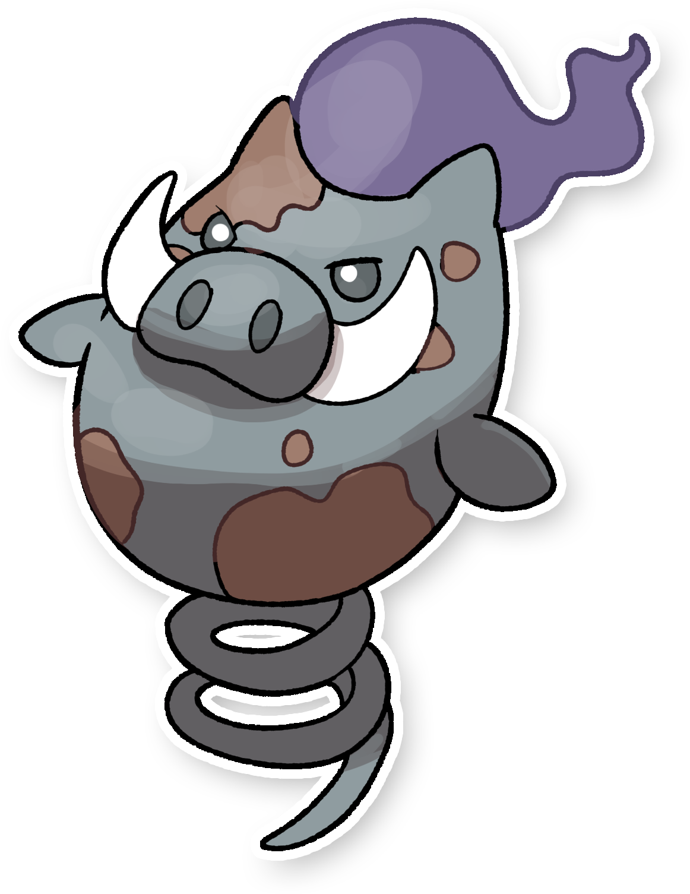
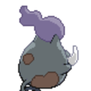
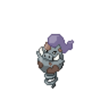
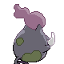
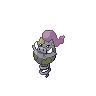

  ⬅️ 
  <a href="https://avventureaditia.github.io/itia-wiki/pokemon/019-dresscatty/">019 - Dresscatty
    
  </a>
  <strong>020 - Spoink di Itia</strong> 
  
  <a href="https://avventureaditia.github.io/itia-wiki/pokemon/021-spiboarth/">021 - Spiboarth
    
  </a>
  ➡️

## Pokédex

=== "Tassonomia"
    

      
      

        

          
Class

          

            
Cinghiale

          

        

        

          
Types

          

            
            
          

        

        

          
Ability

          

            <a href='' title="At the end of each turn, if another Pokemon consumed or Flung a held item that turn, this Pokemon picks up the item if it is not already holding one.  After each battle, this Pokemon has a 10% chance of picking up an item if it is not already holding one.  The air balloon and eject button cannot be picked up.  The items that may be found vary by game, and, since Pokemon Emerald, by the Pokemon's level.  This ability is checked after the battle ends, at which point any temporary ability changes have worn off.">Pickup</a>
          

        

        

          
Cry

          

            <audio controls>
              <source src="../../audio/spoink-itia.mp3" type="audio/mpeg">
            </audio>
          

        

      

    

=== "Aspetto"
    

      
      

        

          
Height

          

            
0,51 m

          

        

        

          
Weight

          

            
12,43 kg

          

        

        

          
Pokédex Color

          

            
Viola

          

        

        

          
Shape

          

            
          

        

      

    

=== "Allevamento"
    

      
      

        

          

            
Catch rate

            

              
200

            

          

          

            
Gender Ratio

            

              
50.0%

              
/

              
50.0%

            

          

        

        

          

            
Egg Groups

            

              
Amorphous

            

          

          

            
Hatch Time

            

              
25 Cycles

            

          

        

        

          

            
Base experience yield

            

              
66

            

          

          

            
Leveling rate

            

              
Medium Fast

            

          

        

        

          

            
Base friendship

            

              
70

            

          

          

            
EV yield

            

              
1 - HP

            

          

        

      

    

    

## Generali

=== "Descrizione Pokedex"
    ### Descrizione
    
    Si dice che da quando Spoink sia arrivato ad Itia, vedendo la pericolosità della sua natura, abbia deciso di gettare via la sua amata sfera e di iniziare a buttarsi nelle mischie più spesso, facendosi crescere delle enormi zanne usate in combattimento.  
    Tuttavia, finendo spesso K.O. contro avversari più forti, ha finito per diventare di tipo Spettro.  

    Per maggiori informazioni il [video completo](https://www.youtube.com/watch?v=QKwaSv46-_A&list=PLniAakFPn_t9I5zqlYAwZ_iSzJmgu5Nqd&index=3).

=== "Ispirazioni"

    ### Ispirazioni
    Le ispirazioni alla base di Spoink e della sua catena evolutiva sono:
    
    - Leggenda del **Cinghiale di Civate**.

=== "Vincitore del contest"
    ### Vincitore

    Il Vincitore di Itia che ha dato origine a Spoink e la sua catena evolutiva è **Emanuele**.

## Base Stats
<table style="width: 100%">
  <tbody style="width: 100%;">
    <tr style="display: flex; align-items: center;">
      <th style="color: #737373;" >HP</th>
      <td style="border-top: none; width: 70px">60</td>
      <td style="width: 100%; min-width: 450px; border-top: none;">
        

        

      </td>
    </tr>
    <tr style="display: flex; align-items: center;">
      <th style="color: #737373;">Attack</th>
      <td style="border-top: none; width: 70px">25</td>
      <td style="width: 100%; min-width: 450px; border-top: none;">
        

        

      </td>
    </tr>
    <tr style="display: flex; align-items: center;">
      <th style="color: #737373;">Defense</th>
      <td style="border-top: none; width: 70px">35</td>
      <td style="width: 100%; min-width: 450px; border-top: none;">
        

        

      </td>
    </tr>
    <tr style="display: flex; align-items: center;">
      <th style="color: #737373;">SP Attack</th>
      <td style="border-top: none; width: 70px">70</td>
      <td style="width: 100%; min-width: 450px; border-top: none;">
        

        

      </td>
    </tr>
    <tr style="display: flex; align-items: center;">
      <th style="color: #737373;">SP Defense</th>
      <td style="border-top: none; width: 70px">80</td>
      <td style="width: 100%; min-width: 450px; border-top: none;">
        

        

      </td>
    </tr>
    <tr style="display: flex; align-items: center;">
      <th style="color: #737373;">Speed</th>
      <td style="border-top: none; width: 70px">60</td>
      <td style="width: 100%; min-width: 450px; border-top: none;">
        

        

      </td>
    </tr>
  </tbody>
</table>

## Aspetto di gioco

=== "Base"
    

      

        
      

      

        
      

    

=== "Shiny"
    

      

        
      

      

        
      

    

##Evolution Change
| Method | Item/Level/Note | Evolved Pokemon |
        | :--: | :--: | :--: |
        | Level Up | 28 | [Spiboarth](https://avventureaditia.github.io/itia-wiki/pokemon/021-spiboarth/) |
        

## Moveset

=== "Level Up Moves"
    | Level | Name | Power | Accuracy | PP | Type | Damage Class |
        | -- | -- | -- | -- | -- | -- | -- |
        
        

=== "Machine Moves"
    | Machine | Name | Power | Accuracy | PP | Type | Damage Class |
        | -- | -- | -- | -- | -- | -- | -- |
        
        
