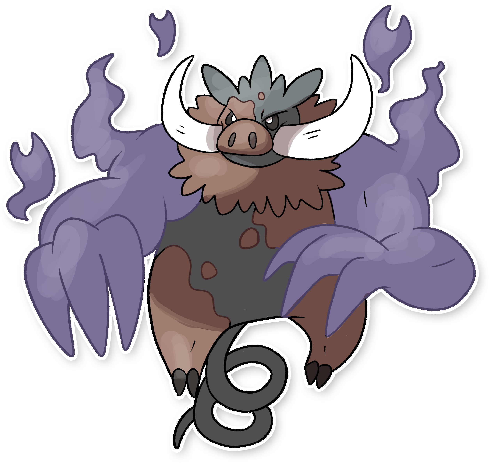

  

  

    

    
Categoria

    

      
Spiricinghiale

    

  

    

      
Types

      

        
        
      

    

    

      
Abilities

      

        <a href='' title="Strengthens moves that make contact to 1.33x their power.">Tough-claws</a>
        
      

    

    

      
Hidden Ability

      

        
      

    

  

## Generali

=== "Descrizione Pokedex"
    ### Descrizione
    
    Si dice che questo Pokémon abbia fatto aderire veri e propri pezzi di terra attorno alle sue spalle per fortificarle, facendo lo stesso con la coda che deve sorreggere tutto il suo peso.  
    Le braccia sono formate dagli spiriti degli Spoink caduti in battaglia.  

    Per maggiori informazioni il [video completo](https://www.youtube.com/watch?v=QKwaSv46-_A&list=PLniAakFPn_t9I5zqlYAwZ_iSzJmgu5Nqd&index=3).

=== "Ispirazioni"

    ### Ispirazioni
    Le ispirazioni alla base di Spoink e della sua catena evolutiva sono:
    
    - Leggenda del **Cinghiale di Civate**.

=== "Vincitore del contest"
    ### Vincitore

    Il Vincitore di Itia che ha dato origine a Spoink e la sua catena evolutiva è **Emanuele**.

## Base Stats
<table style="width: 100%">
  <tbody style="width: 100%;">
    <tr style="display: flex; align-items: center;">
      <th style="color: #737373;" >HP</th>
      <td style="border-top: none; width: 70px">80</td>
      <td style="width: 100%; min-width: 450px; border-top: none;">
        

        

      </td>
    </tr>
    <tr style="display: flex; align-items: center;">
      <th style="color: #737373;">Attack</th>
      <td style="border-top: none; width: 70px">110</td>
      <td style="width: 100%; min-width: 450px; border-top: none;">
        

        

      </td>
    </tr>
    <tr style="display: flex; align-items: center;">
      <th style="color: #737373;">Defense</th>
      <td style="border-top: none; width: 70px">45</td>
      <td style="width: 100%; min-width: 450px; border-top: none;">
        

        

      </td>
    </tr>
    <tr style="display: flex; align-items: center;">
      <th style="color: #737373;">SP Attack</th>
      <td style="border-top: none; width: 70px">45</td>
      <td style="width: 100%; min-width: 450px; border-top: none;">
        

        

      </td>
    </tr>
    <tr style="display: flex; align-items: center;">
      <th style="color: #737373;">SP Defense</th>
      <td style="border-top: none; width: 70px">65</td>
      <td style="width: 100%; min-width: 450px; border-top: none;">
        

        

      </td>
    </tr>
    <tr style="display: flex; align-items: center;">
      <th style="color: #737373;">Speed</th>
      <td style="border-top: none; width: 70px">80</td>
      <td style="width: 100%; min-width: 450px; border-top: none;">
        

        

      </td>
    </tr>
  </tbody>
</table>

## Moveset

=== "Level Up Moves"
    | Level | Name | Power | Accuracy | PP | Type | Damage Class |
        | -- | -- | -- | -- | -- | -- | -- |
        
        

=== "Machine Moves"
    | Machine | Name | Power | Accuracy | PP | Type | Damage Class |
        | -- | -- | -- | -- | -- | -- | -- |
        
        
