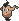

  ⬅️ 
  <a href="https://avventureaditia.github.io/itia-wiki/pokemon/021-spiboarth/">021 - Spiboarth
    
  </a>
  <strong>022 - Phantump di Itia</strong> 
  
  <a href="https://avventureaditia.github.io/itia-wiki/pokemon/023-dumsnot/">023 - Dumsnot
    
  </a>
  ➡️

## Pokédex

=== "Tassonomia"
    

      
      

        

          
Class

          

            
Ceppo

          

        

        

          
Types

          

            
            
          

        

        

          
Ability

          

          <a href='' title="Quando entra in campo si percepisce una brezza tetra.">Atmosfera Sinistra</a>/
          <a href='' title="Garantisce la fuga dai Pokémon selvatici.">Fugafacile</a>
          

        

        

          
Hidden Ability

          

          <a href='' title="Il Pokémon impedisce la fuga o la sostituzione degli avversari di cui calpesta l'ombra.">Pedinombra</a>
          

        

        

          
Cry

          

            <audio controls>
              <source src="../../audio/phantump.mp3" type="audio/mpeg">
            </audio>
          

        

      

    

=== "Aspetto"
    

      
      

        

          
Height

          

            
0,43 m

          

        

        

          
Weight

          

            
20,65 kg

          

        

        

          
Pokédex Color

          

            
Viola

          

        

        

          
Shape

          

            
          

        

      

    

=== "Allevamento"
    

      
      

        

          

            
Catch rate

            

              
120

            

          

          

            
Gender Ratio

            

              
50.0%

              
/

              
50.0%

            

          

        

        

          

            
Egg Groups

            

              
Amorphous

            

          

          

            
Hatch Time

            

              
20 Cycles

            

          

        

        

          

            
Base experience yield

            

              
70

            

          

          

            
Leveling rate

            

              
Medium Fast

            

          

        

        

          

            
Base friendship

            

              
70

            

          

          

            
EV yield

            

              
1 - Sp.Attack

            

          

        

      

    

## Generali

=== "Descrizione Pokedex"
    ### Descrizione
    
    E' l'incarnazione del rancore e della spensieratezza dei bambini che partono all'avventura senza il consenso dei genitori e senza pokémon a proteggerli.  
    Una volta persi nei boschi, Phantump li perseguita nella notte, spingendoli a tornare a casa.  

    Per maggiori informazioni il [video completo](https://www.youtube.com/watch?v=QKwaSv46-_A&list=PLniAakFPn_t9I5zqlYAwZ_iSzJmgu5Nqd&index=3).

=== "Ispirazioni"

    ### Ispirazioni
    Le ispirazioni alla base di Phantump e della sua catena evolutiva sono da ritrovarsi nella storia di **Pinocchio**:
    
    - Il Phantump di Itia rappresenta il pezzo di legno animato dal quale viene intagliato Pinocchio, il colore del legno e la forma delle foglie ricorda il ciliego, in riferimento a **Mastro** **Ciliegia** che è il falegname che regala a Geppetto il pezzo di legno. Il colore Azzurro degli occhi richiama il tipo Folleto e la **Fata** **Turchina**. Il Phantump di Itia rappresenta il **grillo** **parlante** ossia la coscienza di Pinocchio, in questo caso la coscienza dei bambini scappati di casa. Dumsnot invece rappresenta Pinocchio, per questo sembra una marionetta, Indrygard invece rappresenta la Fata Turchina e Geppetto;
    - **Lauroceraso**;
    - **Bacco (o Dionisio)**;
    - **Apollo e Dafne**.

=== "Vincitore del contest"
    ### Vincitore

    Il Vincitore di Itia che ha dato origine a Phantump e la sua catena evolutiva è **Jacopo**.

## Base Stats
<table style="width: 100%">
  <tbody style="width: 100%;">
    <tr style="display: flex; align-items: center;">
      <th style="color: #737373;" >HP</th>
      <td style="border-top: none; width: 70px">43</td>
      <td style="width: 100%; min-width: 450px; border-top: none;">
        

        

      </td>
    </tr>
    <tr style="display: flex; align-items: center;">
      <th style="color: #737373;">Attack</th>
      <td style="border-top: none; width: 70px">70</td>
      <td style="width: 100%; min-width: 450px; border-top: none;">
        

        

      </td>
    </tr>
    <tr style="display: flex; align-items: center;">
      <th style="color: #737373;">Defense</th>
      <td style="border-top: none; width: 70px">48</td>
      <td style="width: 100%; min-width: 450px; border-top: none;">
        

        

      </td>
    </tr>
    <tr style="display: flex; align-items: center;">
      <th style="color: #737373;">SP Attack</th>
      <td style="border-top: none; width: 70px">50</td>
      <td style="width: 100%; min-width: 450px; border-top: none;">
        

        

      </td>
    </tr>
    <tr style="display: flex; align-items: center;">
      <th style="color: #737373;">SP Defense</th>
      <td style="border-top: none; width: 70px">60</td>
      <td style="width: 100%; min-width: 450px; border-top: none;">
        

        

      </td>
    </tr>
    <tr style="display: flex; align-items: center;">
      <th style="color: #737373;">Speed</th>
      <td style="border-top: none; width: 70px">38</td>
      <td style="width: 100%; min-width: 450px; border-top: none;">
        

        

      </td>
    </tr>
  </tbody>
</table>

## Aspetto di gioco

=== "Base"
    

      

        
      

      

        
      

    

=== "Shiny"
    

      

        
      

      

        
      

    

##Evolution Change
| Method | Item/Level/Note | Evolved Pokemon |
        | :--: | :--: | :--: |
        | Level Up | 23 | [Dumsnot](https://avventureaditia.github.io/itia-wiki/pokemon/023-dumsnot/) |
        

## Moveset

=== "Level Up Moves"
    | Level | Name | Power | Accuracy | PP | Type | Damage Class |
        | -- | -- | -- | -- | -- | -- | -- |
        
        

=== "Machine Moves"
    | Machine | Name | Power | Accuracy | PP | Type | Damage Class |
        | -- | -- | -- | -- | -- | -- | -- |
        
        
