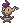
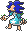

  ⬅️ 
  <a href="https://avventureaditia.github.io/itia-wiki/pokemon/023-dumsnot/">023 - Dumsnot
    
  </a>
  <strong>024 - Indrygard</strong> 
  
  <a href="https://avventureaditia.github.io/itia-wiki/pokemon/025-nixiro/">025 - Nixiro
    
  </a>
  ➡️

  

  

    

    
Class

    

      
Educatore

    

  

    

      
Types

      

        
        
      

    

    

      
Abilities

      

        <a href='' title="Le mosse di tipo Normale diventano di tipo Erba.">Pelleerba</a>
        /<a href='' title="This Pokemon is cured of any major status ailment when it is switched out for another Pokemon.  If this ability is acquired during battle, the Pokemon is cured upon leaving battle before losing the temporary ability.">Natural-cure</a>
      

    

    

      
Hidden Ability

      

        
      

    

  

## Generali

=== "Descrizione Pokedex"
    ### Descrizione
    
    I Dumsnot che accettano il loro ruolo di protettori del bosco, vengono pervasi dall'energia folletto accumulata, trasformando il loro corpo di legno con uno fisico e fatato, evolvendosi così in Indrygard.  
    Questo pokémon è molto protettivo verso i più indifesi e particolarmente spietato verso i più prepotenti.  

    Per maggiori informazioni il [video completo](https://www.youtube.com/watch?v=QKwaSv46-_A&list=PLniAakFPn_t9I5zqlYAwZ_iSzJmgu5Nqd&index=3).

=== "Ispirazioni"

    ### Ispirazioni
    Le ispirazioni alla base di Phantump e della sua catena evolutiva sono da ritrovarsi nella storia di **Pinocchio**:
    
    - Il Phantump di Itia rappresenta il pezzo di legno animato dal quale viene intagliato Pinocchio, il colore del legno e la forma delle foglie ricorda il ciliego, in riferimento a **Mastro** **Ciliegia** che è il falegname che regala a Geppetto il pezzo di legno. Il colore Azzurro degli occhi richiama il tipo Folleto e la **Fata** **Turchina**. Il Phantump di Itia rappresenta il **grillo** **parlante** ossia la coscienza di Pinocchio, in questo caso la coscienza dei bambini scappati di casa. Dumsnot invece rappresenta Pinocchio, per questo sembra una marionetta, Indrygard invece rappresenta la Fata Turchina e Geppetto;
    - **Lauroceraso**;
    - **Bacco (o Dionisio)**;
    - **Apollo e Dafne**.

=== "Vincitore del contest"
    ### Vincitore

    Il Vincitore di Itia che ha dato origine a Phantump e la sua catena evolutiva è **Jacopo**.

## Base Stats
<table style="width: 100%">
  <tbody style="width: 100%;">
    <tr style="display: flex; align-items: center;">
      <th style="color: #737373;" >HP</th>
      <td style="border-top: none; width: 70px">85</td>
      <td style="width: 100%; min-width: 450px; border-top: none;">
        

        

      </td>
    </tr>
    <tr style="display: flex; align-items: center;">
      <th style="color: #737373;">Attack</th>
      <td style="border-top: none; width: 70px">70</td>
      <td style="width: 100%; min-width: 450px; border-top: none;">
        

        

      </td>
    </tr>
    <tr style="display: flex; align-items: center;">
      <th style="color: #737373;">Defense</th>
      <td style="border-top: none; width: 70px">68</td>
      <td style="width: 100%; min-width: 450px; border-top: none;">
        

        

      </td>
    </tr>
    <tr style="display: flex; align-items: center;">
      <th style="color: #737373;">SP Attack</th>
      <td style="border-top: none; width: 70px">120</td>
      <td style="width: 100%; min-width: 450px; border-top: none;">
        

        

      </td>
    </tr>
    <tr style="display: flex; align-items: center;">
      <th style="color: #737373;">SP Defense</th>
      <td style="border-top: none; width: 70px">85</td>
      <td style="width: 100%; min-width: 450px; border-top: none;">
        

        

      </td>
    </tr>
    <tr style="display: flex; align-items: center;">
      <th style="color: #737373;">Speed</th>
      <td style="border-top: none; width: 70px">90</td>
      <td style="width: 100%; min-width: 450px; border-top: none;">
        

        

      </td>
    </tr>
  </tbody>
</table>

## Moveset

=== "Level Up Moves"
    | Level | Name | Power | Accuracy | PP | Type | Damage Class |
        | -- | -- | -- | -- | -- | -- | -- |
        
        

=== "Machine Moves"
    | Machine | Name | Power | Accuracy | PP | Type | Damage Class |
        | -- | -- | -- | -- | -- | -- | -- |
        
        
