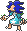
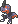
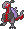
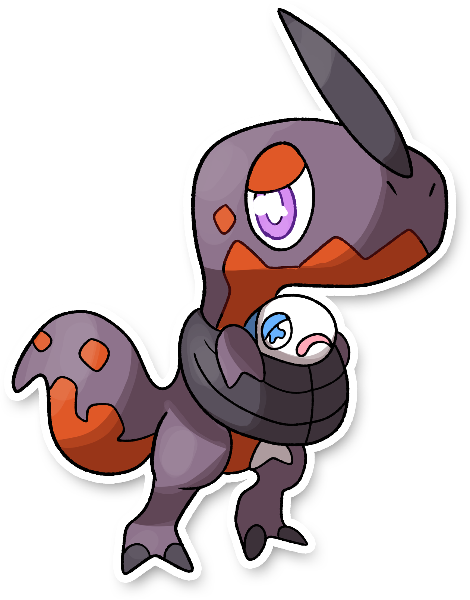
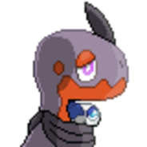
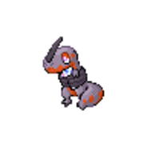
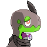
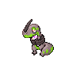

  ⬅️ 
  <a href="https://avventureaditia.github.io/itia-wiki/pokemon/024-indrygard/">024 - Indrygard
    
  </a>
  <strong>025 - Nixiro</strong> 
  
  <a href="https://avventureaditia.github.io/itia-wiki/pokemon/026-scipirock/">026 - Scipirock
    
  </a>
  ➡️

## Pokédex

=== "Tassonomia"
    

      
      

        

          
Class

          

            
Ossuto

          

        

        

          
Types

          

            
            
          

        

        

          
Ability

          

            <a href='' title="Opposing Pokemon cannot eat held Berries while this Pokemon is in battle.  Affected Pokemon can still use bug bite or pluck to eat a target's Berry.">Unnerve</a>
          

        

        

          
Hidden Ability

          

          <a href='' title="Quando al Pokémon rimangono pochi PS, la potenza delle sue mosse di tipo ROCCIA aumenta.">Calcificazione</a>
          

        

        

          
Cry

          

            <audio controls>
              <source src="../../audio/nixiro.mp3" type="audio/mpeg">
            </audio>
          

        

      

    

=== "Aspetto"
    

      
      

        

          
Height

          

            
1,65 m

          

        

        

          
Weight

          

            
84,12 kg

          

        

        

          
Pokédex Color

          

            
Viola

          

        

        

          
Shape

          

            
          

        

      

    

=== "Allevamento"
    

      
      

        

          

            
Catch rate

            

              
45

            

          

          

            
Gender Ratio

            

              
50.0%

              
/

              
50.0%

            

          

        

        

          

            
Egg Groups

            

              
Monster

            

          

          

            
Hatch Time

            

              
30 Cycles

            

          

        

        

          

            
Base experience yield

            

              
70

            

          

          

            
Leveling rate

            

              
Erratic

            

          

        

        

          

            
Base friendship

            

              
70

            

          

          

            
EV yield

            

              
1 - Sp.Attack

            

          

        

      

    

    

## Generali

=== "Descrizione Pokedex"
    ### Descrizione
    
    Molto spesso, a causa delle protuberanze sul suo corpo, le prede di questo pokémon rimangono incastrate.  
    Il suo cibo preferito sono i Wishiwashi, che rimangono vittima di questa trappola.  
    L'indole pacifica di Nixiro lo porta a fare amicizia con il malcapitato.  

    Per maggiori informazioni il [video completo](https://www.youtube.com/watch?v=ZBzH2TlNjMo&list=PLniAakFPn_t9I5zqlYAwZ_iSzJmgu5Nqd&index=4).

=== "Ispirazioni"

    ### Ispirazioni
    Le ispirazioni alla base di Nixiro e della sua catena evolutiva sono:
    
    - **Scipionyx samniticus**: si tratta di un dinosauro il cui fossile è stato trovato in Italia, nello specifico nella zona Napoletana. Si tratta di un fossile conservato talmente bene, che nei tessuti molli trovati, è stato possibile rinvenire anche il fossile di un pesce;
    - **Combustibili fossili**;
    - **Leggenda di San Giorgio e il Drago**.

=== "Vincitore del contest"
    ### Vincitori

    I Vincitori di Itia che hanno dato origine a Nixiro e la sua catena evolutiva sono **Luca** e **Fabio**.

## Base Stats
<table style="width: 100%">
  <tbody style="width: 100%;">
    <tr style="display: flex; align-items: center;">
      <th style="color: #737373;" >HP</th>
      <td style="border-top: none; width: 70px">67</td>
      <td style="width: 100%; min-width: 450px; border-top: none;">
        

        

      </td>
    </tr>
    <tr style="display: flex; align-items: center;">
      <th style="color: #737373;">Attack</th>
      <td style="border-top: none; width: 70px">100</td>
      <td style="width: 100%; min-width: 450px; border-top: none;">
        

        

      </td>
    </tr>
    <tr style="display: flex; align-items: center;">
      <th style="color: #737373;">Defense</th>
      <td style="border-top: none; width: 70px">50</td>
      <td style="width: 100%; min-width: 450px; border-top: none;">
        

        

      </td>
    </tr>
    <tr style="display: flex; align-items: center;">
      <th style="color: #737373;">SP Attack</th>
      <td style="border-top: none; width: 70px">30</td>
      <td style="width: 100%; min-width: 450px; border-top: none;">
        

        

      </td>
    </tr>
    <tr style="display: flex; align-items: center;">
      <th style="color: #737373;">SP Defense</th>
      <td style="border-top: none; width: 70px">45</td>
      <td style="width: 100%; min-width: 450px; border-top: none;">
        

        

      </td>
    </tr>
    <tr style="display: flex; align-items: center;">
      <th style="color: #737373;">Speed</th>
      <td style="border-top: none; width: 70px">58</td>
      <td style="width: 100%; min-width: 450px; border-top: none;">
        

        

      </td>
    </tr>
  </tbody>
</table>

## Aspetto di gioco

=== "Base"
    

      

        
      

      

        
      

    

=== "Shiny"
    

      

        
      

      

        
      

    

##Evolution Change
| Method | Item/Level/Note | Evolved Pokemon |
        | :--: | :--: | :--: |
        | Level Up | 34 | [Scipirock](https://avventureaditia.github.io/itia-wiki/pokemon/026-scipirock/) |
        

## Moveset

=== "Level Up Moves"
    | Level | Name | Power | Accuracy | PP | Type | Damage Class |
        | -- | -- | -- | -- | -- | -- | -- |
        
        

=== "Machine Moves"
    | Machine | Name | Power | Accuracy | PP | Type | Damage Class |
        | -- | -- | -- | -- | -- | -- | -- |
        
        
