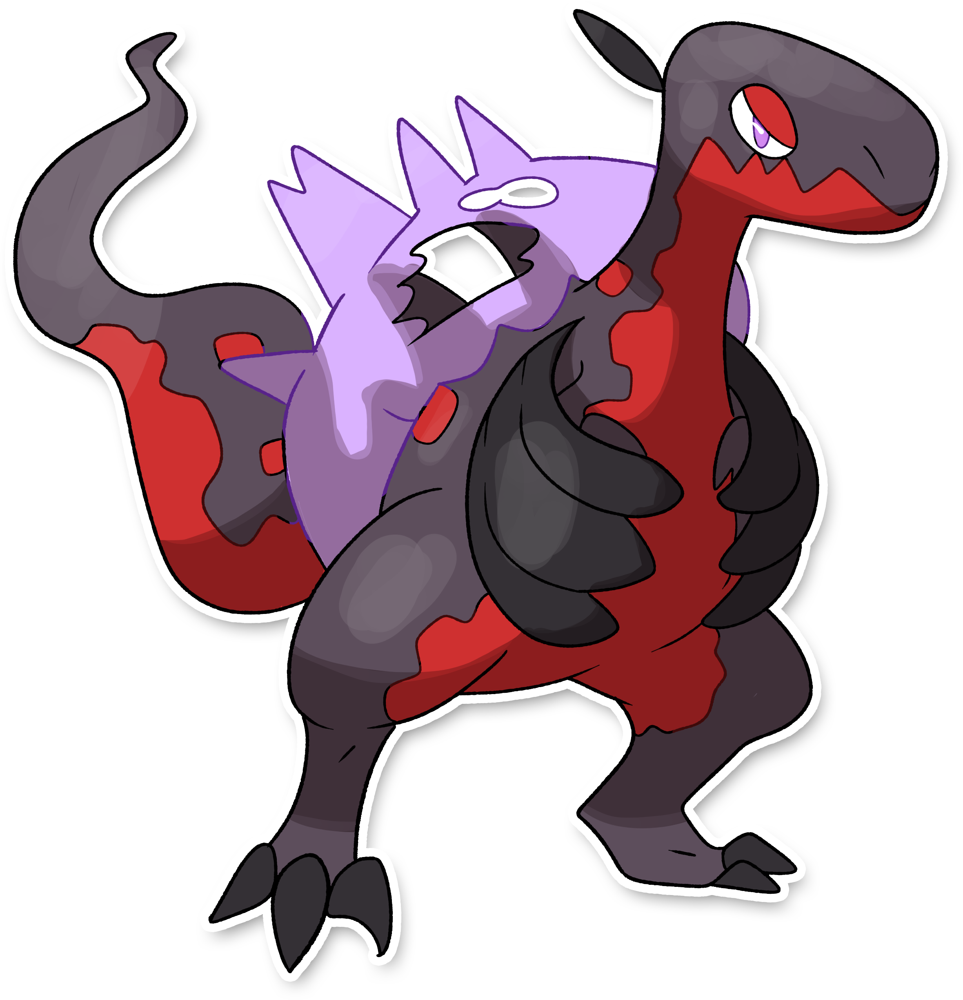

  

  

    

    
Categoria

    

      
Nostalgia

    

  

    

      
Types

      

        
        
      

    

    

      
Abilities

      

        <a href='' title="Opposing Pokemon cannot eat held Berries while this Pokemon is in battle.  Affected Pokemon can still use bug bite or pluck to eat a target's Berry.">Unnerve</a>
        
      

    

    

      
Hidden Ability

      

        
      

    

  

## Generali

=== "Descrizione Pokedex"
    ### Descrizione
    
    Nixiro si evolve quando il suo compagno pesce passa a miglior vita.  
    Il loro rapporto di amicizia nel frattempo è diventato così profondo che lo spirito di Wishiwashi si manifesta sul corpo di Scipirock, donandogli una forza fuori dal comune.  

    Per maggiori informazioni il [video completo](https://www.youtube.com/watch?v=ZBzH2TlNjMo&list=PLniAakFPn_t9I5zqlYAwZ_iSzJmgu5Nqd&index=4).

=== "Ispirazioni"

    ### Ispirazioni
    Le ispirazioni alla base di Nixiro e della sua catena evolutiva sono:
    
    - **Scipionyx samniticus**: si tratta di un dinosauro il cui fossile è stato trovato in Italia, nello specifico nella zona Napoletana. Si tratta di un fossile conservato talmente bene, che nei tessuti molli trovati, è stato possibile rinvenire anche il fossile di un pesce;
    - **Combustibili fossili**;
    - **Leggenda di San Giorgio e il Drago**.

=== "Vincitore del contest"
    ### Vincitori

    I Vincitori di Itia che hanno dato origine a Nixiro e la sua catena evolutiva sono **Luca** e **Fabio**.

## Base Stats
<table style="width: 100%">
  <tbody style="width: 100%;">
    <tr style="display: flex; align-items: center;">
      <th style="color: #737373;" >HP</th>
      <td style="border-top: none; width: 70px">97</td>
      <td style="width: 100%; min-width: 450px; border-top: none;">
        

        

      </td>
    </tr>
    <tr style="display: flex; align-items: center;">
      <th style="color: #737373;">Attack</th>
      <td style="border-top: none; width: 70px">125</td>
      <td style="width: 100%; min-width: 450px; border-top: none;">
        

        

      </td>
    </tr>
    <tr style="display: flex; align-items: center;">
      <th style="color: #737373;">Defense</th>
      <td style="border-top: none; width: 70px">60</td>
      <td style="width: 100%; min-width: 450px; border-top: none;">
        

        

      </td>
    </tr>
    <tr style="display: flex; align-items: center;">
      <th style="color: #737373;">SP Attack</th>
      <td style="border-top: none; width: 70px">50</td>
      <td style="width: 100%; min-width: 450px; border-top: none;">
        

        

      </td>
    </tr>
    <tr style="display: flex; align-items: center;">
      <th style="color: #737373;">SP Defense</th>
      <td style="border-top: none; width: 70px">65</td>
      <td style="width: 100%; min-width: 450px; border-top: none;">
        

        

      </td>
    </tr>
    <tr style="display: flex; align-items: center;">
      <th style="color: #737373;">Speed</th>
      <td style="border-top: none; width: 70px">78</td>
      <td style="width: 100%; min-width: 450px; border-top: none;">
        

        

      </td>
    </tr>
  </tbody>
</table>

## Moveset

=== "Level Up Moves"
    | Level | Name | Power | Accuracy | PP | Type | Damage Class |
        | -- | -- | -- | -- | -- | -- | -- |
        
        

=== "Machine Moves"
    | Machine | Name | Power | Accuracy | PP | Type | Damage Class |
        | -- | -- | -- | -- | -- | -- | -- |
        
        
