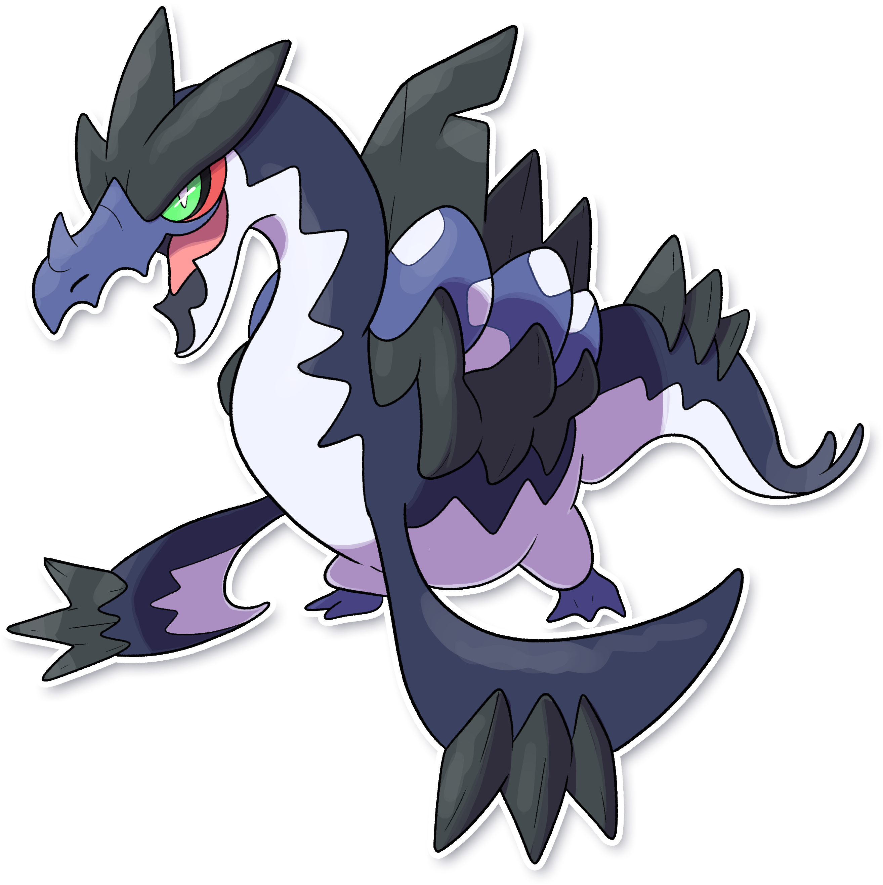
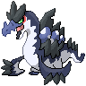

  ⬅️ 
  <a href="https://avventureaditia.github.io/itia-wiki/pokemon/026-scipirock/">026 - Scipirock
    
  </a>
  <strong>027 - Mystrauk</strong> 
  
  <a href="https://avventureaditia.github.io/itia-wiki/pokemon/028-poliphant/">028 - Poliphant
    
  </a>
  ➡️

## Pokédex

=== "Tassonomia"
    

      
      

        

          
Class

          

            
Impostore

          

        

        

          
Types

          

            
            
          

        

        

          
Ability

          

            <a href='' title="Quando il Pokémon subisce un attacco, grazie alla sua pelle ruvida infligge a sua volta danni al Pokémon con cui è entrato in contatto.">Cartavetro</a>/
            <a href='' title="Infligge danni a chi manda KO questo Pokémon entrando in contatto con lui.">Scoppio</a>
          

        

        

          
Hidden Ability

          

          <a href='' title="Le mosse di tipo NORMALE diventano di tipo ROCCIA e la loro potenza aumenta un po'.">Cristallizazione</a>
          

        

        

          
Cry

          

            <audio controls>
              <source src="../../audio/mystrauk.mp3" type="audio/mpeg">
            </audio>
          

        

      

    

=== "Aspetto"
    

      
      

        

          
Height

          

            
2,58 m

          

        

        

          
Weight

          

            
149,12 kg

          

        

        

          
Pokédex Color

          

            
Viola

          

        

        

          
Shape

          

            
          

        

      

    

=== "Allevamento"
    

      
      

        

          

            
Catch rate

            

              
45

            

          

          

            
Gender Ratio

            

              
50.0%

              
/

              
50.0%

            

          

        

        

          

            
Egg Groups

            

              
Monster

            

          

          

            
Hatch Time

            

              
45 Cycles

            

          

        

        

          

            
Base experience yield

            

              
180

            

          

          

            
Leveling rate

            

              
Slow

            

          

        

        

          

            
Base friendship

            

              
70

            

          

          

            
EV yield

            

              
1 - HP

            

          

        

      

    

## Generali

=== "Descrizione Pokedex"
    ### Descrizione

    Si dice che un esemplare di questo Pokémon abiti in un lago della regione di Itia.  
    Per via della sua fisionomia, per molto tempo, è stato scambiato per un enorme rettile marino.   

    Per maggiori informazioni lo [short](https://www.youtube.com/shorts/ANGMspAXa7Q).

=== "Ispirazioni"

    ### Ispirazioni
    Le ispirazioni alla base di Mystrauk sono:
    
    - **Alca Impenne**;
    - **Landoro**;
    - **Bennie il mostro del Lago di Garda**.

=== "Vincitore del contest"
    ### Vincitori

    I Vincitori di Itia che ha dato origine a Mystrauk sono: **Muni**, **Pablitoschio**, **Prismo**, **Steggy boop**, **Tankjo11**, **Umbee**, **Ventuno**.

## Base Stats
<table style="width: 100%">
  <tbody style="width: 100%;">
    <tr style="display: flex; align-items: center;">
      <th style="color: #737373;" >HP</th>
      <td style="border-top: none; width: 70px">90</td>
      <td style="width: 100%; min-width: 450px; border-top: none;">
        

        

      </td>
    </tr>
    <tr style="display: flex; align-items: center;">
      <th style="color: #737373;">Attack</th>
      <td style="border-top: none; width: 70px">130</td>
      <td style="width: 100%; min-width: 450px; border-top: none;">
        

        

      </td>
    </tr>
    <tr style="display: flex; align-items: center;">
      <th style="color: #737373;">Defense</th>
      <td style="border-top: none; width: 70px">95</td>
      <td style="width: 100%; min-width: 450px; border-top: none;">
        

        

      </td>
    </tr>
    <tr style="display: flex; align-items: center;">
      <th style="color: #737373;">SP Attack</th>
      <td style="border-top: none; width: 70px">50</td>
      <td style="width: 100%; min-width: 450px; border-top: none;">
        

        

      </td>
    </tr>
    <tr style="display: flex; align-items: center;">
      <th style="color: #737373;">SP Defense</th>
      <td style="border-top: none; width: 70px">65</td>
      <td style="width: 100%; min-width: 450px; border-top: none;">
        

        

      </td>
    </tr>
    <tr style="display: flex; align-items: center;">
      <th style="color: #737373;">Speed</th>
      <td style="border-top: none; width: 70px">85</td>
      <td style="width: 100%; min-width: 450px; border-top: none;">
        

        

      </td>
    </tr>
  </tbody>
</table>

## Aspetto di gioco

=== "Base"
    

      

        
      

      

        
      

    

=== "Shiny"
    

      

        
      

      

        
      

    

## Moveset

=== "Level Up Moves"
    | Level | Name | Power | Accuracy | PP | Type | Damage Class |
        | -- | -- | -- | -- | -- | -- | -- |
        
        

=== "Machine Moves"
    | Machine | Name | Power | Accuracy | PP | Type | Damage Class |
        | -- | -- | -- | -- | -- | -- | -- |
        
        
