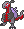
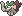

  ⬅️ 
  <a href="https://avventureaditia.github.io/itia-wiki/pokemon/026-scipirock/">026 - Scipirock
    
  </a>
  <strong>027 - Mystrauk</strong> 
  
  <a href="https://avventureaditia.github.io/itia-wiki/pokemon/028-poliphant/">028 - Poliphant
    
  </a>
  ➡️

  

  

    

      
Class

      

        
Impostore

      

    

    

      
Types

      

        
        
      

    

    

      
Abilities

      

        <a href='' title="This Pokemon's Speed is doubled during rain.  This bonus does not count as a stat modifier.">Swift-swim</a>
        
      

    

    

      
Hidden Ability

      

        
      

    

  

## Generali

=== "Descrizione Pokedex"
    ### Descrizione

    Si dice che un esemplare di questo Pokémon abiti in un lago della regione di Itia.  
    Per via della sua fisionomia, per molto tempo, è stato scambiato per un enorme rettile marino.   

    Per maggiori informazioni lo [short](https://www.youtube.com/shorts/ANGMspAXa7Q).

=== "Ispirazioni"

    ### Ispirazioni
    Le ispirazioni alla base di Mystrauk sono:
    
    - **Alca Impenne**;
    - **Landoro**;
    - **Bennie il mostro del Lago di Garda**.

=== "Vincitore del contest"
    ### Vincitori

    I Vincitori di Itia che ha dato origine a Mystrauk sono: **Muni**, **Pablitoschio**, **Prismo**, **Steggy boop**, **Tankjo11**, **Umbee**, **Ventuno**.

## Base Stats
<table style="width: 100%">
  <tbody style="width: 100%;">
    <tr style="display: flex; align-items: center;">
      <th style="color: #737373;" >HP</th>
      <td style="border-top: none; width: 70px">1</td>
      <td style="width: 100%; min-width: 450px; border-top: none;">
        

        

      </td>
    </tr>
    <tr style="display: flex; align-items: center;">
      <th style="color: #737373;">Attack</th>
      <td style="border-top: none; width: 70px">1</td>
      <td style="width: 100%; min-width: 450px; border-top: none;">
        

        

      </td>
    </tr>
    <tr style="display: flex; align-items: center;">
      <th style="color: #737373;">Defense</th>
      <td style="border-top: none; width: 70px">1</td>
      <td style="width: 100%; min-width: 450px; border-top: none;">
        

        

      </td>
    </tr>
    <tr style="display: flex; align-items: center;">
      <th style="color: #737373;">SP Attack</th>
      <td style="border-top: none; width: 70px">1</td>
      <td style="width: 100%; min-width: 450px; border-top: none;">
        

        

      </td>
    </tr>
    <tr style="display: flex; align-items: center;">
      <th style="color: #737373;">SP Defense</th>
      <td style="border-top: none; width: 70px">1</td>
      <td style="width: 100%; min-width: 450px; border-top: none;">
        

        

      </td>
    </tr>
    <tr style="display: flex; align-items: center;">
      <th style="color: #737373;">Speed</th>
      <td style="border-top: none; width: 70px">1</td>
      <td style="width: 100%; min-width: 450px; border-top: none;">
        

        

      </td>
    </tr>
  </tbody>
</table>

## Moveset

=== "Level Up Moves"
    | Level | Name | Power | Accuracy | PP | Type | Damage Class |
        | -- | -- | -- | -- | -- | -- | -- |
        
        

=== "Machine Moves"
    | Machine | Name | Power | Accuracy | PP | Type | Damage Class |
        | -- | -- | -- | -- | -- | -- | -- |
        
        
