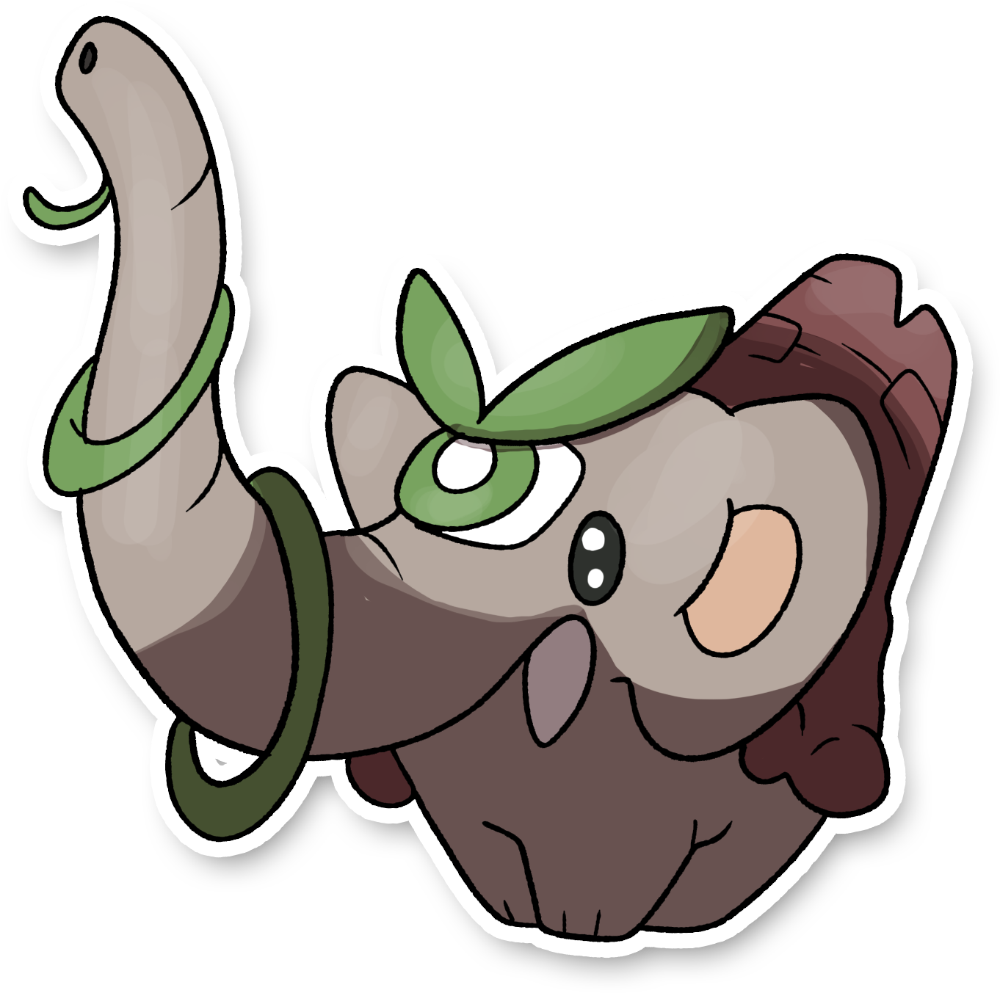
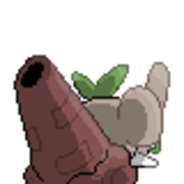
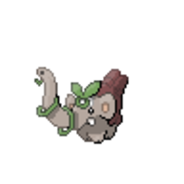
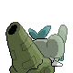
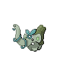

  ⬅️ 
  <a href="https://avventureaditia.github.io/itia-wiki/pokemon/027-mystrauk/">027 - Mystrauk
    
  </a>
  <strong>028 - Poliphant</strong> 
  
  <a href="https://avventureaditia.github.io/itia-wiki/pokemon/029-tendephant/">029 - Tendephant
    
  </a>
  ➡️

## Pokédex

=== "Tassonomia"
    

      
      

        

          
Class

          

            
Ciclope

          

        

        

          
Types

          

            
            
          

        

        

          
Ability

          

          <a href='' title="When this Pokemon is at full HP, any hit that would knock it out will instead leave it with 1 HP.  Regardless of its current HP, it is also immune to the one-hit KO moves: fissure, guillotine, horn drill, and sheer cold.  If this Pokemon is holding a focus sash, this ability takes precedence and the item will not be consumed.">Sturdy</a>/
          <a href='' title="Il Pokémon recupera un po’ di PS quando lascia il campo.">Rigenergia</a>
          

        

        

          
Hidden Ability

          

          <a href='' title="Se il Pokémon viene colpito da una mossa di tipo ERBA, la neutralizza e aumenta il proprio Attacco.">Mangiaerba</a>
          

        

        

          
Cry

          

            <audio controls>
              <source src="../../audio/poliphant.mp3" type="audio/mpeg">
            </audio>
          

        

      

    

=== "Aspetto"
    

      
      

        

          
Height

          

            
3,28 m

          

        

        

          
Weight

          

            
61,54 kg

          

        

        

          
Pokédex Color

          

            
Viola

          

        

        

          
Shape

          

            
          

        

      

    

=== "Allevamento"
    

      
      

        

          

            
Catch rate

            

              
45

            

          

          

            
Gender Ratio

            

              
50.0%

              
/

              
50.0%

            

          

        

        

          

            
Egg Groups

            

              
Monster

            

          

          

            
Hatch Time

            

              
30 Cycles

            

          

        

        

          

            
Base experience yield

            

              
70

            

          

          

            
Leveling rate

            

              
Erratic

            

          

        

        

          

            
Base friendship

            

              
70

            

          

          

            
EV yield

            

              
1 - Defense

            

          

        

      

    

## Generali

=== "Descrizione Pokedex"
    ### Descrizione
    
    Hanno in capo una protuberanza a forma di occhio che serve a spaventare i possibili carnivori in cerca di cibo.  
    La loro bassa statura però, gli impedisce di arrivare alle foglie degli alberi, dovendo accontentarsi di ciò che trovano a terra.  

    Per maggiori informazioni il [video completo](https://www.youtube.com/watch?v=ZBzH2TlNjMo&list=PLniAakFPn_t9I5zqlYAwZ_iSzJmgu5Nqd&index=4).

=== "Ispirazioni"

    ### Ispirazioni
    Le ispirazioni alla base di Poliphant e della sua catena evolutiva sono:
    
    - **Elefanti nani siciliani**: il ritrovamento di questi fossili che presentavano un cranio con un'enorme foro al centro della testa, fecero credere in tempi antichi che l'isola fosse la terra dei Ciclopi;
    - **Elefanti da guerra**: utilizzati in guerra da Cartagine e che attraversarono le Alpi.

=== "Vincitore del contest"
    ### Vincitori

    I Vincitori di Itia che hanno dato origine a Poliphant e la sua catena evolutiva sono **Pino** e **Nicolo**.

## Base Stats
<table style="width: 100%">
  <tbody style="width: 100%;">
    <tr style="display: flex; align-items: center;">
      <th style="color: #737373;" >HP</th>
      <td style="border-top: none; width: 70px">30</td>
      <td style="width: 100%; min-width: 450px; border-top: none;">
        

        

      </td>
    </tr>
    <tr style="display: flex; align-items: center;">
      <th style="color: #737373;">Attack</th>
      <td style="border-top: none; width: 70px">60</td>
      <td style="width: 100%; min-width: 450px; border-top: none;">
        

        

      </td>
    </tr>
    <tr style="display: flex; align-items: center;">
      <th style="color: #737373;">Defense</th>
      <td style="border-top: none; width: 70px">100</td>
      <td style="width: 100%; min-width: 450px; border-top: none;">
        

        

      </td>
    </tr>
    <tr style="display: flex; align-items: center;">
      <th style="color: #737373;">SP Attack</th>
      <td style="border-top: none; width: 70px">42</td>
      <td style="width: 100%; min-width: 450px; border-top: none;">
        

        

      </td>
    </tr>
    <tr style="display: flex; align-items: center;">
      <th style="color: #737373;">SP Defense</th>
      <td style="border-top: none; width: 70px">88</td>
      <td style="width: 100%; min-width: 450px; border-top: none;">
        

        

      </td>
    </tr>
    <tr style="display: flex; align-items: center;">
      <th style="color: #737373;">Speed</th>
      <td style="border-top: none; width: 70px">30</td>
      <td style="width: 100%; min-width: 450px; border-top: none;">
        

        

      </td>
    </tr>
  </tbody>
</table>

## Aspetto di gioco

=== "Base"
    

      

        
      

      

        
      

    

=== "Shiny"
    

      

        
      

      

        
      

    

##Evolution Change
| Method | Item/Level/Note | Evolved Pokemon |
        | :--: | :--: | :--: |
        | Level Up | 34 | [Tendephant](https://avventureaditia.github.io/itia-wiki/pokemon/029-tendephant/) |
        

## Moveset

=== "Level Up Moves"
    | Level | Name | Power | Accuracy | PP | Type | Damage Class |
        | -- | -- | -- | -- | -- | -- | -- |
        
        

=== "Machine Moves"
    | Machine | Name | Power | Accuracy | PP | Type | Damage Class |
        | -- | -- | -- | -- | -- | -- | -- |
        
        
