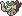
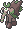
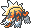
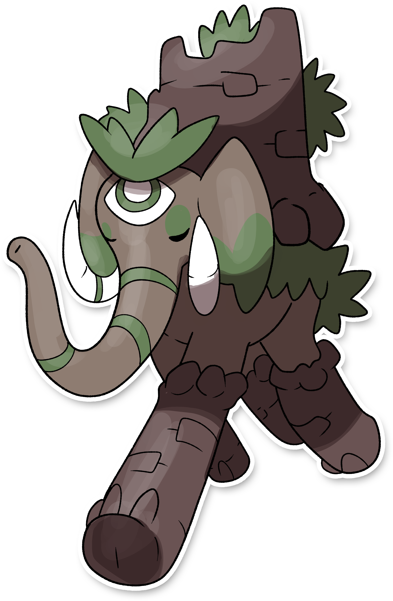

  ⬅️ 
  <a href="https://avventureaditia.github.io/itia-wiki/pokemon/029-poliphant/">028 - Poliphant
    
  </a>
  <strong>029 - Tendephant</strong> 
  
  <a href="https://avventureaditia.github.io/itia-wiki/pokemon/030-easplosion/">030 - Easplosion
    
  </a>
  ➡️

  

  

    

    
Categoria

    

      
Torre

    

  

    

      
Types

      

        
        
      

    

    

      
Abilities

      

        <a href='' title="When this Pokemon is at full HP, any hit that would knock it out will instead leave it with 1 HP.  Regardless of its current HP, it is also immune to the one-hit KO moves: fissure, guillotine, horn drill, and sheer cold.  If this Pokemon is holding a focus sash, this ability takes precedence and the item will not be consumed.">Sturdy</a>
        
      

    

    

      
Hidden Ability

      

        
      

    

  

## Generali

=== "Descrizione Pokedex"
    ### Descrizione
    
    Per superare il problema dell'altezza, con l'evoluzione questo pokémon sviluppa delle grosse colonne rocciose sulle zampe, che servono sia per il movimento che difesa.  
    L'occhio sulla fronte a quanto pare, è diventato vero.  

    Per maggiori informazioni il [video completo](https://www.youtube.com/watch?v=ZBzH2TlNjMo&list=PLniAakFPn_t9I5zqlYAwZ_iSzJmgu5Nqd&index=4).

=== "Ispirazioni"

    ### Ispirazioni
    Le ispirazioni alla base di Poliphant e della sua catena evolutiva sono:
    
    - **Elefanti nani siciliani**: il ritrovamento di questi fossili che presentavano un cranio con un'enorme foro al centro della testa, fecero credere in tempi antichi che l'isola fosse la terra dei Ciclopi;
    - **Elefanti da guerra**: utilizzati in guerra da Cartagine e che attraversarono le Alpi.

=== "Vincitore del contest"
    ### Vincitori

    I Vincitori di Itia che hanno dato origine a Poliphant e la sua catena evolutiva sono **Pino** e **Nicolo**.

## Base Stats
<table style="width: 100%">
  <tbody style="width: 100%;">
    <tr style="display: flex; align-items: center;">
      <th style="color: #737373;" >HP</th>
      <td style="border-top: none; width: 70px">70</td>
      <td style="width: 100%; min-width: 450px; border-top: none;">
        

        

      </td>
    </tr>
    <tr style="display: flex; align-items: center;">
      <th style="color: #737373;">Attack</th>
      <td style="border-top: none; width: 70px">80</td>
      <td style="width: 100%; min-width: 450px; border-top: none;">
        

        

      </td>
    </tr>
    <tr style="display: flex; align-items: center;">
      <th style="color: #737373;">Defense</th>
      <td style="border-top: none; width: 70px">130</td>
      <td style="width: 100%; min-width: 450px; border-top: none;">
        

        

      </td>
    </tr>
    <tr style="display: flex; align-items: center;">
      <th style="color: #737373;">SP Attack</th>
      <td style="border-top: none; width: 70px">47</td>
      <td style="width: 100%; min-width: 450px; border-top: none;">
        

        

      </td>
    </tr>
    <tr style="display: flex; align-items: center;">
      <th style="color: #737373;">SP Defense</th>
      <td style="border-top: none; width: 70px">118</td>
      <td style="width: 100%; min-width: 450px; border-top: none;">
        

        

      </td>
    </tr>
    <tr style="display: flex; align-items: center;">
      <th style="color: #737373;">Speed</th>
      <td style="border-top: none; width: 70px">50</td>
      <td style="width: 100%; min-width: 450px; border-top: none;">
        

        

      </td>
    </tr>
  </tbody>
</table>

## Moveset

=== "Level Up Moves"
    | Level | Name | Power | Accuracy | PP | Type | Damage Class |
        | -- | -- | -- | -- | -- | -- | -- |
        
        

=== "Machine Moves"
    | Machine | Name | Power | Accuracy | PP | Type | Damage Class |
        | -- | -- | -- | -- | -- | -- | -- |
        
        
