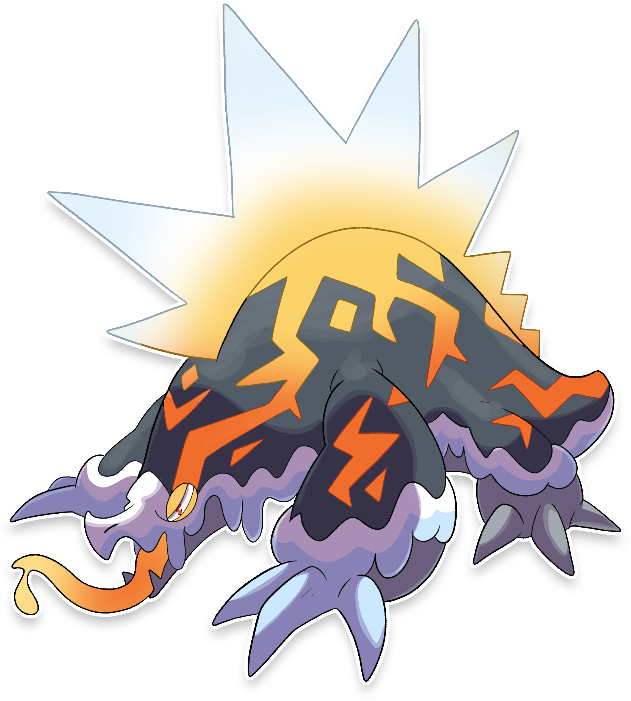
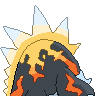
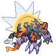

  ⬅️ 
  <a href="https://avventureaditia.github.io/itia-wiki/pokemon/029-tendephant/">029 - Tendephant
    
  </a>
  <strong>030 - Easplosion</strong> 
  
  <a href="https://avventureaditia.github.io/itia-wiki/pokemon/031-fromses/">031 - Fromses
    
  </a>
  ➡️

## Pokédex

=== "Tassonomia"
    

      
      

        

          
Class

          

            
Catastrofe

          

        

        

          
Types

          

            
            
          

        

        

          
Ability

          

          <a href='' title="Quando il Pokémon entra in campo, riduce l'ATTACCO SPECIALE dei nemici infastiditi.">Fastidio</a>/
          <a href='' title="Aumenta l'ATTACCO SPECIALE ma costringe il Pokémon a usare solo la prima mossa selezionata.">Schema Mentale</a>
          

        

        

          
Hidden Ability

          

          <a href='' title="Impedisce al Pokémon di venire scottato e aumenta il suo Attacco se subisce una mossa di tipo Fuoco.">Termoscambio</a>
          

        

        

          
Cry

          

            <audio controls>
              <source src="../../audio/easplosion.mp3" type="audio/mpeg">
            </audio>
          

        

      

    

=== "Aspetto"
    

      
      

        

          
Height

          

            
6,12 m

          

        

        

          
Weight

          

            
261,26 kg

          

        

        

          
Pokédex Color

          

            
Blue

          

        

        

          
Shape

          

            
          

        

      

    

=== "Allevamento"
    

      
      

        

          

            
Catch rate

            

              
40

            

          

          

            
Gender Ratio

            

              
50.0%

              
/

              
50.0%

            

          

        

        

          

            
Egg Groups

            

              
Field and Monster

            

          

          

            
Hatch Time

            

              
40 Cycles

            

          

        

        

          

            
Base experience yield

            

              
187

            

          

          

            
Leveling rate

            

              
Slow

            

          

        

        

          

            
Base friendship

            

              
70

            

          

          

            
EV yield

            

              
2 - Sp.Attack

            

          

        

      

    

## Generali

=== "Descrizione Pokedex"
    ### Descrizione

    Sono Pokémon molto territoriali, la loro difesa e arma principale è la saliva infuocata, prodotta da delle ghiandole nella parte superiore della schiena.  

    Per maggiori informazioni lo [short](https://www.youtube.com/shorts/ANGMspAXa7Q).

=== "Ispirazioni"

    ### Ispirazioni
    Le ispirazioni alla base di Easplosion sono:
    
    - **Eruzione di Pompei**;
    - **Ramarro Orientale**;
    - **Riscaldamento globale**;
    - **Filmografia di Sergio Leone**.

=== "Vincitore del contest"
    ### Vincitore

    Il Vincitore di Itia che ha dato origine a Easplosion è **IlDaddo**.

## Base Stats
<table style="width: 100%">
  <tbody style="width: 100%;">
    <tr style="display: flex; align-items: center;">
      <th style="color: #737373;" >HP</th>
      <td style="border-top: none; width: 70px">93</td>
      <td style="width: 100%; min-width: 450px; border-top: none;">
        

        

      </td>
    </tr>
    <tr style="display: flex; align-items: center;">
      <th style="color: #737373;">Attack</th>
      <td style="border-top: none; width: 70px">60</td>
      <td style="width: 100%; min-width: 450px; border-top: none;">
        

        

      </td>
    </tr>
    <tr style="display: flex; align-items: center;">
      <th style="color: #737373;">Defense</th>
      <td style="border-top: none; width: 70px">65</td>
      <td style="width: 100%; min-width: 450px; border-top: none;">
        

        

      </td>
    </tr>
    <tr style="display: flex; align-items: center;">
      <th style="color: #737373;">SP Attack</th>
      <td style="border-top: none; width: 70px">150</td>
      <td style="width: 100%; min-width: 450px; border-top: none;">
        

        

      </td>
    </tr>
    <tr style="display: flex; align-items: center;">
      <th style="color: #737373;">SP Defense</th>
      <td style="border-top: none; width: 70px">45</td>
      <td style="width: 100%; min-width: 450px; border-top: none;">
        

        

      </td>
    </tr>
    <tr style="display: flex; align-items: center;">
      <th style="color: #737373;">Speed</th>
      <td style="border-top: none; width: 70px">102</td>
      <td style="width: 100%; min-width: 450px; border-top: none;">
        

        

      </td>
    </tr>
  </tbody>
</table>

## Aspetto di gioco

=== "Base"
    

      

        
      

      

        
      

    

=== "Shiny"
    

      

        
      

      

        
      

    

## Moveset

=== "Level Up Moves"
    | Level | Name | Power | Accuracy | PP | Type | Damage Class |
        | -- | -- | -- | -- | -- | -- | -- |
        
        

=== "Machine Moves"
    | Machine | Name | Power | Accuracy | PP | Type | Damage Class |
        | -- | -- | -- | -- | -- | -- | -- |
        
        
