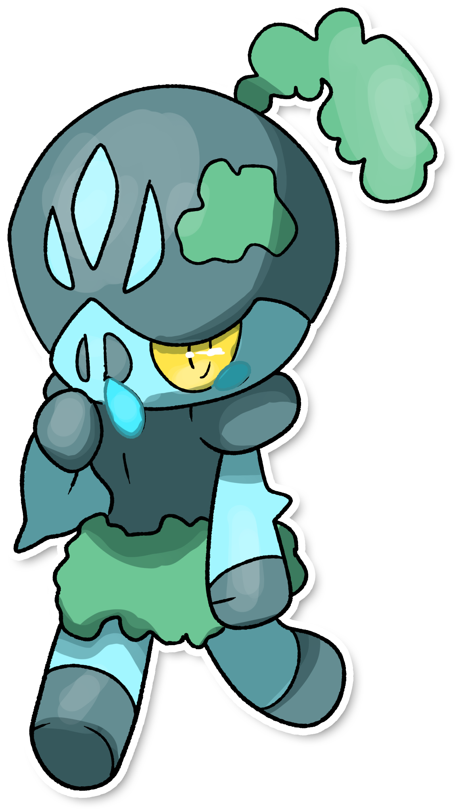

  ⬅️ 
  <a href="https://avventureaditia.github.io/itia-wiki/pokemon/030-easplosion/">030 - Easplosion
    
  </a>
  <strong>031 - Fromses</strong> 
  
  <a href="https://avventureaditia.github.io/itia-wiki/pokemon/032-glaspirit/">032 - Glaspirit
    
  </a>
  ➡️

  

  

    

    
Categoria

    

      
Moccio

    

  

    

      
Types

      

        
        
      

    

    

      
Abilities

      

        <a href='' title="During hail, this Pokemon has 1.25x its evasion, and it does not take hail damage regardless of type.  The evasion bonus does not count as a stat modifier.  Overworld: If the lead Pokemon has this ability, the wild encounter rate is halved in snow.">Snow-cloak</a>
        
      

    

    

      
Hidden Ability

      

        
      

    

  

## Generali

=== "Descrizione Pokedex"
    ### Descrizione
    
    Questo Pokémon non sembra godere di buona salute, infatti il suo naso è sempre gocciolante.  
    Non è combattivo e preferisce essere accudito e protetto da specie di altri pokémon più grossi di lui.  
    Più il muschio sul suo corpo aumenta, più sembra essere prossimo alla sua evoluzione.  

    Per maggiori informazioni il [video completo](https://www.youtube.com/watch?v=cO1HPwF5_E4&list=PLniAakFPn_t9I5zqlYAwZ_iSzJmgu5Nqd&index=5).

=== "Ispirazioni"

    ### Ispirazioni
    Le ispirazioni alla base di Fromses e della sua catena evolutiva sono:
    
    - **Leggenda del Gran Sasso e del Gigante Ermes**.

=== "Vincitore del contest"
    ### Vincitore

    Il Vincitore di Itia che ha dato origine a Fromses e la sua catena evolutiva è **Lorenzo**.

## Base Stats
<table style="width: 100%">
  <tbody style="width: 100%;">
    <tr style="display: flex; align-items: center;">
      <th style="color: #737373;" >HP</th>
      <td style="border-top: none; width: 70px">55</td>
      <td style="width: 100%; min-width: 450px; border-top: none;">
        

        

      </td>
    </tr>
    <tr style="display: flex; align-items: center;">
      <th style="color: #737373;">Attack</th>
      <td style="border-top: none; width: 70px">70</td>
      <td style="width: 100%; min-width: 450px; border-top: none;">
        

        

      </td>
    </tr>
    <tr style="display: flex; align-items: center;">
      <th style="color: #737373;">Defense</th>
      <td style="border-top: none; width: 70px">40</td>
      <td style="width: 100%; min-width: 450px; border-top: none;">
        

        

      </td>
    </tr>
    <tr style="display: flex; align-items: center;">
      <th style="color: #737373;">SP Attack</th>
      <td style="border-top: none; width: 70px">60</td>
      <td style="width: 100%; min-width: 450px; border-top: none;">
        

        

      </td>
    </tr>
    <tr style="display: flex; align-items: center;">
      <th style="color: #737373;">SP Defense</th>
      <td style="border-top: none; width: 70px">40</td>
      <td style="width: 100%; min-width: 450px; border-top: none;">
        

        

      </td>
    </tr>
    <tr style="display: flex; align-items: center;">
      <th style="color: #737373;">Speed</th>
      <td style="border-top: none; width: 70px">40</td>
      <td style="width: 100%; min-width: 450px; border-top: none;">
        

        

      </td>
    </tr>
  </tbody>
</table>

##Evolution Change
| Method | Item/Level/Note | Evolved Pokemon |
        | :--: | :--: | :--: |
        | Level Up | 38 | [Glaspirit](https://avventureaditia.github.io/itia-wiki/pokemon/031-fromses/) |
        

## Moveset

=== "Level Up Moves"
    | Level | Name | Power | Accuracy | PP | Type | Damage Class |
        | -- | -- | -- | -- | -- | -- | -- |
        
        

=== "Machine Moves"
    | Machine | Name | Power | Accuracy | PP | Type | Damage Class |
        | -- | -- | -- | -- | -- | -- | -- |
        
        
