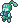
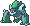
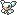
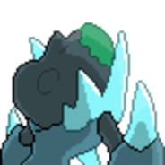
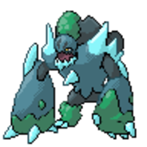
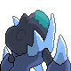
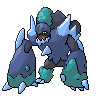

  ⬅️ 
  <a href="https://avventureaditia.github.io/itia-wiki/pokemon/031-fromses/">031 - Fromses
    
  </a>
  <strong>032 - Glaspirit</strong> 
  
  <a href="https://avventureaditia.github.io/itia-wiki/pokemon/033-batcot/">033 - Batcot
    
  </a>
  ➡️

## Pokédex

=== "Tassonomia"
    

      
      

        

          
Class

          

            
Titano

          

        

        

          
Types

          

            
            
          

        

        

          
Ability

          

            <a href='' title="During hail, this Pokemon has 1.25x its evasion, and it does not take hail damage regardless of type.  The evasion bonus does not count as a stat modifier.  Overworld: If the lead Pokemon has this ability, the wild encounter rate is halved in snow.">Snow-cloak</a>/
            <a href='' title="Quando al Pokémon rimangono pochi PS, la potenza delle sue mosse di tipo ROCCIA aumenta.">Calcificazione</a>
          

        

        

          
Hidden Ability

          

          <a href='' title="Aumenta la potenza delle mosse, ma ne annulla gli effetti aggiuntivi.">Forzabruta</a>
          

        

        

          
Cry

          

            <audio controls>
              <source src="../../audio/glaspirit.mp3" type="audio/mpeg">
            </audio>
          

        

      

    

=== "Aspetto"
    

      
      

        

          
Height

          

            
2,17 m

          

        

        

          
Weight

          

            
95,87 kg

          

        

        

          
Pokédex Color

          

            
Ciano

          

        

        

          
Shape

          

            
          

        

      

    

=== "Allevamento"
    

      
      

        

          

            
Catch rate

            

              
70

            

          

          

            
Gender Ratio

            

              
50.0%

              
/

              
50.0%

            

          

        

        

          

            
Egg Groups

            

              
Monster and Field

            

          

          

            
Hatch Time

            

              
30 Cycles

            

          

        

        

          

            
Base experience yield

            

              
136

            

          

          

            
Leveling rate

            

              
Medium Fast

            

          

        

        

          

            
Base friendship

            

              
70

            

          

          

            
EV yield

            

              
2 - Defence

            

          

        

      

    

## Generali

=== "Descrizione Pokedex"
    ### Descrizione
    
    I Fromses che riescono a farsi avanti allenandosi e non volendo più essere protetti, riescono ad evolversi in Glaspirit.  
    Questi enormi giganti di ghiaccio non si muovono molto, ma hanno una forza spaventosa.  
    Restano fermi e immobili sotto la neve, facendo fuoriuscire solo la parte superiore del corpo, che sembra ricordare un volto umano.  

    Per maggiori informazioni il [video completo](https://www.youtube.com/watch?v=cO1HPwF5_E4&list=PLniAakFPn_t9I5zqlYAwZ_iSzJmgu5Nqd&index=5).

=== "Ispirazioni"

    ### Ispirazioni
    Le ispirazioni alla base di Fromses e della sua catena evolutiva sono:
    
    - **Leggenda del Gran Sasso e del Gigante Ermes**.

=== "Vincitore del contest"
    ### Vincitore

    Il Vincitore di Itia che ha dato origine a Fromses e la sua catena evolutiva è **Lorenzo**.

## Base Stats
<table style="width: 100%">
  <tbody style="width: 100%;">
    <tr style="display: flex; align-items: center;">
      <th style="color: #737373;" >HP</th>
      <td style="border-top: none; width: 70px">95</td>
      <td style="width: 100%; min-width: 450px; border-top: none;">
        

        

      </td>
    </tr>
    <tr style="display: flex; align-items: center;">
      <th style="color: #737373;">Attack</th>
      <td style="border-top: none; width: 70px">130</td>
      <td style="width: 100%; min-width: 450px; border-top: none;">
        

        

      </td>
    </tr>
    <tr style="display: flex; align-items: center;">
      <th style="color: #737373;">Defense</th>
      <td style="border-top: none; width: 70px">80</td>
      <td style="width: 100%; min-width: 450px; border-top: none;">
        

        

      </td>
    </tr>
    <tr style="display: flex; align-items: center;">
      <th style="color: #737373;">SP Attack</th>
      <td style="border-top: none; width: 70px">70</td>
      <td style="width: 100%; min-width: 450px; border-top: none;">
        

        

      </td>
    </tr>
    <tr style="display: flex; align-items: center;">
      <th style="color: #737373;">SP Defense</th>
      <td style="border-top: none; width: 70px">80</td>
      <td style="width: 100%; min-width: 450px; border-top: none;">
        

        

      </td>
    </tr>
    <tr style="display: flex; align-items: center;">
      <th style="color: #737373;">Speed</th>
      <td style="border-top: none; width: 70px">50</td>
      <td style="width: 100%; min-width: 450px; border-top: none;">
        

        

      </td>
    </tr>
  </tbody>
</table>

## Aspetto di gioco

=== "Base"
    

      

        
      

      

        
      

    

=== "Shiny"
    

      

        
      

      

        
      

    

## Moveset

=== "Level Up Moves"
    | Level | Name | Power | Accuracy | PP | Type | Damage Class |
        | -- | -- | -- | -- | -- | -- | -- |
        
        

=== "Machine Moves"
    | Machine | Name | Power | Accuracy | PP | Type | Damage Class |
        | -- | -- | -- | -- | -- | -- | -- |
        
        
