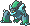
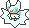

  ⬅️ 
  <a href="https://avventureaditia.github.io/itia-wiki/pokemon/032-glaspirit/">032 - Glaspirit
    
  </a>
  <strong>033 - Batcot</strong> 
  
  <a href="https://avventureaditia.github.io/itia-wiki/pokemon/034-flakewing/">034 - Flakewing
    
  </a>
  ➡️

## Pokédex

=== "Tassonomia"
    

      
      

        

          
Class

          

            
Pipistrello

          

        

        

          
Types

          

            
            
          

        

        

          
Ability

          

            <a href='' title="This Pokemon is immune to ground-type moves, spikes, toxic spikes, and arena trap.  This ability is disabled during gravity or ingrain, or while holding an iron ball.  This ability is not disabled during roost.">Levitate</a>
          

        

        

          
Hidden Ability

          

          <a href='' title="Protegge totalmente dalle mosse sonore.">Antisuono</a>
          

        

        

          
Cry

          

            <audio controls>
              <source src="../../audio/batcot.mp3" type="audio/mpeg">
            </audio>
          

        

      

    

=== "Aspetto"
    

      
      

        

          
Height

          

            
0,32 m

          

        

        

          
Weight

          

            
5,18 kg

          

        

        

          
Pokédex Color

          

            
Ciano

          

        

        

          
Shape

          

            
          

        

      

    

=== "Allevamento"
    

      
      

        

          

            
Catch rate

            

              
100

            

          

          

            
Gender Ratio

            

              
50.0%

              
/

              
50.0%

            

          

        

        

          

            
Egg Groups

            

              
Flying and Fairy

            

          

          

            
Hatch Time

            

              
35 Cycles

            

          

        

        

          

            
Base experience yield

            

              
66

            

          

          

            
Leveling rate

            

              
Slow

            

          

        

        

          

            
Base friendship

            

              
70

            

          

          

            
EV yield

            

              
1 - Attack

            

          

        

      

    

## Generali

=== "Descrizione Pokedex"
    ### Descrizione
    
    Usa la membrana che ha sulla testa e sulle ali per proteggersi dal freddo.  
    Per evitare i predatori Batcot cerca di atterrare sulla neve il meno possibile, così da non lasciare impronte e segni del suo passaggio.  
    Purtroppo, il suo dolce aroma attrae più pokémon del previsto.  

    Per maggiori informazioni il [video completo](https://www.youtube.com/watch?v=cO1HPwF5_E4&list=PLniAakFPn_t9I5zqlYAwZ_iSzJmgu5Nqd&index=5).

=== "Ispirazioni"

    ### Ispirazioni
    Le ispirazioni alla base di Batcot e della sua catena evolutiva sono:
    
    - **Mantelloni**: creature mostruose simili ad esseri umani ma con braccia sproporzionatamente lunghe e senza piedi. Hanno la capacità di trasformarsi in pipistrelli;
    - **Lince**;
    - **Volpe volante**;
    - **Fiocchi di neve**;
    - **Torta di Knam**.

=== "Vincitore del contest"
    ### Vincitore

    Il Vincitore di Itia che ha dato origine a Batcot e la sua catena evolutiva è **Luca**.

## Base Stats
<table style="width: 100%">
  <tbody style="width: 100%;">
    <tr style="display: flex; align-items: center;">
      <th style="color: #737373;" >HP</th>
      <td style="border-top: none; width: 70px">40</td>
      <td style="width: 100%; min-width: 450px; border-top: none;">
        

        

      </td>
    </tr>
    <tr style="display: flex; align-items: center;">
      <th style="color: #737373;">Attack</th>
      <td style="border-top: none; width: 70px">45</td>
      <td style="width: 100%; min-width: 450px; border-top: none;">
        

        

      </td>
    </tr>
    <tr style="display: flex; align-items: center;">
      <th style="color: #737373;">Defense</th>
      <td style="border-top: none; width: 70px">35</td>
      <td style="width: 100%; min-width: 450px; border-top: none;">
        

        

      </td>
    </tr>
    <tr style="display: flex; align-items: center;">
      <th style="color: #737373;">SP Attack</th>
      <td style="border-top: none; width: 70px">30</td>
      <td style="width: 100%; min-width: 450px; border-top: none;">
        

        

      </td>
    </tr>
    <tr style="display: flex; align-items: center;">
      <th style="color: #737373;">SP Defense</th>
      <td style="border-top: none; width: 70px">40</td>
      <td style="width: 100%; min-width: 450px; border-top: none;">
        

        

      </td>
    </tr>
    <tr style="display: flex; align-items: center;">
      <th style="color: #737373;">Speed</th>
      <td style="border-top: none; width: 70px">55</td>
      <td style="width: 100%; min-width: 450px; border-top: none;">
        

        

      </td>
    </tr>
  </tbody>
</table>

## Aspetto di gioco

=== "Base"
    

      

        
      

      

        
      

    

=== "Shiny"
    

      

        
      

      

        
      

    

    

##Evolution Change
| Method | Item/Level/Note | Evolved Pokemon |
        | :--: | :--: | :--: |
        | Level Up | 28 | [Flakewing](https://avventureaditia.github.io/itia-wiki/pokemon/034-flakewing/) |
        

## Moveset

=== "Level Up Moves"
    | Level | Name | Power | Accuracy | PP | Type | Damage Class |
        | -- | -- | -- | -- | -- | -- | -- |
        
        

=== "Machine Moves"
    | Machine | Name | Power | Accuracy | PP | Type | Damage Class |
        | -- | -- | -- | -- | -- | -- | -- |
        
        
