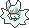
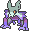
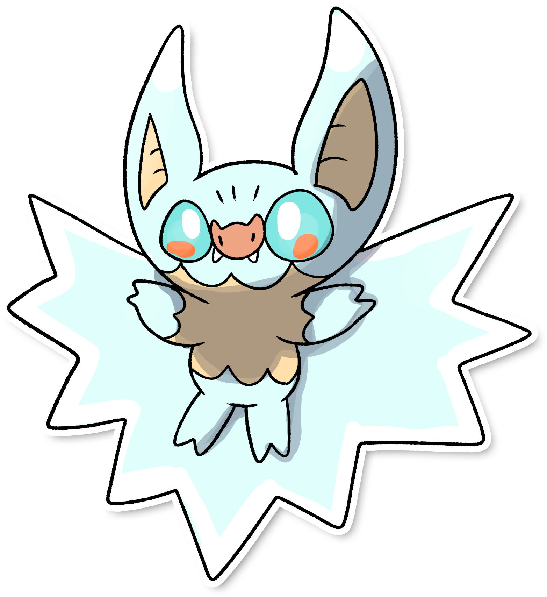

  ⬅️ 
  <a href="https://avventureaditia.github.io/itia-wiki/pokemon/033-batcot/">033 - Batcot
    
  </a>
  <strong>034 - Flakewing</strong> 
  
  <a href="https://avventureaditia.github.io/itia-wiki/pokemon/035-skulknam/">035 - Skulknam
    
  </a>
  ➡️

  

  

    

    
Categoria

    

      
Pipistrello

    

  

    

      
Types

      

        
        
      

    

    

      
Abilities

      

        <a href='' title="This Pokemon is immune to ground-type moves, spikes, toxic spikes, and arena trap.  This ability is disabled during gravity or ingrain, or while holding an iron ball.  This ability is not disabled during roost.">Levitate</a>
        
      

    

    

      
Hidden Ability

      

        
      

    

  

## Generali

=== "Descrizione Pokedex"
    ### Descrizione
    
    Con l'evoluzione, Flakewing allarga la sua membrana alare per ricoprire zone del corpo che prima rimanevano allo scoperto.  
    Allo stesso tempo però, le orecchie ne rimangono sprovviste, poichè le utilizza per localizzare predatori e prede a lunga distanza.  

    Per maggiori informazioni il [video completo](https://www.youtube.com/watch?v=cO1HPwF5_E4&list=PLniAakFPn_t9I5zqlYAwZ_iSzJmgu5Nqd&index=5).

=== "Ispirazioni"

    ### Ispirazioni
    Le ispirazioni alla base di Batcot e della sua catena evolutiva sono:
    
    - **Mantelloni**: creature mostruose simili ad esseri umani ma con braccia sproporzionatamente lunghe e senza piedi. Hanno la capacità di trasformarsi in pipistrelli;
    - **Lince**;
    - **Volpe volante**;
    - **Fiocchi di neve**;
    - **Torta di Knam**.

=== "Vincitore del contest"
    ### Vincitore

    Il Vincitore di Itia che ha dato origine a Batcot e la sua catena evolutiva è **Luca**.

## Base Stats
<table style="width: 100%">
  <tbody style="width: 100%;">
    <tr style="display: flex; align-items: center;">
      <th style="color: #737373;" >HP</th>
      <td style="border-top: none; width: 70px">75</td>
      <td style="width: 100%; min-width: 450px; border-top: none;">
        

        

      </td>
    </tr>
    <tr style="display: flex; align-items: center;">
      <th style="color: #737373;">Attack</th>
      <td style="border-top: none; width: 70px">80</td>
      <td style="width: 100%; min-width: 450px; border-top: none;">
        

        

      </td>
    </tr>
    <tr style="display: flex; align-items: center;">
      <th style="color: #737373;">Defense</th>
      <td style="border-top: none; width: 70px">70</td>
      <td style="width: 100%; min-width: 450px; border-top: none;">
        

        

      </td>
    </tr>
    <tr style="display: flex; align-items: center;">
      <th style="color: #737373;">SP Attack</th>
      <td style="border-top: none; width: 70px">65</td>
      <td style="width: 100%; min-width: 450px; border-top: none;">
        

        

      </td>
    </tr>
    <tr style="display: flex; align-items: center;">
      <th style="color: #737373;">SP Defense</th>
      <td style="border-top: none; width: 70px">75</td>
      <td style="width: 100%; min-width: 450px; border-top: none;">
        

        

      </td>
    </tr>
    <tr style="display: flex; align-items: center;">
      <th style="color: #737373;">Speed</th>
      <td style="border-top: none; width: 70px">90</td>
      <td style="width: 100%; min-width: 450px; border-top: none;">
        

        

      </td>
    </tr>
  </tbody>
</table>

##Evolution Change
| Method | Item/Level/Note | Evolved Pokemon |
        | :--: | :--: | :--: |
        | Other | Sconfitto tre volte | [Skulknam](https://avventureaditia.github.io/itia-wiki/pokemon/035-skulknam/) |
        

## Moveset

=== "Level Up Moves"
    | Level | Name | Power | Accuracy | PP | Type | Damage Class |
        | -- | -- | -- | -- | -- | -- | -- |
        
        

=== "Machine Moves"
    | Machine | Name | Power | Accuracy | PP | Type | Damage Class |
        | -- | -- | -- | -- | -- | -- | -- |
        
        
