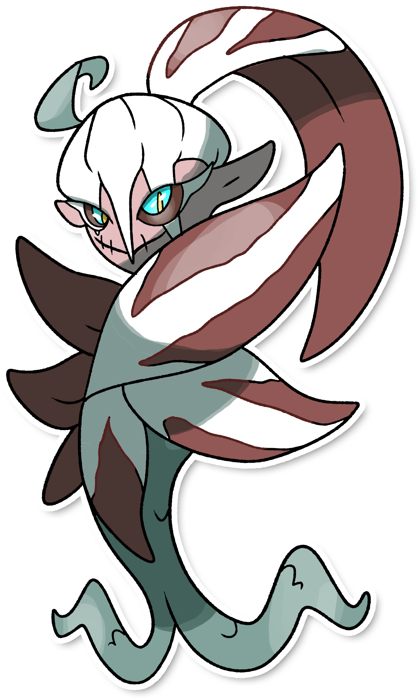

  <-  
  **Icyshblord**  
   ->

  

  

    

    
Categoria

    

      
Sanguanel

    

  

    

      
Types

      

        
        
      

    

    

      
Abilities

      

        <a href='' title="Moves that hit this Pokemon have a 30% chance of being Disabled afterward.">Cursed-body</a>
        
      

    

    

      
Hidden Ability

      

        
      

    

  

## Generali

=== "Descrizione Pokedex"
    ### Descrizione
    
    Icyshblord è una creatura difficile da incontrare, poichè si dice sia incredibilmente veloce.  
    Tuttavia, chiunque osa inseguirlo si ritroverà disperso nei boschi e perderà via via sempre più ricordi.  
    Per questo motivo, sembra essere più un mito che un vero pokémon.  
    
    Per maggiori informazioni il [video completo](https://www.youtube.com/watch?v=cO1HPwF5_E4&list=PLniAakFPn_t9I5zqlYAwZ_iSzJmgu5Nqd&index=5).

=== "Ispirazioni"

    ### Ispirazioni
    Le ispirazioni alla base di Icyshblord e della sua catena evolutiva sono:
    
    - **Sanguanel**: creature mostruose del folklore Veneto, rappresentati come piccoli folletti dalla pelle rossa e dalle orecchie a punta. Dall'animo buono ma capaci di essere pericolossisimi per via dei loro scherzi. Hanno anche la capacità di realizzare nodi difficilissimi da sciogliere;
    - **Radicchio rosso di Treviso**: in dialetto veneto detto anche "Spadon".
    - **Anguana**: dette anche "Donne fata";
    - **Sirene**;

=== "Vincitore del contest"
    ### Vincitore

    Il Vincitore di Itia che ha dato origine a Icyshblord e la sua catena evolutiva è **Aki**.

## Base Stats
<table style="width: 100%">
  <tbody style="width: 100%;">
    <tr style="display: flex; align-items: center;">
      <th style="color: #737373;" >HP</th>
      <td style="border-top: none; width: 70px">60</td>
      <td style="width: 100%; min-width: 450px; border-top: none;">
        

        

      </td>
    </tr>
    <tr style="display: flex; align-items: center;">
      <th style="color: #737373;">Attack</th>
      <td style="border-top: none; width: 70px">60</td>
      <td style="width: 100%; min-width: 450px; border-top: none;">
        

        

      </td>
    </tr>
    <tr style="display: flex; align-items: center;">
      <th style="color: #737373;">Defense</th>
      <td style="border-top: none; width: 70px">60</td>
      <td style="width: 100%; min-width: 450px; border-top: none;">
        

        

      </td>
    </tr>
    <tr style="display: flex; align-items: center;">
      <th style="color: #737373;">SP Attack</th>
      <td style="border-top: none; width: 70px">60</td>
      <td style="width: 100%; min-width: 450px; border-top: none;">
        

        

      </td>
    </tr>
    <tr style="display: flex; align-items: center;">
      <th style="color: #737373;">SP Defense</th>
      <td style="border-top: none; width: 70px">60</td>
      <td style="width: 100%; min-width: 450px; border-top: none;">
        

        

      </td>
    </tr>
    <tr style="display: flex; align-items: center;">
      <th style="color: #737373;">Speed</th>
      <td style="border-top: none; width: 70px">60</td>
      <td style="width: 100%; min-width: 450px; border-top: none;">
        

        

      </td>
    </tr>
  </tbody>
</table>

##Evolution Change
| Method | Item/Level/Note | Evolved Pokemon |
        | :--: | :--: | :--: |
        | Level Up | 32 | [Flocywerth](https://avventureaditia.github.io/itia-wiki/pokemon/037-flocywerth/) |
        

## Moveset

=== "Level Up Moves"
    | Level | Name | Power | Accuracy | PP | Type | Damage Class |
        | -- | -- | -- | -- | -- | -- | -- |
        
        

=== "Machine Moves"
    | Machine | Name | Power | Accuracy | PP | Type | Damage Class |
        | -- | -- | -- | -- | -- | -- | -- |
        
        
