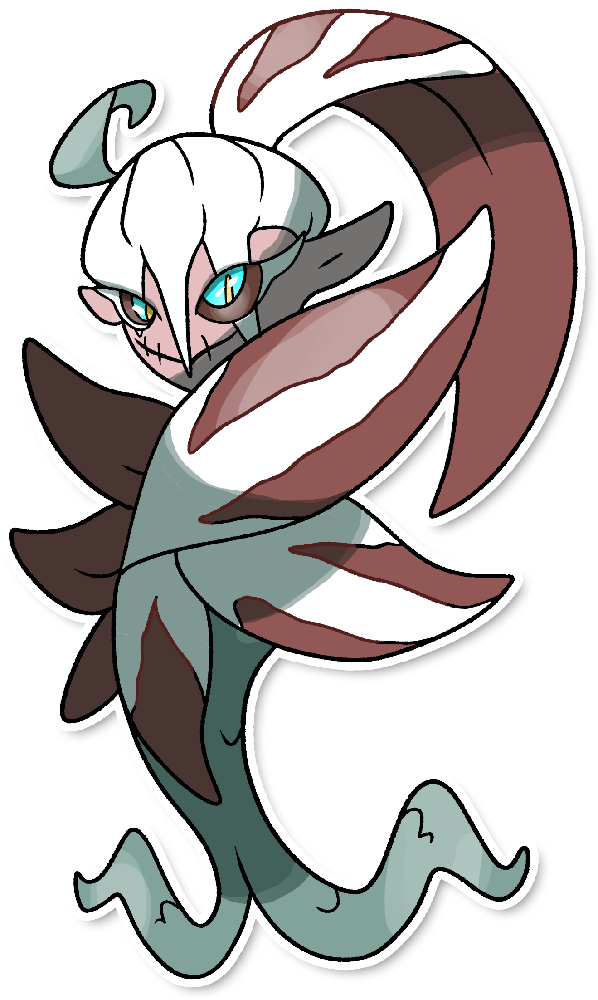
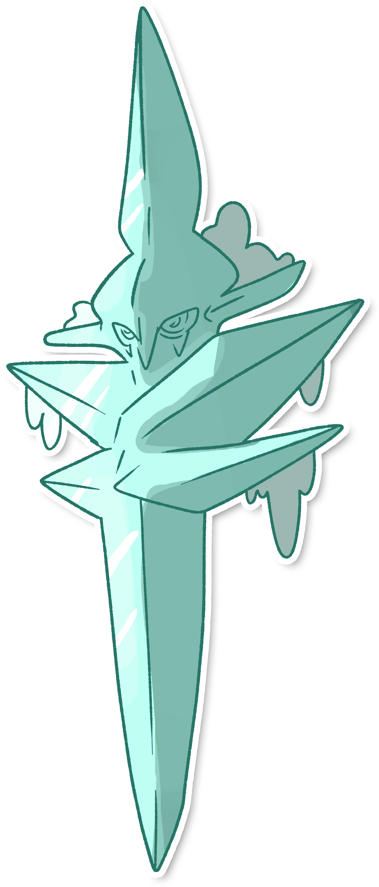

## Aspetto

=== "Forma Base"
    ### Forma Notturna
    

      
      

        

        
Categoria

        

          
Anguana

        

      

        

          
Types

          

            
            
          

        

        

          
Abilities

          

            <a href='' title="Il pokémon cambia forma tra il giorno e la notte.">Cambiogelo</a>    
          

        

        

          
Hidden Ability

          
 
          

        

      

    

=== "Forma Alternativa"
    ### Forma Diurna
    

      
      

        

        
Categoria

        

          
Anguana

        

      

        

          
Types

          

            
            
          

        

        

          
Abilities

          

            <a href='' title="Il pokémon cambia forma tra il giorno e la notte.">Cambiogelo</a>    
          

        

        

          
Hidden Ability

          
 
          

        

      

    

## Generali

=== "Descrizione Pokedex"
    ### Descrizione
    
    I Flocywerth sono pokémon venerati da popoli antichi come creature di magnifica e mortale bellezza.  
    Sembra che ne esistano solamente esemplari di sesso femminile.  
    Sono in grado di cambiare forma dal giorno alla notte, nelle quali le loro statistiche si invertono totalmente.
    
    Per maggiori informazioni il [video completo](https://www.youtube.com/watch?v=cO1HPwF5_E4&list=PLniAakFPn_t9I5zqlYAwZ_iSzJmgu5Nqd&index=5).

=== "Ispirazioni"

    ### Ispirazioni
    Le ispirazioni alla base di Icyshblord e della sua catena evolutiva sono:
    
    - **Sanguanel**: creature mostruose del folklore Veneto, rappresentati come piccoli folletti dalla pelle rossa e dalle orecchie a punta. Dall'animo buono ma capaci di essere pericolossisimi per via dei loro scherzi. Hanno anche la capacità di realizzare nodi difficilissimi da sciogliere;
    - **Radicchio rosso di Treviso**: in dialetto veneto detto anche "Spadon".
    - **Anguana**: dette anche "Donne fata";
    - **Sirene**;

=== "Vincitore del contest"
    ### Vincitore

    Il Vincitore di Itia che ha dato origine a Icyshblord e la sua catena evolutiva è **Aki**.

## Base Stats

=== "Forma Base"
    ### Forma Notturna
    <table style="width: 100%">
      <tbody style="width: 100%;">
        <tr style="display: flex; align-items: center;">
          <th style="color: #737373;" >HP</th>
          <td style="border-top: none; width: 70px">80</td>
          <td style="width: 100%; min-width: 450px; border-top: none;">
            

            

          </td>
        </tr>
        <tr style="display: flex; align-items: center;">
          <th style="color: #737373;">Attack</th>
          <td style="border-top: none; width: 70px">135</td>
          <td style="width: 100%; min-width: 450px; border-top: none;">
            

            

          </td>
        </tr>
        <tr style="display: flex; align-items: center;">
          <th style="color: #737373;">Defense</th>
          <td style="border-top: none; width: 70px">45</td>
          <td style="width: 100%; min-width: 450px; border-top: none;">
            

            

          </td>
        </tr>
        <tr style="display: flex; align-items: center;">
          <th style="color: #737373;">SP Attack</th>
          <td style="border-top: none; width: 70px">135</td>
          <td style="width: 100%; min-width: 450px; border-top: none;">
            

            

          </td>
        </tr>
        <tr style="display: flex; align-items: center;">
          <th style="color: #737373;">SP Defense</th>
          <td style="border-top: none; width: 70px">45</td>
          <td style="width: 100%; min-width: 450px; border-top: none;">
            

            

          </td>
        </tr>
        <tr style="display: flex; align-items: center;">
          <th style="color: #737373;">Speed</th>
          <td style="border-top: none; width: 70px">110</td>
          <td style="width: 100%; min-width: 450px; border-top: none;">
            

            

          </td>
        </tr>
      </tbody>
    </table>

=== "Forma Alternativa"
    ### Forma Diurna
    <table style="width: 100%">
      <tbody style="width: 100%;">
        <tr style="display: flex; align-items: center;">
          <th style="color: #737373;" >HP</th>
          <td style="border-top: none; width: 70px">80</td>
          <td style="width: 100%; min-width: 450px; border-top: none;">
            

            

          </td>
        </tr>
        <tr style="display: flex; align-items: center;">
          <th style="color: #737373;">Attack</th>
          <td style="border-top: none; width: 70px">45</td>
          <td style="width: 100%; min-width: 450px; border-top: none;">
            

            

          </td>
        </tr>
        <tr style="display: flex; align-items: center;">
          <th style="color: #737373;">Defense</th>
          <td style="border-top: none; width: 70px">135</td>
          <td style="width: 100%; min-width: 450px; border-top: none;">
            

            

          </td>
        </tr>
        <tr style="display: flex; align-items: center;">
          <th style="color: #737373;">SP Attack</th>
          <td style="border-top: none; width: 70px">45</td>
          <td style="width: 100%; min-width: 450px; border-top: none;">
            

            

          </td>
        </tr>
        <tr style="display: flex; align-items: center;">
          <th style="color: #737373;">SP Defense</th>
          <td style="border-top: none; width: 70px">135</td>
          <td style="width: 100%; min-width: 450px; border-top: none;">
            

            

          </td>
        </tr>
        <tr style="display: flex; align-items: center;">
          <th style="color: #737373;">Speed</th>
          <td style="border-top: none; width: 70px">110</td>
          <td style="width: 100%; min-width: 450px; border-top: none;">
            

            

          </td>
        </tr>
      </tbody>
    </table>

## Moveset

=== "Level Up Moves"
    | Level | Name | Power | Accuracy | PP | Type | Damage Class |
        | -- | -- | -- | -- | -- | -- | -- |
        
        

=== "Machine Moves"
    | Machine | Name | Power | Accuracy | PP | Type | Damage Class |
        | -- | -- | -- | -- | -- | -- | -- |
        
        
