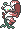
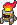
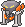
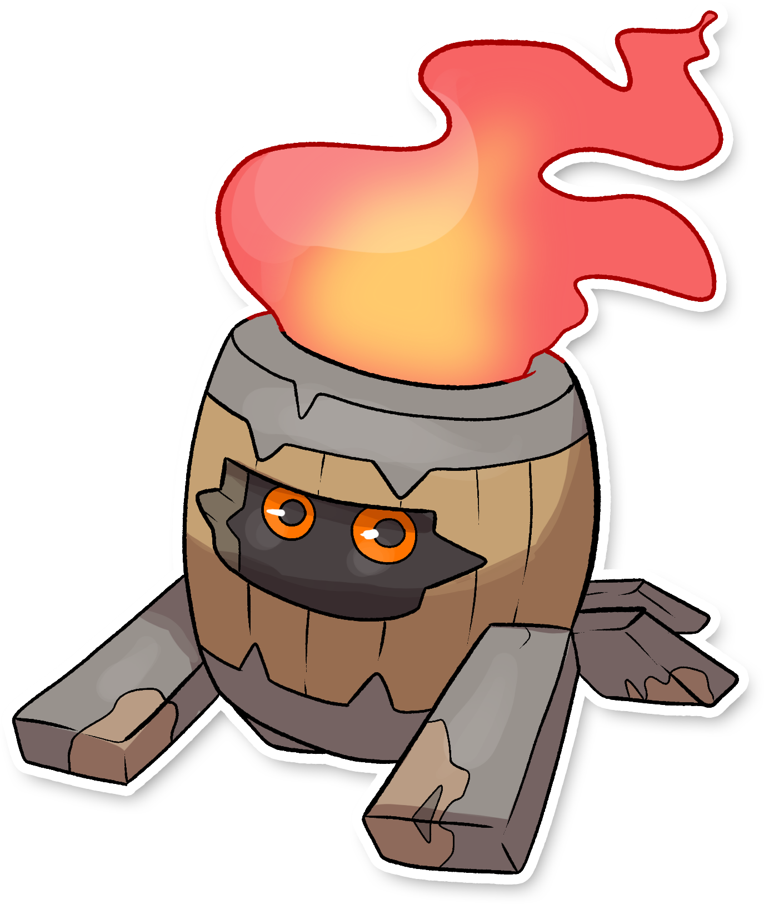

  ⬅️ 
  <a href="https://avventureaditia.github.io/itia-wiki/pokemon/037-flocywerth/">037 - Flocywerth
    
  </a>
  <strong>038 - Stakiles</strong> 
  
  <a href="https://avventureaditia.github.io/itia-wiki/pokemon/039-vesteam/">039 - Vesteam
    
  </a>
  ➡️

## Pokédex

=== "Tassonomia"
    

      
      

        

          
Class

          

            
Barilfiamma

          

        

        

          
Types

          

            
            
          

        

        

          
Ability

          

            <a href='' title="Whenever a move makes contact with this Pokemon, the move's user has a 30% chance of being burned.  Overworld: If any Pokemon in the party has this ability, each egg in the party has its hatch counter decreased by 2 (rather than 1) each step cycle, making eggs hatch roughly twice as quickly.  This effect does not stack if multiple Pokemon have this ability or magma armor.">Flame-body</a>
          

        

        

          
Cry

          

            <audio controls>
              <source src="../../audio/stakiles.mp3" type="audio/mpeg">
            </audio>
          

        

      

    

=== "Aspetto"
    

      
      

        

          
Height

          

            
0,50 m

          

        

        

          
Weight

          

            
12,74 kg

          

        

        

          
Pokédex Color

          

            
Rosso

          

        

        

          
Shape

          

            
          

        

      

    

=== "Allevamento"
    

      
      

        

          

            
Catch rate

            

              
150

            

          

          

            
Gender Ratio

            

              
50.0%

              
/

              
50.0%

            

          

        

        

          

            
Egg Groups

            

              
Monster and Field

            

          

          

            
Hatch Time

            

              
40 Cycles

            

          

        

        

          

            
Base experience yield

            

              
76

            

          

          

            
Leveling rate

            

              
Medium Slow

            

          

        

        

          

            
Base friendship

            

              
70

            

          

          

            
EV yield

            

              
1 - Sp.Attack

            

          

        

      

    

## Generali

=== "Descrizione Pokedex"
    ### Descrizione
    
    Gli Stakiles vagano di notte in cerca di cibo e se non lo trovano per ripicca appicano dei piccoli incendi.  
    Sembrano essere stati la causa di un grande incendio nell'antichità di Itia, che ancora oggi viene chiamato "La notte dei 100 Stakiles".  
    Usano il barile come protezione e nessuno sa cosa si nasconde al loro interno.  
    
    Per maggiori informazioni il [video completo](https://www.youtube.com/watch?v=tvs4fqO_V18&list=PLniAakFPn_t9I5zqlYAwZ_iSzJmgu5Nqd&index=6).

=== "Ispirazioni"

    ### Ispirazioni
    Le ispirazioni alla base di Stakiles e della sua catena evolutiva sono:
    
    - **Incendio di Roma 64 D.C.**;
    - **Circo Massimo**: Si tratta del luogo in cui è stato appiccato l'incendio sopra indicato. Nell'antica Roma veniva utilizzato come mercato, per questo la forma base si ispira ad un barile;
    - **Tempio di Vesta**: tempio sacro presente a Roma, caratterizzato dalla presenza di un focolare, che secondo le antiche usanze non doveva mai spegnersi. Le sacerdotesse chiamate **Vestali** avevano il compito di tenere sempre accesa la fiamma e venivano punite con la morte.

=== "Vincitore del contest"
    ### Vincitore

    Il Vincitore di Itia che ha dato origine a Stakiles e la sua catena evolutiva è **Luca**.

## Base Stats
<table style="width: 100%">
  <tbody style="width: 100%;">
    <tr style="display: flex; align-items: center;">
      <th style="color: #737373;" >HP</th>
      <td style="border-top: none; width: 70px">40</td>
      <td style="width: 100%; min-width: 450px; border-top: none;">
        

        

      </td>
    </tr>
    <tr style="display: flex; align-items: center;">
      <th style="color: #737373;">Attack</th>
      <td style="border-top: none; width: 70px">40</td>
      <td style="width: 100%; min-width: 450px; border-top: none;">
        

        

      </td>
    </tr>
    <tr style="display: flex; align-items: center;">
      <th style="color: #737373;">Defense</th>
      <td style="border-top: none; width: 70px">40</td>
      <td style="width: 100%; min-width: 450px; border-top: none;">
        

        

      </td>
    </tr>
    <tr style="display: flex; align-items: center;">
      <th style="color: #737373;">SP Attack</th>
      <td style="border-top: none; width: 70px">70</td>
      <td style="width: 100%; min-width: 450px; border-top: none;">
        

        

      </td>
    </tr>
    <tr style="display: flex; align-items: center;">
      <th style="color: #737373;">SP Defense</th>
      <td style="border-top: none; width: 70px">40</td>
      <td style="width: 100%; min-width: 450px; border-top: none;">
        

        

      </td>
    </tr>
    <tr style="display: flex; align-items: center;">
      <th style="color: #737373;">Speed</th>
      <td style="border-top: none; width: 70px">20</td>
      <td style="width: 100%; min-width: 450px; border-top: none;">
        

        

      </td>
    </tr>
  </tbody>
</table>

##Evolution Change
| Method | Item/Level/Note | Evolved Pokemon |
        | :--: | :--: | :--: |
        | Other | Level Up mentre conosce Incendio | [Vesteam](https://avventureaditia.github.io/itia-wiki/pokemon/039-vesteam/) |
        

## Moveset

=== "Level Up Moves"
    | Level | Name | Power | Accuracy | PP | Type | Damage Class |
        | -- | -- | -- | -- | -- | -- | -- |
        
        

=== "Machine Moves"
    | Machine | Name | Power | Accuracy | PP | Type | Damage Class |
        | -- | -- | -- | -- | -- | -- | -- |
        
        
