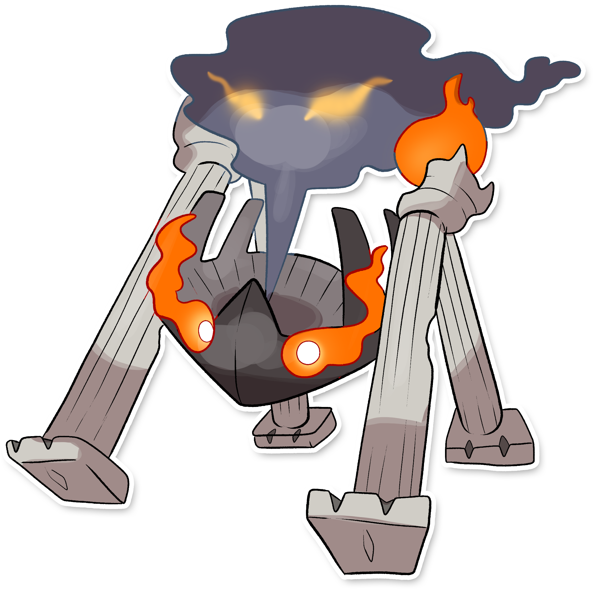

  

  

    

        
Class

        

          
Fuoco Sacro

        

      

    

      
Types

      

        
        
      

    

    

      
Abilities

      

        <a href='' title="Whenever a move makes contact with this Pokemon, the move's user has a 30% chance of being burned.  Overworld: If any Pokemon in the party has this ability, each egg in the party has its hatch counter decreased by 2 (rather than 1) each step cycle, making eggs hatch roughly twice as quickly.  This effect does not stack if multiple Pokemon have this ability or magma armor.">Flame-body</a>
        
      

    

    

      
Hidden Ability

      

        
      

    

  

## Generali

=== "Descrizione Pokedex"
    ### Descrizione
    
    I Vesteam per vivere devono mantenere la fiamma nella loro testa accesa.  
    Durante il giorno dormono emettendo un fumo profumato, durante la notte escono in cerca di cibo.  
    Sembra possano controllare un gruppo di Stakiles.  
    Nell'antichità e tutt'ora sono venerati e rispettati.  
    
    Per maggiori informazioni il [video completo](https://www.youtube.com/watch?v=tvs4fqO_V18&list=PLniAakFPn_t9I5zqlYAwZ_iSzJmgu5Nqd&index=6).

=== "Ispirazioni"

    ### Ispirazioni
    Le ispirazioni alla base di Stakiles e della sua catena evolutiva sono:
    
    - **Incendio di Roma 64 D.C.**;
    - **Circo Massimo**: Si tratta del luogo in cui è stato appiccato l'incendio sopra indicato. Nell'antica Roma veniva utilizzato come mercato, per questo la forma base si ispira ad un barile;
    - **Tempio di Vesta**: tempio sacro presente a Roma, caratterizzato dalla presenza di un focolare, che secondo le antiche usanze non doveva mai spegnersi. Le sacerdotesse chiamate **Vestali** avevano il compito di tenere sempre accesa la fiamma e venivano punite con la morte.

=== "Vincitore del contest"
    ### Vincitore

    Il Vincitore di Itia che ha dato origine a Stakiles e la sua catena evolutiva è **Luca**.

## Base Stats
<table style="width: 100%">
  <tbody style="width: 100%;">
    <tr style="display: flex; align-items: center;">
      <th style="color: #737373;" >HP</th>
      <td style="border-top: none; width: 70px">60</td>
      <td style="width: 100%; min-width: 450px; border-top: none;">
        

        

      </td>
    </tr>
    <tr style="display: flex; align-items: center;">
      <th style="color: #737373;">Attack</th>
      <td style="border-top: none; width: 70px">50</td>
      <td style="width: 100%; min-width: 450px; border-top: none;">
        

        

      </td>
    </tr>
    <tr style="display: flex; align-items: center;">
      <th style="color: #737373;">Defense</th>
      <td style="border-top: none; width: 70px">90</td>
      <td style="width: 100%; min-width: 450px; border-top: none;">
        

        

      </td>
    </tr>
    <tr style="display: flex; align-items: center;">
      <th style="color: #737373;">SP Attack</th>
      <td style="border-top: none; width: 70px">120</td>
      <td style="width: 100%; min-width: 450px; border-top: none;">
        

        

      </td>
    </tr>
    <tr style="display: flex; align-items: center;">
      <th style="color: #737373;">SP Defense</th>
      <td style="border-top: none; width: 70px">80</td>
      <td style="width: 100%; min-width: 450px; border-top: none;">
        

        

      </td>
    </tr>
    <tr style="display: flex; align-items: center;">
      <th style="color: #737373;">Speed</th>
      <td style="border-top: none; width: 70px">30</td>
      <td style="width: 100%; min-width: 450px; border-top: none;">
        

        

      </td>
    </tr>
  </tbody>
</table>

## Moveset

=== "Level Up Moves"
    | Level | Name | Power | Accuracy | PP | Type | Damage Class |
        | -- | -- | -- | -- | -- | -- | -- |
        
        

=== "Machine Moves"
    | Machine | Name | Power | Accuracy | PP | Type | Damage Class |
        | -- | -- | -- | -- | -- | -- | -- |
        
        
