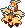

  ⬅️ <a href="https://avventureaditia.github.io/itia-wiki/pokemon/040-fember/"> 040 - Fember </a>
  <strong>041 - Insolame</strong> 
  
  <a href="https://avventureaditia.github.io/itia-wiki/pokemon/042-reclugma/"> 042 - Reclugma </a> ➡️

## Pokédex

=== "Tassonomia"
    

      
      

        

          
Class

          

            
Sole

          

        

        

          
Types

          

            
            
          

        

        

          
Ability

          

            <a href='' title="During strong sunlight, this Pokemon has 1.5x its Special Attack but takes 1/8 of its maximum HP in damage after each turn.">Solar-power</a>
          

        

        

          
Cry

          

            <audio controls>
              <source src="../../audio/insolame.mp3" type="audio/mpeg">
            </audio>
          

        

      

    

=== "Aspetto"
    

      
      

        

          
Height

          

            
1,36 m

          

        

        

          
Weight

          

            
45,54 kg

          

        

        

          
Pokédex Color

          

            
Rosso

          

        

        

          
Shape

          

            
          

        

      

    

=== "Allevamento"
    

      
      

        

          

            
Catch rate

            

              
70

            

          

          

            
Gender Ratio

            

              
25.0%

              
/

              
75.0%

            

          

        

        

          

            
Egg Groups

            

              
Monster and Fairy

            

          

          

            
Hatch Time

            

              
20 Cycles

            

          

        

        

          

            
Base experience yield

            

              
167

            

          

          

            
Leveling rate

            

              
Medium Fast

            

          

        

        

          

            
Base friendship

            

              
70

            

          

          

            
EV yield

            

              
2 - Sp.Attack

            

          

        

      

    

## Generali

=== "Descrizione Pokedex"
    ### Descrizione

    Ha un animo gentile e protettivo.  
    Se vede un Fember che prende il sole, lo ammonisce e si prende cura di lui finché non sta meglio.  
    Leggende popolari raccontano che spaventi i bambini che giocano all'esterno nei più caldi pomeriggi estivi.  
    
    Per maggiori informazioni il [video completo](https://www.youtube.com/watch?v=tvs4fqO_V18&list=PLniAakFPn_t9I5zqlYAwZ_iSzJmgu5Nqd&index=6).

=== "Ispirazioni"

    ### Ispirazioni
    Le ispirazioni alla base di Fember e della sua catena evolutiva sono:
    
    - **Mama 'e su Sole**: una creatura tipica del folklore sardo, nata per mettere in guardia i bambini dal rischio di restare al sole nelle ore più calde della giornata;
    -L'aspetto riprende alcuni **vestiti sardi** mentre il volto arrossato richiama un **termometro al mercurio** (oltre ai **sintomi della febbre**).

=== "Vincitore del contest"
    ### Vincitore

    Il Vincitore di Itia che ha dato origine a Fember e la sua catena evolutiva è **Erin**.

## Base Stats
<table style="width: 100%">
  <tbody style="width: 100%;">
    <tr style="display: flex; align-items: center;">
      <th style="color: #737373;" >HP</th>
      <td style="border-top: none; width: 70px">60</td>
      <td style="width: 100%; min-width: 450px; border-top: none;">
        

        

      </td>
    </tr>
    <tr style="display: flex; align-items: center;">
      <th style="color: #737373;">Attack</th>
      <td style="border-top: none; width: 70px">60</td>
      <td style="width: 100%; min-width: 450px; border-top: none;">
        

        

      </td>
    </tr>
    <tr style="display: flex; align-items: center;">
      <th style="color: #737373;">Defense</th>
      <td style="border-top: none; width: 70px">60</td>
      <td style="width: 100%; min-width: 450px; border-top: none;">
        

        

      </td>
    </tr>
    <tr style="display: flex; align-items: center;">
      <th style="color: #737373;">SP Attack</th>
      <td style="border-top: none; width: 70px">105</td>
      <td style="width: 100%; min-width: 450px; border-top: none;">
        

        

      </td>
    </tr>
    <tr style="display: flex; align-items: center;">
      <th style="color: #737373;">SP Defense</th>
      <td style="border-top: none; width: 70px">105</td>
      <td style="width: 100%; min-width: 450px; border-top: none;">
        

        

      </td>
    </tr>
    <tr style="display: flex; align-items: center;">
      <th style="color: #737373;">Speed</th>
      <td style="border-top: none; width: 70px">105</td>
      <td style="width: 100%; min-width: 450px; border-top: none;">
        

        

      </td>
    </tr>
  </tbody>
</table>

## Aspetto di gioco

=== "Base"
    

      

        
      

      

        
      

    

=== "Shiny"
    

      

        
      

      

        
      

    

## Moveset

=== "Level Up Moves"
    | Level | Name | Power | Accuracy | PP | Type | Damage Class |
        | -- | -- | -- | -- | -- | -- | -- |
        
        

=== "Machine Moves"
    | Machine | Name | Power | Accuracy | PP | Type | Damage Class |
        | -- | -- | -- | -- | -- | -- | -- |
        
        
