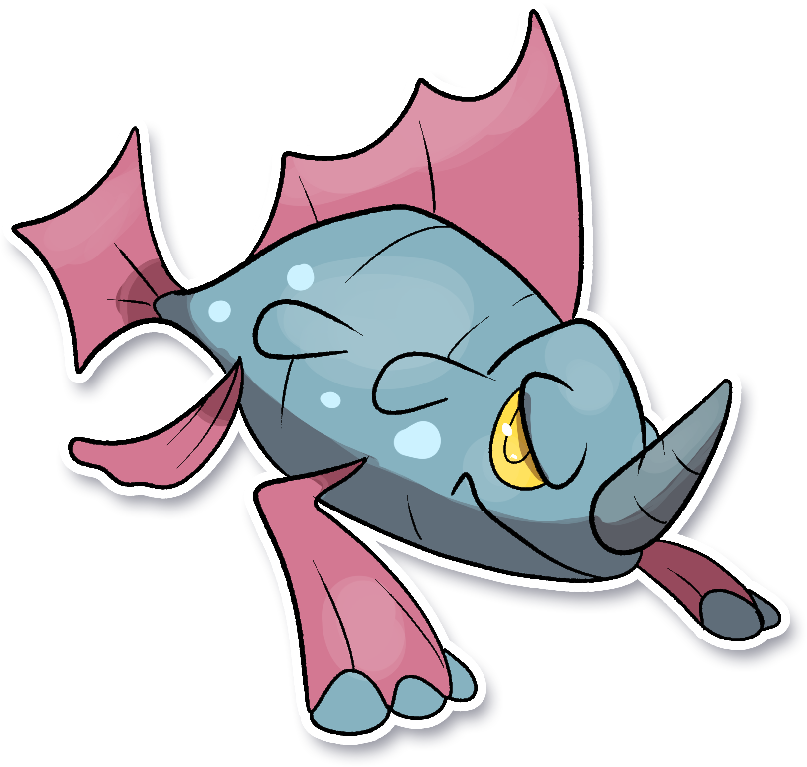

  ⬅️ <a href="https://avventureaditia.github.io/itia-wiki/pokemon/044-volchamber/"> 044 - Volchamber </a>
  <strong>045 - Rhinocola</strong> 
  
  <a href="https://avventureaditia.github.io/itia-wiki/pokemon/046-rhinostris/"> 046 - Rhinostris </a> ➡️

## Pokédex

=== "Tassonomia"
    

      
      

        

          
Class

          

            
Acquacorno

          

        

        

          
Types

          

            
          

        

        

          
Ability

          

            <a href='' title="This Pokemon's Speed is doubled during rain.  This bonus does not count as a stat modifier.">Swift-swim</a>
          

        

        

          
Cry

          

            <audio controls>
              <source src="../../audio/rhinocola.mp3" type="audio/mpeg">
            </audio>
          

        

      

    

=== "Aspetto"
    

      
      

        

          
Height

          

            
0,42 m

          

        

        

          
Weight

          

            
23,64 kg

          

        

        

          
Pokédex Color

          

            
Blu

          

        

        

          
Shape

          

            
          

        

      

    

=== "Allevamento"
    

      
      

        

          

            
Catch rate

            

              
155

            

          

          

            
Gender Ratio

            

              
50.0%

              
/

              
50.0%

            

          

        

        

          

            
Egg Groups

            

              
Monster and Water 2

            

          

          

            
Hatch Time

            

              
20 Cycles

            

          

        

        

          

            
Base experience yield

            

              
66

            

          

          

            
Leveling rate

            

              
Medium Slow

            

          

        

        

          

            
Base friendship

            

              
70

            

          

          

            
EV yield

            

              
1 - Attack

            

          

        

      

    

## Generali

=== "Descrizione Pokedex"
    ### Descrizione

    I piccoli Rhinocola nuotano liberamente nei mari di Itia cercando tesori e spaventando i pescatori che navigano in quelle acque.  
    Si dice che in realtà siano i protettori delle zone in cui vivano e che il loro comportamento sia solo il loro modo di fare la guardia.  

    Per maggiori informazioni il [video completo](https://www.youtube.com/watch?v=cMEAadCg6y0&list=PLniAakFPn_t9I5zqlYAwZ_iSzJmgu5Nqd&index=7).

=== "Ispirazioni"

    ### Ispirazioni
    Le ispirazioni alla base di Rhinocola e della sua catena evolutiva sono:
    
    - **Leggenda di Colapesce**;
    - **Rinoceronte marino**.

=== "Vincitore del contest"
    ### Vincitore

    Il Vincitore di Itia che ha dato origine a Rhinocola e la sua catena evolutiva è **Fabio**.

## Base Stats
<table style="width: 100%">
  <tbody style="width: 100%;">
    <tr style="display: flex; align-items: center;">
      <th style="color: #737373;" >HP</th>
      <td style="border-top: none; width: 70px">76</td>
      <td style="width: 100%; min-width: 450px; border-top: none;">
        

        

      </td>
    </tr>
    <tr style="display: flex; align-items: center;">
      <th style="color: #737373;">Attack</th>
      <td style="border-top: none; width: 70px">57</td>
      <td style="width: 100%; min-width: 450px; border-top: none;">
        

        

      </td>
    </tr>
    <tr style="display: flex; align-items: center;">
      <th style="color: #737373;">Defense</th>
      <td style="border-top: none; width: 70px">48</td>
      <td style="width: 100%; min-width: 450px; border-top: none;">
        

        

      </td>
    </tr>
    <tr style="display: flex; align-items: center;">
      <th style="color: #737373;">SP Attack</th>
      <td style="border-top: none; width: 70px">48</td>
      <td style="width: 100%; min-width: 450px; border-top: none;">
        

        

      </td>
    </tr>
    <tr style="display: flex; align-items: center;">
      <th style="color: #737373;">SP Defense</th>
      <td style="border-top: none; width: 70px">62</td>
      <td style="width: 100%; min-width: 450px; border-top: none;">
        

        

      </td>
    </tr>
    <tr style="display: flex; align-items: center;">
      <th style="color: #737373;">Speed</th>
      <td style="border-top: none; width: 70px">34</td>
      <td style="width: 100%; min-width: 450px; border-top: none;">
        

        

      </td>
    </tr>
  </tbody>
</table>

##Evolution Change
| Method | Item/Level/Note | Evolved Pokemon |
        | :--: | :--: | :--: |
        | Level Up | 28 | [Rhinostris](https://avventureaditia.github.io/itia-wiki/pokemon/046-rhinostris/) |
        

## Moveset

=== "Level Up Moves"
    | Level | Name | Power | Accuracy | PP | Type | Damage Class |
        | -- | -- | -- | -- | -- | -- | -- |
        
        

=== "Machine Moves"
    | Machine | Name | Power | Accuracy | PP | Type | Damage Class |
        | -- | -- | -- | -- | -- | -- | -- |
        
        
