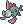
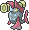

  ⬅️ <a href="https://avventureaditia.github.io/itia-wiki/pokemon/045-rhinocola/"> 045 - Rhinocola </a>
  <strong>046 - Rhinostris</strong> 
  
  <a href="https://avventureaditia.github.io/itia-wiki/pokemon/047-gondoval/"> 047 - Gondoval </a> ➡️

  

  

    

        
Class

        

          
Acquacorno

        

      

    

      
Types

      

        
        
      

    

    

      
Abilities

      

        <a href='' title="This Pokemon's Speed is doubled during rain.  This bonus does not count as a stat modifier.">Swift-swim</a>
        
      

    

    

      
Hidden Ability

      

        
      

    

  

## Generali

=== "Descrizione Pokedex"
    ### Descrizione

    I Rhinostris sono noti per la loro forza, infatti passano la loro vita a tenere una colonna che usano come arma.  
    Le leggende narrano che se un Rhinostris dovesse farla cadere, Itia verrebbe colpita da un tremendo terremoto.  
    Una volta trovata una colonna da portare il Pokémon non se ne separerà mai per tutta la vita.  

    Per maggiori informazioni il [video completo](https://www.youtube.com/watch?v=cMEAadCg6y0&list=PLniAakFPn_t9I5zqlYAwZ_iSzJmgu5Nqd&index=7).

=== "Ispirazioni"

    ### Ispirazioni
    Le ispirazioni alla base di Rhinocola e della sua catena evolutiva sono:
    
    - **Leggenda di Colapesce**;
    - **Rinoceronte marino**.

=== "Vincitore del contest"
    ### Vincitore

    Il Vincitore di Itia che ha dato origine a Rhinocola e la sua catena evolutiva è **Fabio**.

## Base Stats
<table style="width: 100%">
  <tbody style="width: 100%;">
    <tr style="display: flex; align-items: center;">
      <th style="color: #737373;" >HP</th>
      <td style="border-top: none; width: 70px">111</td>
      <td style="width: 100%; min-width: 450px; border-top: none;">
        

        

      </td>
    </tr>
    <tr style="display: flex; align-items: center;">
      <th style="color: #737373;">Attack</th>
      <td style="border-top: none; width: 70px">92</td>
      <td style="width: 100%; min-width: 450px; border-top: none;">
        

        

      </td>
    </tr>
    <tr style="display: flex; align-items: center;">
      <th style="color: #737373;">Defense</th>
      <td style="border-top: none; width: 70px">68</td>
      <td style="width: 100%; min-width: 450px; border-top: none;">
        

        

      </td>
    </tr>
    <tr style="display: flex; align-items: center;">
      <th style="color: #737373;">SP Attack</th>
      <td style="border-top: none; width: 70px">83</td>
      <td style="width: 100%; min-width: 450px; border-top: none;">
        

        

      </td>
    </tr>
    <tr style="display: flex; align-items: center;">
      <th style="color: #737373;">SP Defense</th>
      <td style="border-top: none; width: 70px">82</td>
      <td style="width: 100%; min-width: 450px; border-top: none;">
        

        

      </td>
    </tr>
    <tr style="display: flex; align-items: center;">
      <th style="color: #737373;">Speed</th>
      <td style="border-top: none; width: 70px">39</td>
      <td style="width: 100%; min-width: 450px; border-top: none;">
        

        

      </td>
    </tr>
  </tbody>
</table>

## Moveset

=== "Level Up Moves"
    | Level | Name | Power | Accuracy | PP | Type | Damage Class |
        | -- | -- | -- | -- | -- | -- | -- |
        
        

=== "Machine Moves"
    | Machine | Name | Power | Accuracy | PP | Type | Damage Class |
        | -- | -- | -- | -- | -- | -- | -- |
        
        
