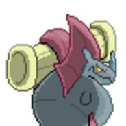
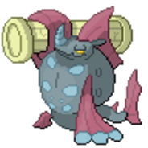
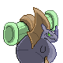
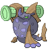

  ⬅️ <a href="https://avventureaditia.github.io/itia-wiki/pokemon/045-rhinocola/"> 045 - Rhinocola </a>
  <strong>046 - Rhinostris</strong> 
  
  <a href="https://avventureaditia.github.io/itia-wiki/pokemon/047-gondoval/"> 047 - Gondoval </a> ➡️

## Pokédex

=== "Tassonomia"
    

      
      

        

          
Class

          

            
Acquacorno

          

        

        

          
Types

          

            
            
          

        

        

          
Ability

          

            <a href='' title="This Pokemon's Speed is doubled during rain.  This bonus does not count as a stat modifier.">Swift-swim</a>
          

        

        

          
Cry

          

            <audio controls>
              <source src="../../audio/rhinostris.mp3" type="audio/mpeg">
            </audio>
          

        

      

    

=== "Aspetto"
    

      
      

        

          
Height

          

            
0,78 m

          

        

        

          
Weight

          

            
45,87 kg

          

        

        

          
Pokédex Color

          

            
Blu

          

        

        

          
Shape

          

            
          

        

      

    

=== "Allevamento"
    

      
      

        

          

            
Catch rate

            

              
40

            

          

          

            
Gender Ratio

            

              
50.0%

              
/

              
50.0%

            

          

        

        

          

            
Egg Groups

            

              
Monster and Water 2

            

          

          

            
Hatch Time

            

              
20 Cycles

            

          

        

        

          

            
Base experience yield

            

              
236

            

          

          

            
Leveling rate

            

              
Medium Slow

            

          

        

        

          

            
Base friendship

            

              
70

            

          

          

            
EV yield

            

              
2 - Attack / 1 - Defence

            

          

        

      

    

## Generali

=== "Descrizione Pokedex"
    ### Descrizione

    I Rhinostris sono noti per la loro forza, infatti passano la loro vita a tenere una colonna che usano come arma.  
    Le leggende narrano che se un Rhinostris dovesse farla cadere, Itia verrebbe colpita da un tremendo terremoto.  
    Una volta trovata una colonna da portare il Pokémon non se ne separerà mai per tutta la vita.  

    Per maggiori informazioni il [video completo](https://www.youtube.com/watch?v=cMEAadCg6y0&list=PLniAakFPn_t9I5zqlYAwZ_iSzJmgu5Nqd&index=7).

=== "Ispirazioni"

    ### Ispirazioni
    Le ispirazioni alla base di Rhinocola e della sua catena evolutiva sono:
    
    - **Leggenda di Colapesce**;
    - **Rinoceronte marino**.

=== "Vincitore del contest"
    ### Vincitore

    Il Vincitore di Itia che ha dato origine a Rhinocola e la sua catena evolutiva è **Fabio**.

## Base Stats
<table style="width: 100%">
  <tbody style="width: 100%;">
    <tr style="display: flex; align-items: center;">
      <th style="color: #737373;" >HP</th>
      <td style="border-top: none; width: 70px">111</td>
      <td style="width: 100%; min-width: 450px; border-top: none;">
        

        

      </td>
    </tr>
    <tr style="display: flex; align-items: center;">
      <th style="color: #737373;">Attack</th>
      <td style="border-top: none; width: 70px">92</td>
      <td style="width: 100%; min-width: 450px; border-top: none;">
        

        

      </td>
    </tr>
    <tr style="display: flex; align-items: center;">
      <th style="color: #737373;">Defense</th>
      <td style="border-top: none; width: 70px">68</td>
      <td style="width: 100%; min-width: 450px; border-top: none;">
        

        

      </td>
    </tr>
    <tr style="display: flex; align-items: center;">
      <th style="color: #737373;">SP Attack</th>
      <td style="border-top: none; width: 70px">83</td>
      <td style="width: 100%; min-width: 450px; border-top: none;">
        

        

      </td>
    </tr>
    <tr style="display: flex; align-items: center;">
      <th style="color: #737373;">SP Defense</th>
      <td style="border-top: none; width: 70px">82</td>
      <td style="width: 100%; min-width: 450px; border-top: none;">
        

        

      </td>
    </tr>
    <tr style="display: flex; align-items: center;">
      <th style="color: #737373;">Speed</th>
      <td style="border-top: none; width: 70px">39</td>
      <td style="width: 100%; min-width: 450px; border-top: none;">
        

        

      </td>
    </tr>
  </tbody>
</table>

## Aspetto di gioco

=== "Base"
    

      

        
      

      

        
      

    

=== "Shiny"
    

      

        
      

      

        
      

    

## Moveset

=== "Level Up Moves"
    | Level | Name | Power | Accuracy | PP | Type | Damage Class |
        | -- | -- | -- | -- | -- | -- | -- |
        
        

=== "Machine Moves"
    | Machine | Name | Power | Accuracy | PP | Type | Damage Class |
        | -- | -- | -- | -- | -- | -- | -- |
        
        
