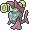
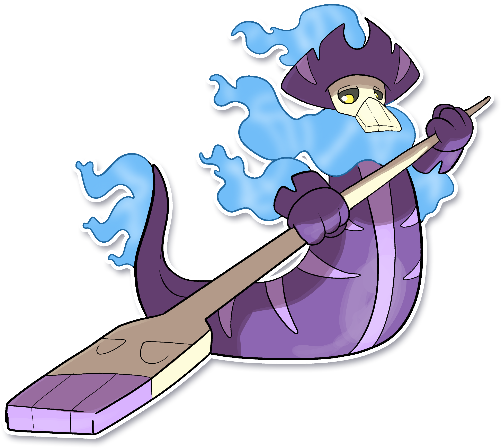

  ⬅️ <a href="https://avventureaditia.github.io/itia-wiki/pokemon/046-rhinostris/"> 046 - Rhinostris </a>
  <strong>047 - Gondoval</strong> 
  
  <a href="https://avventureaditia.github.io/itia-wiki/pokemon/048-cryptidile/"> 048 - Cryptidile </a> ➡️

## Pokédex

=== "Tassonomia"
    

      
      

        

          
Class

          

            
Traghetto

          

        

        

          
Types

          

            
            
          

        

        

          
Ability

          

            <a href='' title="Moves that hit this Pokemon have a 30% chance of being Disabled afterward.">Cursed-body</a>
          

        

        

          
Cry

          

            <audio controls>
              <source src="../../audio/gondoval.mp3" type="audio/mpeg">
            </audio>
          

        

      

    

=== "Aspetto"
    

      
      

        

          
Height

          

            
1,54 m

          

        

        

          
Weight

          

            
56,23 kg

          

        

        

          
Pokédex Color

          

            
Blu

          

        

        

          
Shape

          

            
          

        

      

    

=== "Allevamento"
    

      
      

        

          

            
Catch rate

            

              
45

            

          

          

            
Gender Ratio

            

              
50.0%

              
/

              
50.0%

            

          

        

        

          

            
Egg Groups

            

              
Monster and Amorphous

            

          

          

            
Hatch Time

            

              
30 Cycles

            

          

        

        

          

            
Base experience yield

            

              
146

            

          

          

            
Leveling rate

            

              
Medium Slow

            

          

        

        

          

            
Base friendship

            

              
70

            

          

          

            
EV yield

            

              
2 - Attack / 1 - Defence

            

          

        

      

    

## Generali

=== "Descrizione Pokedex"
    ### Descrizione

    I Gondoval vivono particolarmente in zone lagunari vicino ai centri abitati, preferiscono viaggare in solitudine, ma sono attirati da grandi concentrazioni di persone durante le festività.  
    Si dice che siano in grando proprio loro in grando di traghettare le anime meritevoli all'altro mondo e che siano in grado di far rivedere i propri cari a chi lo desidera per poco tempo se si gettano due monote d'oro nelle acque in cui navigano.  

    Per maggiori informazioni il [video completo](https://www.youtube.com/watch?v=cMEAadCg6y0&list=PLniAakFPn_t9I5zqlYAwZ_iSzJmgu5Nqd&index=7).

=== "Ispirazioni"

    ### Ispirazioni
    Le ispirazioni alla base di Gondoval sono:
    
    - La città di **Venezia**, con i suoi canali e la **gondola**;
    - Le maschere del carnevale Veneziano, in particolare la **Bauta**.

=== "Vincitore del contest"
    ### Vincitore

    Il Vincitore di Itia che ha dato origine a Gondoval è **Federico**.

## Base Stats
<table style="width: 100%">
  <tbody style="width: 100%;">
    <tr style="display: flex; align-items: center;">
      <th style="color: #737373;" >HP</th>
      <td style="border-top: none; width: 70px">70</td>
      <td style="width: 100%; min-width: 450px; border-top: none;">
        

        

      </td>
    </tr>
    <tr style="display: flex; align-items: center;">
      <th style="color: #737373;">Attack</th>
      <td style="border-top: none; width: 70px">131</td>
      <td style="width: 100%; min-width: 450px; border-top: none;">
        

        

      </td>
    </tr>
    <tr style="display: flex; align-items: center;">
      <th style="color: #737373;">Defense</th>
      <td style="border-top: none; width: 70px">100</td>
      <td style="width: 100%; min-width: 450px; border-top: none;">
        

        

      </td>
    </tr>
    <tr style="display: flex; align-items: center;">
      <th style="color: #737373;">SP Attack</th>
      <td style="border-top: none; width: 70px">86</td>
      <td style="width: 100%; min-width: 450px; border-top: none;">
        

        

      </td>
    </tr>
    <tr style="display: flex; align-items: center;">
      <th style="color: #737373;">SP Defense</th>
      <td style="border-top: none; width: 70px">90</td>
      <td style="width: 100%; min-width: 450px; border-top: none;">
        

        

      </td>
    </tr>
    <tr style="display: flex; align-items: center;">
      <th style="color: #737373;">Speed</th>
      <td style="border-top: none; width: 70px">40</td>
      <td style="width: 100%; min-width: 450px; border-top: none;">
        

        

      </td>
    </tr>
  </tbody>
</table>

## Moveset

=== "Level Up Moves"
    | Level | Name | Power | Accuracy | PP | Type | Damage Class |
        | -- | -- | -- | -- | -- | -- | -- |
        
        

=== "Machine Moves"
    | Machine | Name | Power | Accuracy | PP | Type | Damage Class |
        | -- | -- | -- | -- | -- | -- | -- |
        
        
