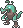
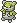

  ⬅️ <a href="https://avventureaditia.github.io/itia-wiki/pokemon/049-elusuchus/"> 049 - Elusuchus </a>
  <strong>050 - Teetitan</strong> 
  
  <a href="https://avventureaditia.github.io/itia-wiki/pokemon/051-muskuma/"> 051 - Muskuma </a> ➡️

## Pokédex

=== "Tassonomia"
    

      
      

        

          
Class

          

            
Grandenti

          

        

        

          
Types

          

            
            
          

        

        

          
Ability

          

            <a href='' title="When this Pokemon enters battle, the opponent's Attack is lowered by one stage.  In a double battle, both opponents are affected.  This ability also takes effect when acquired during a battle, but will not take effect again if lost and reobtained without leaving battle.  This ability has no effect on an opponent that has a substitute.  Overworld: If the first Pokemon in the party has this ability, any random encounter with a Pokemon five or more levels lower than it has a 50% chance of being skipped.">Intimidate</a>
          

        

        

          
Cry

          

            <audio controls>
              <source src="../../audio/teetitan.mp3" type="audio/mpeg">
            </audio>
          

        

      

    

=== "Aspetto"
    

      
      

        

          
Height

          

            
1,48 m

          

        

        

          
Weight

          

            
83,38 kg

          

        

        

          
Pokédex Color

          

            
Blu

          

        

        

          
Shape

          

            
          

        

      

    

=== "Allevamento"
    

      
      

        

          

            
Catch rate

            

              
40

            

          

          

            
Gender Ratio

            

              
50.0%

              
/

              
50.0%

            

          

        

        

          

            
Egg Groups

            

              
Monster and Field/

            

          

          

            
Hatch Time

            

              
20 Cycles

            

          

        

        

          

            
Base experience yield

            

              
376

            

          

          

            
Leveling rate

            

              
Slow

            

          

        

        

          

            
Base friendship

            

              
70

            

          

          

            
EV yield

            

              
3 - Attack

            

          

        

      

    

## Generali

=== "Descrizione Pokedex"
    ### Descrizione

    A causa della forte solitudine dovuta alla paura delle persone, i Teetitan hanno sviluppato un'aggressività senza precedenti.  
    Ora utilizzano i loro camuffamenti di piante per attirare gli umani verso di loro per poi farli a pezzi con le loro poderose mascelle.  

    Per maggiori informazioni il [video completo](https://www.youtube.com/watch?v=cMEAadCg6y0&list=PLniAakFPn_t9I5zqlYAwZ_iSzJmgu5Nqd&index=7).

=== "Ispirazioni"

    ### Ispirazioni
    Le ispirazioni alla base di Cryptidile e della sua catena evolutiva sono:
    
    - **Leggenda degli uomini-coccodrillo**;
    - Fossile del **Megadontosuchus arduini**: rinvenuto nei pressi di Verona, il nome significa "Coccodrillo dai denti enormi".

=== "Vincitore del contest"
    ### Vincitore

    Il Vincitore di Itia che ha dato origine a Cryptidile e la sua catena evolutiva è **Federico**.

## Base Stats
<table style="width: 100%">
  <tbody style="width: 100%;">
    <tr style="display: flex; align-items: center;">
      <th style="color: #737373;" >HP</th>
      <td style="border-top: none; width: 70px">95</td>
      <td style="width: 100%; min-width: 450px; border-top: none;">
        

        

      </td>
    </tr>
    <tr style="display: flex; align-items: center;">
      <th style="color: #737373;">Attack</th>
      <td style="border-top: none; width: 70px">117</td>
      <td style="width: 100%; min-width: 450px; border-top: none;">
        

        

      </td>
    </tr>
    <tr style="display: flex; align-items: center;">
      <th style="color: #737373;">Defense</th>
      <td style="border-top: none; width: 70px">80</td>
      <td style="width: 100%; min-width: 450px; border-top: none;">
        

        

      </td>
    </tr>
    <tr style="display: flex; align-items: center;">
      <th style="color: #737373;">SP Attack</th>
      <td style="border-top: none; width: 70px">65</td>
      <td style="width: 100%; min-width: 450px; border-top: none;">
        

        

      </td>
    </tr>
    <tr style="display: flex; align-items: center;">
      <th style="color: #737373;">SP Defense</th>
      <td style="border-top: none; width: 70px">70</td>
      <td style="width: 100%; min-width: 450px; border-top: none;">
        

        

      </td>
    </tr>
    <tr style="display: flex; align-items: center;">
      <th style="color: #737373;">Speed</th>
      <td style="border-top: none; width: 70px">92</td>
      <td style="width: 100%; min-width: 450px; border-top: none;">
        

        

      </td>
    </tr>
  </tbody>
</table>

## Aspetto di gioco

=== "Base"
    

      

        
      

      

        
      

    

=== "Shiny"
    

      

        
      

      

        
      

    

## Moveset

=== "Level Up Moves"
    | Level | Name | Power | Accuracy | PP | Type | Damage Class |
        | -- | -- | -- | -- | -- | -- | -- |
        
        

=== "Machine Moves"
    | Machine | Name | Power | Accuracy | PP | Type | Damage Class |
        | -- | -- | -- | -- | -- | -- | -- |
        
        
