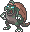
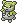
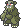
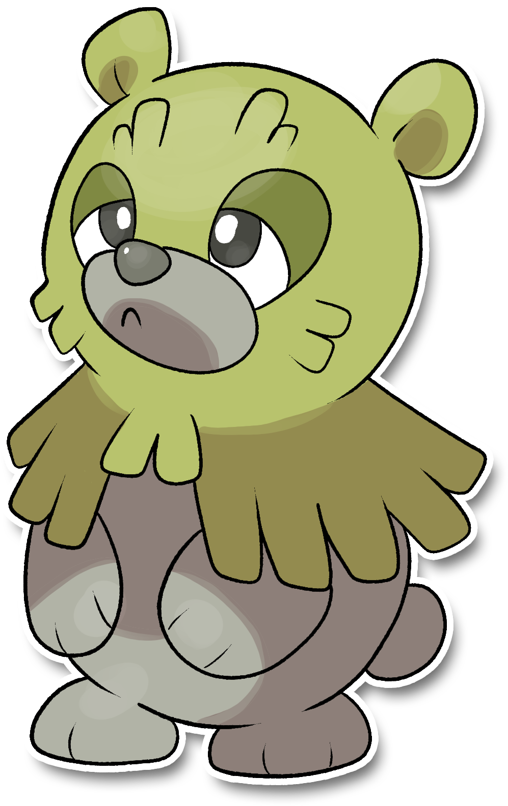

  ⬅️ <a href="https://avventureaditia.github.io/itia-wiki/pokemon/050-teetitan/"> 050 - Teetitan </a>
  <strong>051 - Muskuma</strong> 
  
  <a href="https://avventureaditia.github.io/itia-wiki/pokemon/052-marsikane/"> 052 - Marsikane </a> ➡️

## Pokédex

=== "Tassonomia"
    

      
      

        

          
Class

          

            
Orsetto

          

        

        

          
Types

          

            
            
          

        

        

          
Ability

          

            <a href='' title="Whenever a grass-type move hits this Pokemon, its Attack rises one stage, negating any other effect on it.">Sap-sipper</a>
          

        

        

          
Cry

          

            <audio controls>
              <source src="../../audio/muskuma.mp3" type="audio/mpeg">
            </audio>
          

        

      

    

=== "Aspetto"
    

      
      

        

          
Height

          

            
0,57 m

          

        

        

          
Weight

          

            
34,78 kg

          

        

        

          
Pokédex Color

          

            
Verde

          

        

        

          
Shape

          

            
          

        

      

    

=== "Allevamento"
    

      
      

        

          

            
Catch rate

            

              
145

            

          

          

            
Gender Ratio

            

              
50.0%

              
/

              
50.0%

            

          

        

        

          

            
Egg Groups

            

              
Monster and Field

            

          

          

            
Hatch Time

            

              
20 Cycles

            

          

        

        

          

            
Base experience yield

            

              
94

            

          

          

            
Leveling rate

            

              
Medium Slow

            

          

        

        

          

            
Base friendship

            

              
70

            

          

          

            
EV yield

            

              
1 - Defense

            

          

        

      

    

## Generali

=== "Descrizione Pokedex"
    ### Descrizione

    I Muskuma sono soliti nascondersi nelle zone più fredde delle foreste.  
    Grazie al rapporto con la natura che li circonda sono considerati simbolo della buona salute delle radure nelle quali vive.  
    Tuttavia in inverno si sposta in branco per raggiungere zone più montuose.  
    Questo comportamento segnala alla popolazione di Itia l'arrivo delle stagioni fredde.  

    Per maggiori informazioni il [video completo](https://www.youtube.com/watch?v=5O2NF9_ckdw&list=PLniAakFPn_t9I5zqlYAwZ_iSzJmgu5Nqd&index=8).

=== "Ispirazioni"

    ### Ispirazioni
    Le ispirazioni alla base di Muskuma e della sua catena evolutiva sono:
    
    - **Orso bruno marsicano**;
    - Leggenda del **bosco sacro di Angizia**;
    - **Orsa della Vigolana**;
    - **Salvan**.

=== "Vincitore del contest"
    ### Vincitori

    I Vincitori di Itia che hanno dato origine a Muskuma e la sua catena evolutiva sono **Manuela** e **Matteo**.

## Base Stats
<table style="width: 100%">
  <tbody style="width: 100%;">
    <tr style="display: flex; align-items: center;">
      <th style="color: #737373;" >HP</th>
      <td style="border-top: none; width: 70px">55</td>
      <td style="width: 100%; min-width: 450px; border-top: none;">
        

        

      </td>
    </tr>
    <tr style="display: flex; align-items: center;">
      <th style="color: #737373;">Attack</th>
      <td style="border-top: none; width: 70px">70</td>
      <td style="width: 100%; min-width: 450px; border-top: none;">
        

        

      </td>
    </tr>
    <tr style="display: flex; align-items: center;">
      <th style="color: #737373;">Defense</th>
      <td style="border-top: none; width: 70px">40</td>
      <td style="width: 100%; min-width: 450px; border-top: none;">
        

        

      </td>
    </tr>
    <tr style="display: flex; align-items: center;">
      <th style="color: #737373;">SP Attack</th>
      <td style="border-top: none; width: 70px">60</td>
      <td style="width: 100%; min-width: 450px; border-top: none;">
        

        

      </td>
    </tr>
    <tr style="display: flex; align-items: center;">
      <th style="color: #737373;">SP Defense</th>
      <td style="border-top: none; width: 70px">40</td>
      <td style="width: 100%; min-width: 450px; border-top: none;">
        

        

      </td>
    </tr>
    <tr style="display: flex; align-items: center;">
      <th style="color: #737373;">Speed</th>
      <td style="border-top: none; width: 70px">40</td>
      <td style="width: 100%; min-width: 450px; border-top: none;">
        

        

      </td>
    </tr>
  </tbody>
</table>

##Evolution Change
| Method | Item/Level/Note | Evolved Pokemon |
        | :--: | :--: | :--: |
        | Level Up | 30 | [Marsikane](https://avventureaditia.github.io/itia-wiki/pokemon/052-marsikane/) |
        

## Moveset

=== "Level Up Moves"
    | Level | Name | Power | Accuracy | PP | Type | Damage Class |
        | -- | -- | -- | -- | -- | -- | -- |
        
        

=== "Machine Moves"
    | Machine | Name | Power | Accuracy | PP | Type | Damage Class |
        | -- | -- | -- | -- | -- | -- | -- |
        
        
