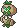

  ⬅️ <a href="https://avventureaditia.github.io/itia-wiki/pokemon/053-staly/"> 053 - Staly </a>
  <strong>054 - Rupedola</strong> 
  
  <a href="https://avventureaditia.github.io/itia-wiki/pokemon/055-camuninfa/"> 055 - Camuninfa </a> ➡️

  

  

    

        
Class

        

          
Erbostatua

        

      

    

      
Types

      

        
        
      

    

    

      
Abilities

      

        <a href='' title="This Pokemon's Speed is doubled during strong sunlight.  This bonus does not count as a stat modifier.">Chlorophyll</a>
        
      

    

    

      
Hidden Ability

      

        
      

    

  

## Generali

=== "Descrizione Pokedex"
    ### Descrizione

    Gli Staly una volta trovata una roccia invitante vi si annidano costruendosi una solida armatura per proteggersi, evolvendosi in Rupedola.  
    Antiche popolazioni di Itia spesso costruivano delle rocce adeguate a far crescere questi pokémon in modo da guadagnarsi la loro benevolenza e amicizia.  
    Si possano ancora trovare in giro alcuni simboli disegnati in loro onore.  

    Per maggiori informazioni il [video completo](https://www.youtube.com/watch?v=5O2NF9_ckdw&list=PLniAakFPn_t9I5zqlYAwZ_iSzJmgu5Nqd&index=8).

=== "Ispirazioni"

    ### Ispirazioni
    Le ispirazioni alla base di Staly e della sua catena evolutiva sono:
    
    - **Stella Alpina**;
    - **La Rosa Camuna**;
    - **Sibilla e le sue fate**.

=== "Vincitore del contest"
    ### Vincitore

    Il Vincitore di Itia che ha dato origine a Staly e la sua catena evolutiva è **Andrea**.

## Base Stats
<table style="width: 100%">
  <tbody style="width: 100%;">
    <tr style="display: flex; align-items: center;">
      <th style="color: #737373;" >HP</th>
      <td style="border-top: none; width: 70px">52</td>
      <td style="width: 100%; min-width: 450px; border-top: none;">
        

        

      </td>
    </tr>
    <tr style="display: flex; align-items: center;">
      <th style="color: #737373;">Attack</th>
      <td style="border-top: none; width: 70px">40</td>
      <td style="width: 100%; min-width: 450px; border-top: none;">
        

        

      </td>
    </tr>
    <tr style="display: flex; align-items: center;">
      <th style="color: #737373;">Defense</th>
      <td style="border-top: none; width: 70px">48</td>
      <td style="width: 100%; min-width: 450px; border-top: none;">
        

        

      </td>
    </tr>
    <tr style="display: flex; align-items: center;">
      <th style="color: #737373;">SP Attack</th>
      <td style="border-top: none; width: 70px">40</td>
      <td style="width: 100%; min-width: 450px; border-top: none;">
        

        

      </td>
    </tr>
    <tr style="display: flex; align-items: center;">
      <th style="color: #737373;">SP Defense</th>
      <td style="border-top: none; width: 70px">48</td>
      <td style="width: 100%; min-width: 450px; border-top: none;">
        

        

      </td>
    </tr>
    <tr style="display: flex; align-items: center;">
      <th style="color: #737373;">Speed</th>
      <td style="border-top: none; width: 70px">62</td>
      <td style="width: 100%; min-width: 450px; border-top: none;">
        

        

      </td>
    </tr>
  </tbody>
</table>

##Evolution Change
| Method | Item/Level/Note | Evolved Pokemon |
        | :--: | :--: | :--: |
        | Level Up | 38 | [Camuninfa](https://avventureaditia.github.io/itia-wiki/pokemon/055-camuninfa/) |
        

## Moveset

=== "Level Up Moves"
    | Level | Name | Power | Accuracy | PP | Type | Damage Class |
        | -- | -- | -- | -- | -- | -- | -- |
        
        

=== "Machine Moves"
    | Machine | Name | Power | Accuracy | PP | Type | Damage Class |
        | -- | -- | -- | -- | -- | -- | -- |
        
        
