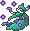

  ⬅️ <a href="https://avventureaditia.github.io/itia-wiki/pokemon/055-camuninfa/"> 055 - Camuninfa </a>
  <strong>056 - Voluva</strong> 
  
  <a href="https://avventureaditia.github.io/itia-wiki/pokemon/057-uvanity/"> 057 - Uvanity </a> ➡️

  

  

    

        
Class

        

          
Acino

        

      

    

      
Types

      

        
        
      

    

    

      
Abilities

      

        <a href='' title="This Pokemon's moves ignore light screen, reflect, and safeguard.">Infiltrator</a>
        
      

    

    

      
Hidden Ability

      

        
      

    

  

## Generali

=== "Descrizione Pokedex"
    ### Descrizione

    I Voluva sono conosciuti per il loro carattere calmo e paziente.  
    Infatti, il loro unico scopo nella vita è raggiungere l’acino d’uva che cresce sulla lora coda che sembra avere vita propria sfuggendogli continuamente dalle zampe.  
    Non si sa ancora se sia davvero così o se in realtà è controllato dai poteri psichici del Pokémon che si diverte a giocare in questo modo.  

    Per maggiori informazioni il [video completo](https://www.youtube.com/watch?v=5O2NF9_ckdw&list=PLniAakFPn_t9I5zqlYAwZ_iSzJmgu5Nqd&index=8).

=== "Ispirazioni"

    ### Ispirazioni
    Le ispirazioni alla base di Voluva e della sua catena evolutiva sono:
    
    - **Volpe e l’uva**;
    - **Dio Bacco**;
    - **Leggenda del fiore della Veronica**;
    - **Santa Lucia**.

=== "Vincitore del contest"
    ### Vincitori

    I Vincitori di Itia che hanno dato origine a Voluva e la sua catena evolutiva sono **Davide** e **Nekuro**.

## Base Stats
<table style="width: 100%">
  <tbody style="width: 100%;">
    <tr style="display: flex; align-items: center;">
      <th style="color: #737373;" >HP</th>
      <td style="border-top: none; width: 70px">38</td>
      <td style="width: 100%; min-width: 450px; border-top: none;">
        

        

      </td>
    </tr>
    <tr style="display: flex; align-items: center;">
      <th style="color: #737373;">Attack</th>
      <td style="border-top: none; width: 70px">41</td>
      <td style="width: 100%; min-width: 450px; border-top: none;">
        

        

      </td>
    </tr>
    <tr style="display: flex; align-items: center;">
      <th style="color: #737373;">Defense</th>
      <td style="border-top: none; width: 70px">40</td>
      <td style="width: 100%; min-width: 450px; border-top: none;">
        

        

      </td>
    </tr>
    <tr style="display: flex; align-items: center;">
      <th style="color: #737373;">SP Attack</th>
      <td style="border-top: none; width: 70px">50</td>
      <td style="width: 100%; min-width: 450px; border-top: none;">
        

        

      </td>
    </tr>
    <tr style="display: flex; align-items: center;">
      <th style="color: #737373;">SP Defense</th>
      <td style="border-top: none; width: 70px">65</td>
      <td style="width: 100%; min-width: 450px; border-top: none;">
        

        

      </td>
    </tr>
    <tr style="display: flex; align-items: center;">
      <th style="color: #737373;">Speed</th>
      <td style="border-top: none; width: 70px">65</td>
      <td style="width: 100%; min-width: 450px; border-top: none;">
        

        

      </td>
    </tr>
  </tbody>
</table>

##Evolution Change
| Method | Item/Level/Note | Evolved Pokemon |
        | :--: | :--: | :--: |
        | Item | Dawn Stone | [Uvanity](https://avventureaditia.github.io/itia-wiki/pokemon/057-uvanity/) |
        

## Moveset

=== "Level Up Moves"
    | Level | Name | Power | Accuracy | PP | Type | Damage Class |
        | -- | -- | -- | -- | -- | -- | -- |
        
        

=== "Machine Moves"
    | Machine | Name | Power | Accuracy | PP | Type | Damage Class |
        | -- | -- | -- | -- | -- | -- | -- |
        
        
