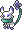
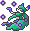
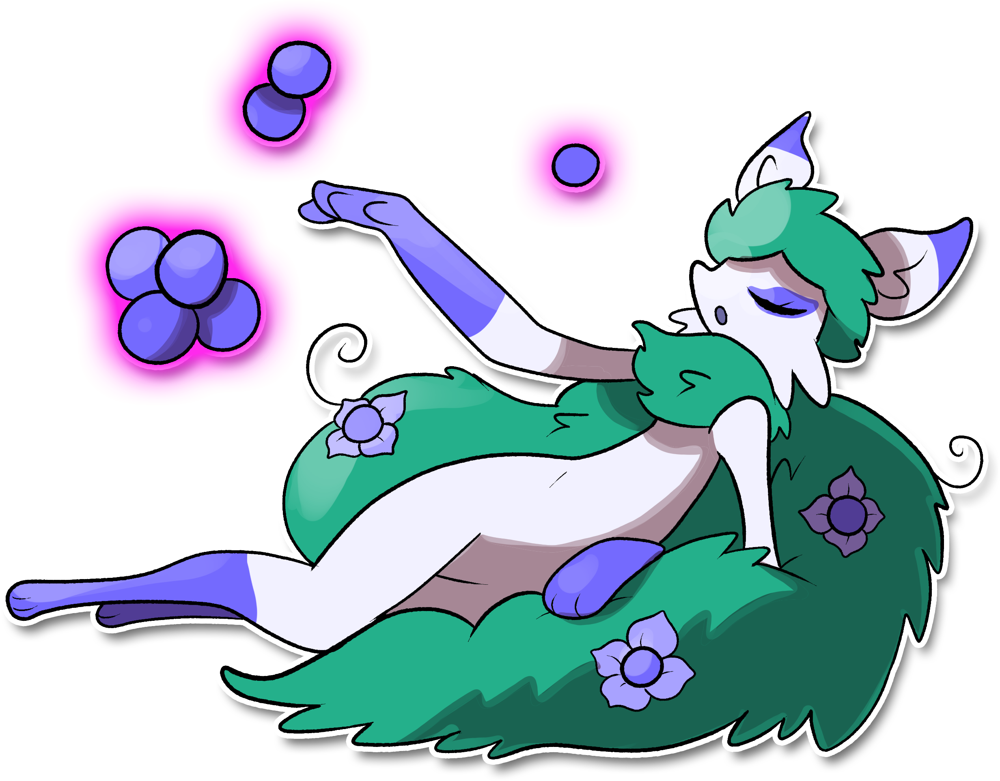

  ⬅️ <a href="https://avventureaditia.github.io/itia-wiki/pokemon/056-voluva/"> 056 - Voluva </a>
  <strong>057 - Uvanity</strong> 
  
  <a href="https://avventureaditia.github.io/itia-wiki/pokemon/058-mullitos/"> 058 - Mullitos </a> ➡️

  

  

    

      

        
Class

        

          
Grappolo

        

      

      
Types

      

        
        
      

    

    

      
Abilities

      

        <a href='' title="This Pokemon's moves ignore light screen, reflect, and safeguard.">Infiltrator</a>
        
      

    

    

      
Hidden Ability

      

        
      

    

  

## Generali

=== "Descrizione Pokedex"
    ### Descrizione

    Quando Voluva riesce a raggiungere l’acino d’uva sulla sua coda e a cibarsene si evolve in Uvanity.  
    Questo Pokémon possiede enormi capacità psichiche che sfrutta a proprio piacimento controllando gli acini d’uva che la sua enorme coda produce.  
    Questi acini sono commestibili, ma allo stesso tempo fungono da occhi al Pokémon che li controlla a distanza e riesce a carpire ogni desiderio e pensiero di chiunque gli stia accanto, in questo modo, avendo un’indole gentile riesce a realizzare i desideri di chi ritiene degno.  

    Per maggiori informazioni il [video completo](https://www.youtube.com/watch?v=5O2NF9_ckdw&list=PLniAakFPn_t9I5zqlYAwZ_iSzJmgu5Nqd&index=8).

=== "Ispirazioni"

    ### Ispirazioni
    Le ispirazioni alla base di Voluva e della sua catena evolutiva sono:
    
    - **Volpe e l’uva**;
    - **Dio Bacco**;
    - **Leggenda del fiore della Veronica**;
    - **Santa Lucia**.

=== "Vincitore del contest"
    ### Vincitori

    I Vincitori di Itia che hanno dato origine a Voluva e la sua catena evolutiva sono **Davide** e **Nekuro**.

## Base Stats
<table style="width: 100%">
  <tbody style="width: 100%;">
    <tr style="display: flex; align-items: center;">
      <th style="color: #737373;" >HP</th>
      <td style="border-top: none; width: 70px">73</td>
      <td style="width: 100%; min-width: 450px; border-top: none;">
        

        

      </td>
    </tr>
    <tr style="display: flex; align-items: center;">
      <th style="color: #737373;">Attack</th>
      <td style="border-top: none; width: 70px">76</td>
      <td style="width: 100%; min-width: 450px; border-top: none;">
        

        

      </td>
    </tr>
    <tr style="display: flex; align-items: center;">
      <th style="color: #737373;">Defense</th>
      <td style="border-top: none; width: 70px">75</td>
      <td style="width: 100%; min-width: 450px; border-top: none;">
        

        

      </td>
    </tr>
    <tr style="display: flex; align-items: center;">
      <th style="color: #737373;">SP Attack</th>
      <td style="border-top: none; width: 70px">100</td>
      <td style="width: 100%; min-width: 450px; border-top: none;">
        

        

      </td>
    </tr>
    <tr style="display: flex; align-items: center;">
      <th style="color: #737373;">SP Defense</th>
      <td style="border-top: none; width: 70px">80</td>
      <td style="width: 100%; min-width: 450px; border-top: none;">
        

        

      </td>
    </tr>
    <tr style="display: flex; align-items: center;">
      <th style="color: #737373;">Speed</th>
      <td style="border-top: none; width: 70px">100</td>
      <td style="width: 100%; min-width: 450px; border-top: none;">
        

        

      </td>
    </tr>
  </tbody>
</table>

## Moveset

=== "Level Up Moves"
    | Level | Name | Power | Accuracy | PP | Type | Damage Class |
        | -- | -- | -- | -- | -- | -- | -- |
        
        

=== "Machine Moves"
    | Machine | Name | Power | Accuracy | PP | Type | Damage Class |
        | -- | -- | -- | -- | -- | -- | -- |
        
        
