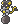
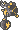
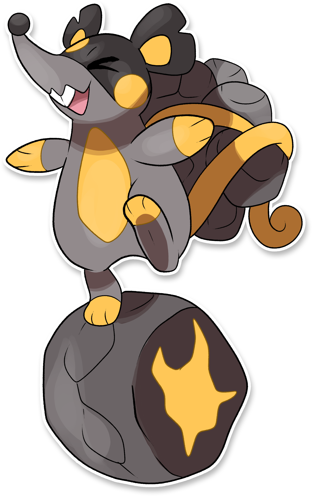
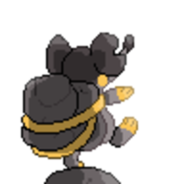
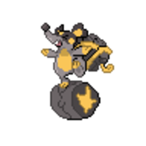
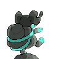
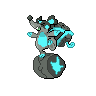

  ⬅️ <a href="https://avventureaditia.github.io/itia-wiki/pokemon/058-mullitos/"> 058 - Mullitos </a>
  <strong>059 - Nuraghimin</strong> 
  
  <a href="https://avventureaditia.github.io/itia-wiki/pokemon/060-frogtry/"> 060 - Frogtry </a> ➡️

## Pokédex

=== "Tassonomia"
    

      
      

        

          
Class

          

            
Minatore

          

        

        

          
Types

          

            
            
          

        

        

          
Ability

          

            <a href='' title="Whenever a move makes contact with this Pokemon, the move's user has a 30% chance of being paralyzed.  Pokemon that are immune to electric-type moves can still be paralyzed by this ability.  Overworld: If the lead Pokemon has this ability, there is a 50% chance that encounters will be with an electric Pokemon, if applicable.">Static</a>
          

        

        

          
Cry

          

            <audio controls>
              <source src="../../audio/nuraghimin.mp3" type="audio/mpeg">
            </audio>
          

        

      

    

=== "Aspetto"
    

      
      

        

          
Height

          

            
0,61 m

          

        

        

          
Weight

          

            
16,17 kg

          

        

        

          
Pokédex Color

          

            
Giallo

          

        

        

          
Shape

          

            
          

        

      

    

=== "Allevamento"
    

      
      

        

          

            
Catch rate

            

              
70

            

          

          

            
Gender Ratio

            

              
50.0%

              
/

              
50.0%

            

          

        

        

          

            
Egg Groups

            

              
Field and Monster

            

          

          

            
Hatch Time

            

              
20 Cycles

            

          

        

        

          

            
Base experience yield

            

              
179

            

          

          

            
Leveling rate

            

              
Medium Fast

            

          

        

        

          

            
Base friendship

            

              
70

            

          

          

            
EV yield

            

              
2 - Sp.Attack

            

          

        

      

    

## Generali

=== "Descrizione Pokedex"
    ### Descrizione

    I Nuraghimin raccolgono un elevato numero di pietre che trasportano grazie alla loro lunghissima coda, così da usarle sia per attaccare sia per difendersi.  
    Vengono caricate di elettricità strofinandole sulle loro guance per poi lanciarle contro gli avversari.  
    Quando colpiscono un ostacolo, queste pietre esplodono generando una cupola di elettricità che paralizza chiunque ne entri a contatto.  
    Sfrecciano velocissimi sulle loro ruote di pietra in tutte le miniere della regione.  

    Per maggiori informazioni il [video completo](https://www.youtube.com/watch?v=wc_j9yS_Pck&list=PLniAakFPn_t9I5zqlYAwZ_iSzJmgu5Nqd&index=9).

=== "Ispirazioni"

    ### Ispirazioni
    Le ispirazioni alla base di Mullitos e della sua catena evolutiva sono:
    
    - **Mustiolo**;
    - **Su carr'e Nannai**;
    - **Nuraghe**.

=== "Vincitore del contest"
    ### Vincitore

    Il Vincitore di Itia che ha dato origine a Mullitos e la sua catena evolutiva è **Marco**.

## Base Stats
<table style="width: 100%">
  <tbody style="width: 100%;">
    <tr style="display: flex; align-items: center;">
      <th style="color: #737373;" >HP</th>
      <td style="border-top: none; width: 70px">88</td>
      <td style="width: 100%; min-width: 450px; border-top: none;">
        

        

      </td>
    </tr>
    <tr style="display: flex; align-items: center;">
      <th style="color: #737373;">Attack</th>
      <td style="border-top: none; width: 70px">80</td>
      <td style="width: 100%; min-width: 450px; border-top: none;">
        

        

      </td>
    </tr>
    <tr style="display: flex; align-items: center;">
      <th style="color: #737373;">Defense</th>
      <td style="border-top: none; width: 70px">73</td>
      <td style="width: 100%; min-width: 450px; border-top: none;">
        

        

      </td>
    </tr>
    <tr style="display: flex; align-items: center;">
      <th style="color: #737373;">SP Attack</th>
      <td style="border-top: none; width: 70px">122</td>
      <td style="width: 100%; min-width: 450px; border-top: none;">
        

        

      </td>
    </tr>
    <tr style="display: flex; align-items: center;">
      <th style="color: #737373;">SP Defense</th>
      <td style="border-top: none; width: 70px">68</td>
      <td style="width: 100%; min-width: 450px; border-top: none;">
        

        

      </td>
    </tr>
    <tr style="display: flex; align-items: center;">
      <th style="color: #737373;">Speed</th>
      <td style="border-top: none; width: 70px">79</td>
      <td style="width: 100%; min-width: 450px; border-top: none;">
        

        

      </td>
    </tr>
  </tbody>
</table>

## Aspetto di gioco

=== "Base"
    

      

        
      

      

        
      

    

=== "Shiny"
    

      

        
      

      

        
      

    

    

## Moveset

=== "Level Up Moves"
    | Level | Name | Power | Accuracy | PP | Type | Damage Class |
        | -- | -- | -- | -- | -- | -- | -- |
        
        

=== "Machine Moves"
    | Machine | Name | Power | Accuracy | PP | Type | Damage Class |
        | -- | -- | -- | -- | -- | -- | -- |
        
        
