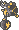

  ⬅️ <a href="https://avventureaditia.github.io/itia-wiki/pokemon/059-nuraghimin/"> 059 - Nuraghimin </a>
  <strong>060 - Frogtry</strong> 
  
  <a href="https://avventureaditia.github.io/itia-wiki/pokemon/061-galvtoadur/"> 061 - Galvtoadur </a> ➡️

  

  

    

        
Class

        

          
Elettrana

        

      

    

      
Types

      

        
        
      

    

    

      
Abilities

      

        <a href='' title="When this Pokemon uses a Normal moves, that move is Electric its power is 1.2x.">Galvanize</a>
        
      

    

    

      
Hidden Ability

      

        
      

    

  

## Generali

=== "Descrizione Pokedex"
    ### Descrizione

    Questo piccolo Pokémon è piuttosto comune nella regione di Itia, soprattutto nelle parti centro meridionale.  
    Nonostante l'aspetto, l'elettricità che ha nelle zampe posteriori gli consente di spiccare balzi anche di 2 metri, ma capita che non siano intenzionali, più in alto riesce a saltare, più è prossima l'evoluzione.  

    Per maggiori informazioni il [video completo](https://www.youtube.com/watch?v=wc_j9yS_Pck&list=PLniAakFPn_t9I5zqlYAwZ_iSzJmgu5Nqd&index=9).

=== "Ispirazioni"

    ### Ispirazioni
    Le ispirazioni alla base di Frogtry e della sua catena evolutiva sono:
    
    - **Esperimenti di Luigi Galvani e Galvanometro**;
    - **Rana italica**.

=== "Vincitore del contest"
    ### Vincitore

    Il Vincitore di Itia che ha dato origine a Frogtry e la sua catena evolutiva è **Andrea**.

## Base Stats
<table style="width: 100%">
  <tbody style="width: 100%;">
    <tr style="display: flex; align-items: center;">
      <th style="color: #737373;" >HP</th>
      <td style="border-top: none; width: 70px">40</td>
      <td style="width: 100%; min-width: 450px; border-top: none;">
        

        

      </td>
    </tr>
    <tr style="display: flex; align-items: center;">
      <th style="color: #737373;">Attack</th>
      <td style="border-top: none; width: 70px">50</td>
      <td style="width: 100%; min-width: 450px; border-top: none;">
        

        

      </td>
    </tr>
    <tr style="display: flex; align-items: center;">
      <th style="color: #737373;">Defense</th>
      <td style="border-top: none; width: 70px">45</td>
      <td style="width: 100%; min-width: 450px; border-top: none;">
        

        

      </td>
    </tr>
    <tr style="display: flex; align-items: center;">
      <th style="color: #737373;">SP Attack</th>
      <td style="border-top: none; width: 70px">20</td>
      <td style="width: 100%; min-width: 450px; border-top: none;">
        

        

      </td>
    </tr>
    <tr style="display: flex; align-items: center;">
      <th style="color: #737373;">SP Defense</th>
      <td style="border-top: none; width: 70px">30</td>
      <td style="width: 100%; min-width: 450px; border-top: none;">
        

        

      </td>
    </tr>
    <tr style="display: flex; align-items: center;">
      <th style="color: #737373;">Speed</th>
      <td style="border-top: none; width: 70px">70</td>
      <td style="width: 100%; min-width: 450px; border-top: none;">
        

        

      </td>
    </tr>
  </tbody>
</table>

##Evolution Change
| Method | Item/Level/Note | Evolved Pokemon |
        | :--: | :--: | :--: |
        | Level Up | 26 | [Galvtoadur](https://avventureaditia.github.io/itia-wiki/pokemon/061-galvtoadur/) |
        

## Moveset

=== "Level Up Moves"
    | Level | Name | Power | Accuracy | PP | Type | Damage Class |
        | -- | -- | -- | -- | -- | -- | -- |
        
        

=== "Machine Moves"
    | Machine | Name | Power | Accuracy | PP | Type | Damage Class |
        | -- | -- | -- | -- | -- | -- | -- |
        
        
