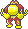
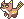
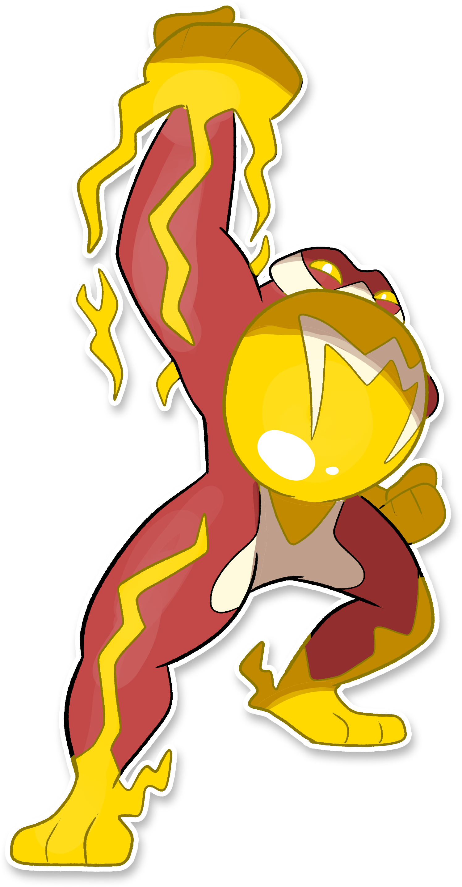

  ⬅️ <a href="https://avventureaditia.github.io/itia-wiki/pokemon/060-frogtry/"> 060 - Frogtry </a>
  <strong>061 - Galvtoadur</strong> 
  
  <a href="https://avventureaditia.github.io/itia-wiki/pokemon/062-sparkynx/"> 062 - Sparkynx </a> ➡️

## Pokédex

=== "Tassonomia"
    

      
      

        

          
Class

          

            
Rospelettro

          

        

        

          
Types

          

            
            
          

        

        

          
Ability

          

            <a href='' title="When this Pokemon uses a Normal moves, that move is Electric its power is 1.2x.">Galvanize</a>
          

        

        

          
Cry

          

            <audio controls>
              <source src="../../audio/galvtoadur.mp3" type="audio/mpeg">
            </audio>
          

        

      

    

=== "Aspetto"
    

      
      

        

          
Height

          

            
1,76 m

          

        

        

          
Weight

          

            
67,16 kg

          

        

        

          
Pokédex Color

          

            
Giallo

          

        

        

          
Shape

          

            
          

        

      

    

=== "Allevamento"
    

      
      

        

          

            
Catch rate

            

              
70

            

          

          

            
Gender Ratio

            

              
50.0%

              
/

              
50.0%

            

          

        

        

          

            
Egg Groups

            

              
Field and Amorphous

            

          

          

            
Hatch Time

            

              
20 Cycles

            

          

        

        

          

            
Base experience yield

            

              
187

            

          

          

            
Leveling rate

            

              
Medium Slow

            

          

        

        

          

            
Base friendship

            

              
70

            

          

          

            
EV yield

            

              
2 - Attack

            

          

        

      

    

## Generali

=== "Descrizione Pokedex"
    ### Descrizione

    L'elettricità che ha in corpo potenzia i colpi che sferra, consentendogli di sferrare attacchi corpo a corpo ad estrema rapidità.  
    Nonostante l'apparenza, la sua vera forza risiede nelle zampe inferiori, nelle quali scorre perennemente l'elettricità prodotta dai pattern sul corpo che circondano tutti e quattro gli arti.  

    Per maggiori informazioni il [video completo](https://www.youtube.com/watch?v=wc_j9yS_Pck&list=PLniAakFPn_t9I5zqlYAwZ_iSzJmgu5Nqd&index=9).

=== "Ispirazioni"

    ### Ispirazioni
    Le ispirazioni alla base di Frogtry e della sua catena evolutiva sono:
    
    - **Esperimenti di Luigi Galvani e Galvanometro**;
    - **Rana italica**.

=== "Vincitore del contest"
    ### Vincitore

    Il Vincitore di Itia che ha dato origine a Frogtry e la sua catena evolutiva è **Andrea**.

## Base Stats
<table style="width: 100%">
  <tbody style="width: 100%;">
    <tr style="display: flex; align-items: center;">
      <th style="color: #737373;" >HP</th>
      <td style="border-top: none; width: 70px">70</td>
      <td style="width: 100%; min-width: 450px; border-top: none;">
        

        

      </td>
    </tr>
    <tr style="display: flex; align-items: center;">
      <th style="color: #737373;">Attack</th>
      <td style="border-top: none; width: 70px">130</td>
      <td style="width: 100%; min-width: 450px; border-top: none;">
        

        

      </td>
    </tr>
    <tr style="display: flex; align-items: center;">
      <th style="color: #737373;">Defense</th>
      <td style="border-top: none; width: 70px">60</td>
      <td style="width: 100%; min-width: 450px; border-top: none;">
        

        

      </td>
    </tr>
    <tr style="display: flex; align-items: center;">
      <th style="color: #737373;">SP Attack</th>
      <td style="border-top: none; width: 70px">35</td>
      <td style="width: 100%; min-width: 450px; border-top: none;">
        

        

      </td>
    </tr>
    <tr style="display: flex; align-items: center;">
      <th style="color: #737373;">SP Defense</th>
      <td style="border-top: none; width: 70px">50</td>
      <td style="width: 100%; min-width: 450px; border-top: none;">
        

        

      </td>
    </tr>
    <tr style="display: flex; align-items: center;">
      <th style="color: #737373;">Speed</th>
      <td style="border-top: none; width: 70px">105</td>
      <td style="width: 100%; min-width: 450px; border-top: none;">
        

        

      </td>
    </tr>
  </tbody>
</table>

## Moveset

=== "Level Up Moves"
    | Level | Name | Power | Accuracy | PP | Type | Damage Class |
        | -- | -- | -- | -- | -- | -- | -- |
        
        

=== "Machine Moves"
    | Machine | Name | Power | Accuracy | PP | Type | Damage Class |
        | -- | -- | -- | -- | -- | -- | -- |
        
        
