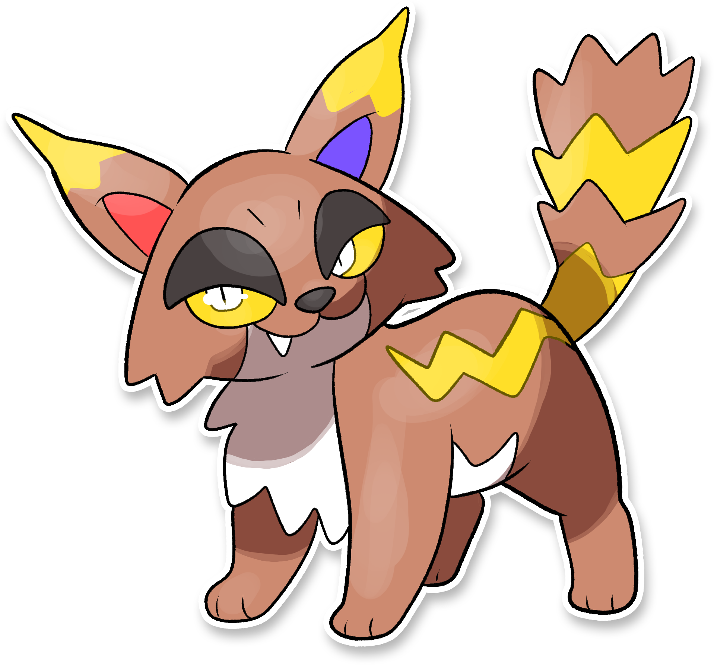

  ⬅️ <a href="https://avventureaditia.github.io/itia-wiki/pokemon/061-galvtoadur/"> 061 - Galvtoadur </a>
  <strong>062 - Sparkynx</strong> 
  
  <a href="https://avventureaditia.github.io/itia-wiki/pokemon/063-lighynx/"> 063 - Lighynx </a> ➡️

## Pokédex

=== "Tassonomia"
    

      
      

        

          
Class

          

            
Lince

          

        

        

          
Types

          

            
          

        

        

          
Ability

          

            <a href='' title="When this Pokemon enters battle, the opponent's Attack is lowered by one stage.  In a double battle, both opponents are affected.  This ability also takes effect when acquired during a battle, but will not take effect again if lost and reobtained without leaving battle.  This ability has no effect on an opponent that has a substitute.  Overworld: If the first Pokemon in the party has this ability, any random encounter with a Pokemon five or more levels lower than it has a 50% chance of being skipped.">Intimidate</a>
          

        

        

          
Cry

          

            <audio controls>
              <source src="../../audio/sparkynx.mp3" type="audio/mpeg">
            </audio>
          

        

      

    

=== "Aspetto"
    

      
      

        

          
Height

          

            
0,34 m

          

        

        

          
Weight

          

            
3,21 kg

          

        

        

          
Pokédex Color

          

            
Giallo

          

        

        

          
Shape

          

            
          

        

      

    

=== "Allevamento"
    

      
      

        

          

            
Catch rate

            

              
120

            

          

          

            
Gender Ratio

            

              
50.00%

              
/

              
50.00%

            

          

        

        

          

            
Egg Groups

            

              
Field

            

          

          

            
Hatch Time

            

              
20 Cycles

            

          

        

        

          

            
Base experience yield

            

              
76

            

          

          

            
Leveling rate

            

              
Fast

            

          

        

        

          

            
Base friendship

            

              
70

            

          

          

            
EV yield

            

              
1 - Speed

            

          

        

      

    

## Generali

=== "Descrizione Pokedex"
    ### Descrizione

    Nelle zone di confine, tra le montagne e i centri abitati si possono trovare gli Sparkynx.  
    Questo Pokémon è timido e difficilmente si può incontrare in natura.  
    Tramite i ciuffi di pelo sulle orecchie, Sparkynx riesce a catturare le particelle elettriche presenti nell'aria a seconda dell'orecchio.  
    Tramite l'orecchio sinistro cattura le particelle positive e con il destro quelle negative.  

    Per maggiori informazioni il [video completo](https://www.youtube.com/watch?v=wc_j9yS_Pck&list=PLniAakFPn_t9I5zqlYAwZ_iSzJmgu5Nqd&index=9).

=== "Ispirazioni"

    ### Ispirazioni
    Le ispirazioni alla base di Sparkynx e della sua catena evolutiva sono:
    
    - **Alessandro Volta e la Pila**;
    - **Lince**.

=== "Vincitore del contest"
    ### Vincitore

    Il Vincitore di Itia che ha dato origine a Sparkynx e la sua catena evolutiva è **GODZILLA**.

## Base Stats
<table style="width: 100%">
  <tbody style="width: 100%;">
    <tr style="display: flex; align-items: center;">
      <th style="color: #737373;" >HP</th>
      <td style="border-top: none; width: 70px">62</td>
      <td style="width: 100%; min-width: 450px; border-top: none;">
        

        

      </td>
    </tr>
    <tr style="display: flex; align-items: center;">
      <th style="color: #737373;">Attack</th>
      <td style="border-top: none; width: 70px">73</td>
      <td style="width: 100%; min-width: 450px; border-top: none;">
        

        

      </td>
    </tr>
    <tr style="display: flex; align-items: center;">
      <th style="color: #737373;">Defense</th>
      <td style="border-top: none; width: 70px">58</td>
      <td style="width: 100%; min-width: 450px; border-top: none;">
        

        

      </td>
    </tr>
    <tr style="display: flex; align-items: center;">
      <th style="color: #737373;">SP Attack</th>
      <td style="border-top: none; width: 70px">50</td>
      <td style="width: 100%; min-width: 450px; border-top: none;">
        

        

      </td>
    </tr>
    <tr style="display: flex; align-items: center;">
      <th style="color: #737373;">SP Defense</th>
      <td style="border-top: none; width: 70px">54</td>
      <td style="width: 100%; min-width: 450px; border-top: none;">
        

        

      </td>
    </tr>
    <tr style="display: flex; align-items: center;">
      <th style="color: #737373;">Speed</th>
      <td style="border-top: none; width: 70px">72</td>
      <td style="width: 100%; min-width: 450px; border-top: none;">
        

        

      </td>
    </tr>
  </tbody>
</table>

##Evolution Change
| Method | Item/Level/Note | Evolved Pokemon |
        | :--: | :--: | :--: |
        | Level Up | 34 | [Lighynx](https://avventureaditia.github.io/itia-wiki/pokemon/063-lighynx/) |
        

## Moveset

=== "Level Up Moves"
    | Level | Name | Power | Accuracy | PP | Type | Damage Class |
        | -- | -- | -- | -- | -- | -- | -- |
        
        

=== "Machine Moves"
    | Machine | Name | Power | Accuracy | PP | Type | Damage Class |
        | -- | -- | -- | -- | -- | -- | -- |
        
        
