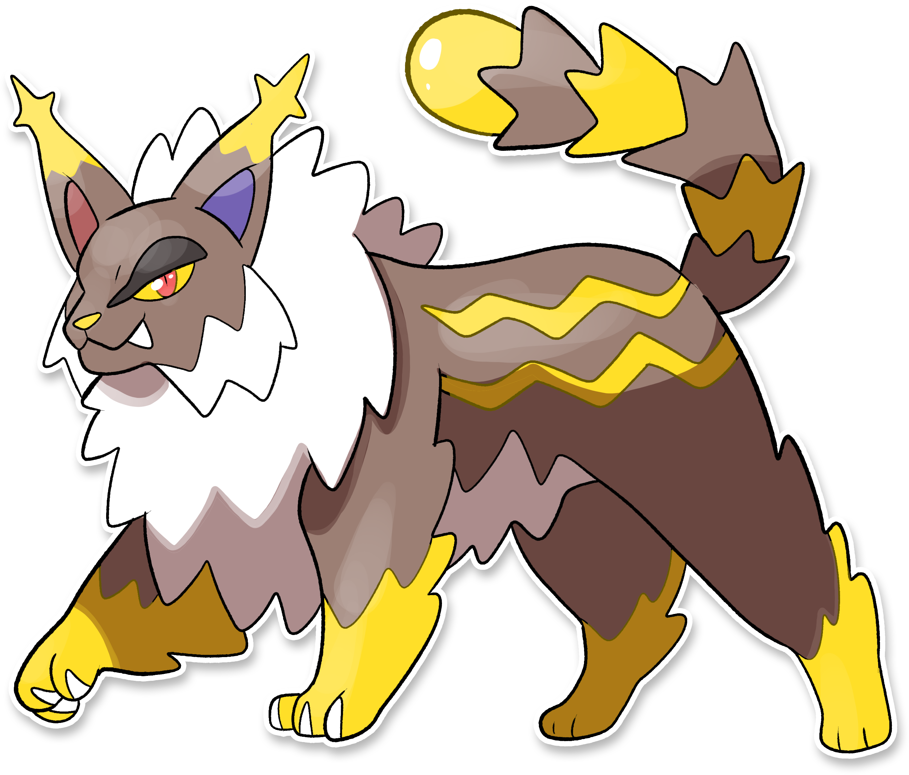

  ⬅️ <a href="https://avventureaditia.github.io/itia-wiki/pokemon/062-sparkynx/"> 062 - Sparkynx </a>
  <strong>063 - Lighynx</strong> 
  
  <a href="https://avventureaditia.github.io/itia-wiki/pokemon/064-rotom-squillo/"> 064 - Rotom-squillo </a> ➡️

  

  

    

        
Class

        

          
Lince

        

      

    

        
Class

        

          
Lince

        

      

    

      
Types

      

        
        
      

    

    

      
Abilities

      

        <a href='' title="When this Pokemon enters battle, the opponent's Attack is lowered by one stage.  In a double battle, both opponents are affected.  This ability also takes effect when acquired during a battle, but will not take effect again if lost and reobtained without leaving battle.  This ability has no effect on an opponent that has a substitute.  Overworld: If the first Pokemon in the party has this ability, any random encounter with a Pokemon five or more levels lower than it has a 50% chance of being skipped.">Intimidate</a>
        
      

    

    

      
Hidden Ability

      

        
      

    

  

## Generali

=== "Descrizione Pokedex"
    ### Descrizione

    A differenza degli Sparkynx, molto affettuosi, i Lighynx preferiscono stare alla larga dai centri abitati dagli umani, forse consapevoli della loro enorme potenza in grado di causare blackout in tutte le zone circostanti.  
    Proprio per questa loro capacità hanno acquisito il tipo buio, poiché riescono anche a vedere perfettamente senza la luce.  
    L'elettricità che producono viene conservata nei lunghi peli del collo che danno la scossa quando toccati.  

    Per maggiori informazioni il [video completo](https://www.youtube.com/watch?v=wc_j9yS_Pck&list=PLniAakFPn_t9I5zqlYAwZ_iSzJmgu5Nqd&index=9).

=== "Ispirazioni"

    ### Ispirazioni
    Le ispirazioni alla base di Sparkynx e della sua catena evolutiva sono:
    
    - **Alessandro Volta e la Pila**;
    - **Lince**.

=== "Vincitore del contest"
    ### Vincitore

    Il Vincitore di Itia che ha dato origine a Sparkynx e la sua catena evolutiva è **GODZILLA**.

## Base Stats
<table style="width: 100%">
  <tbody style="width: 100%;">
    <tr style="display: flex; align-items: center;">
      <th style="color: #737373;" >HP</th>
      <td style="border-top: none; width: 70px">86</td>
      <td style="width: 100%; min-width: 450px; border-top: none;">
        

        

      </td>
    </tr>
    <tr style="display: flex; align-items: center;">
      <th style="color: #737373;">Attack</th>
      <td style="border-top: none; width: 70px">109</td>
      <td style="width: 100%; min-width: 450px; border-top: none;">
        

        

      </td>
    </tr>
    <tr style="display: flex; align-items: center;">
      <th style="color: #737373;">Defense</th>
      <td style="border-top: none; width: 70px">72</td>
      <td style="width: 100%; min-width: 450px; border-top: none;">
        

        

      </td>
    </tr>
    <tr style="display: flex; align-items: center;">
      <th style="color: #737373;">SP Attack</th>
      <td style="border-top: none; width: 70px">68</td>
      <td style="width: 100%; min-width: 450px; border-top: none;">
        

        

      </td>
    </tr>
    <tr style="display: flex; align-items: center;">
      <th style="color: #737373;">SP Defense</th>
      <td style="border-top: none; width: 70px">66</td>
      <td style="width: 100%; min-width: 450px; border-top: none;">
        

        

      </td>
    </tr>
    <tr style="display: flex; align-items: center;">
      <th style="color: #737373;">Speed</th>
      <td style="border-top: none; width: 70px">106</td>
      <td style="width: 100%; min-width: 450px; border-top: none;">
        

        

      </td>
    </tr>
  </tbody>
</table>

## Moveset

=== "Level Up Moves"
    | Level | Name | Power | Accuracy | PP | Type | Damage Class |
        | -- | -- | -- | -- | -- | -- | -- |
        
        

=== "Machine Moves"
    | Machine | Name | Power | Accuracy | PP | Type | Damage Class |
        | -- | -- | -- | -- | -- | -- | -- |
        
        
