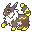
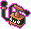
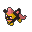
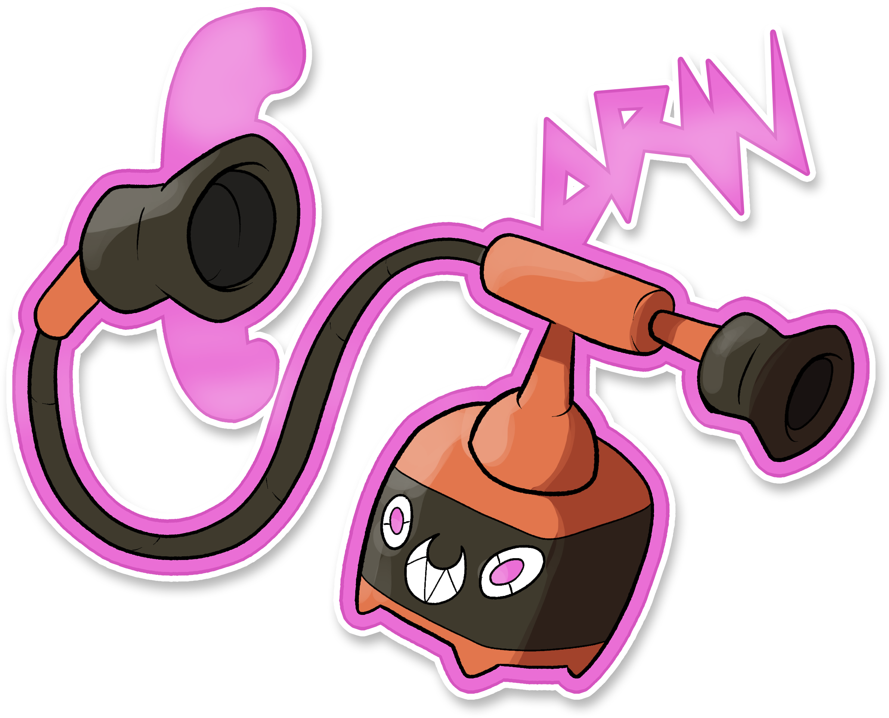
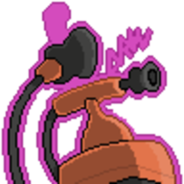
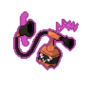
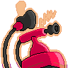
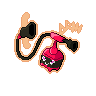

  ⬅️ <a href="https://avventureaditia.github.io/itia-wiki/pokemon/063-lighynx/"> 063 - Lighynx </a>
  <strong>064 - Rotom Squillo</strong> 
  
  <a href="https://avventureaditia.github.io/itia-wiki/pokemon/065-gladeon/"> 065 - Gladeon </a> ➡️

## Pokédex

=== "Tassonomia"
    

      
      

        

          
Class

          

            
Plasma

          

        

        

          
Types

          

            
            
          

        

        

          
Ability

          

            <a href='' title="This Pokemon is immune to ground-type moves, spikes, toxic spikes, and arena trap.  This ability is disabled during gravity or ingrain, or while holding an iron ball.  This ability is not disabled during roost.">Levitate</a>
          

        

        

          
Cry

          

            <audio controls>
              <source src="../../audio/rotom-squillo.mp3" type="audio/mpeg">
            </audio>
          

        

      

    

=== "Aspetto"
    

      
      

        

          
Height

          

            
0,34 m

          

        

        

          
Weight

          

            
5,06 kg

          

        

        

          
Pokédex Color

          

            
Giallo

          

        

        

          
Shape

          

            
          

        

      

    

=== "Allevamento"
    

      
      

        

          

            
Catch rate

            

              
45

            

          

          

            
Gender Ratio

            

              
Sconosciuto

            

          

        

        

          

            
Egg Groups

            

              
Amorphous

            

          

          

            
Hatch Time

            

              
20 Cycles

            

          

        

        

          

            
Base experience yield

            

              
189

            

          

          

            
Leveling rate

            

              
Medium Fast

            

          

        

        

          

            
Base friendship

            

              
70

            

          

          

            
EV yield

            

              
2 - Sp.Defense

            

          

        

      

    

## Generali

=== "Descrizione Pokedex"
    ### Descrizione

    Rotom assume questa forma quando entra in contatto con un vecchio telefono abbandonato.  
    Sotto queste nuove sembianze è in grado di comunicare telepaticamente a distanza con qualsiasi altro Pokémon essere vivente della terra, divertendosi a fare Scherzi a chiunque gli capiti a tiro.  
    Se qualcuno dovesse rispondere a una chiamata proveniente dalle cornette di questo Pokémon, vedrà la sua anima venire assorbita all'interno.  

    Per maggiori informazioni il [video completo](https://www.youtube.com/watch?v=wc_j9yS_Pck&list=PLniAakFPn_t9I5zqlYAwZ_iSzJmgu5Nqd&index=9).

=== "Ispirazioni"

    ### Ispirazioni
    Le ispirazioni alla base di questa forma di Rotom sono:
    
    - **Invenzione della macchina da scrivere**;
    - **Invenzione del telefono di Antonio Meucci**.

=== "Vincitore del contest"
    ### Vincitore

    Il Vincitore di Itia che ha dato origine a questa nuova forma di Rotom è **Chara**.

## Base Stats
<table style="width: 100%">
  <tbody style="width: 100%;">
    <tr style="display: flex; align-items: center;">
      <th style="color: #737373;" >HP</th>
      <td style="border-top: none; width: 70px">50</td>
      <td style="width: 100%; min-width: 450px; border-top: none;">
        

        

      </td>
    </tr>
    <tr style="display: flex; align-items: center;">
      <th style="color: #737373;">Attack</th>
      <td style="border-top: none; width: 70px">65</td>
      <td style="width: 100%; min-width: 450px; border-top: none;">
        

        

      </td>
    </tr>
    <tr style="display: flex; align-items: center;">
      <th style="color: #737373;">Defense</th>
      <td style="border-top: none; width: 70px">107</td>
      <td style="width: 100%; min-width: 450px; border-top: none;">
        

        

      </td>
    </tr>
    <tr style="display: flex; align-items: center;">
      <th style="color: #737373;">SP Attack</th>
      <td style="border-top: none; width: 70px">105</td>
      <td style="width: 100%; min-width: 450px; border-top: none;">
        

        

      </td>
    </tr>
    <tr style="display: flex; align-items: center;">
      <th style="color: #737373;">SP Defense</th>
      <td style="border-top: none; width: 70px">107</td>
      <td style="width: 100%; min-width: 450px; border-top: none;">
        

        

      </td>
    </tr>
    <tr style="display: flex; align-items: center;">
      <th style="color: #737373;">Speed</th>
      <td style="border-top: none; width: 70px">86</td>
      <td style="width: 100%; min-width: 450px; border-top: none;">
        

        

      </td>
    </tr>
  </tbody>
</table>

## Aspetto di gioco

=== "Base"
    

      

        
      

      

        
      

    

=== "Shiny"
    

      

        
      

      

        
      

    

## Moveset

=== "Level Up Moves"
    | Level | Name | Power | Accuracy | PP | Type | Damage Class |
        | -- | -- | -- | -- | -- | -- | -- |
        
        

=== "Machine Moves"
    | Machine | Name | Power | Accuracy | PP | Type | Damage Class |
        | -- | -- | -- | -- | -- | -- | -- |
        
        
