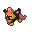

  ⬅️ <a href="https://avventureaditia.github.io/itia-wiki/pokemon/065-gladeon/"> 065 - Gladeon </a>
  <strong>066 - Vipeon</strong> 
  
  <a href="https://avventureaditia.github.io/itia-wiki/pokemon/067-baundeon/"> 067 - Baundeon </a> ➡️

## Pokédex

=== "Tassonomia"
    

      
      

        

          
Class

          

            
Serpegatto

          

        

        

          
Types

          

            
          

        

        

          
Ability

          

            <a href='' title="Whenever a move makes contact with this Pokemon, the move's user has a 30% chance of being poisoned.">Poison-point</a>  
          

        

        

          
Cry

          

            <audio controls>
              <source src="../../audio/vipeon.mp3" type="audio/mpeg">
            </audio>
          

        

      

    

=== "Aspetto"
    

      
      

        

          
Height

          

            
0,67 m

          

        

        

          
Weight

          

            
12,33 kg

          

        

        

          
Pokédex Color

          

            
Viola

          

        

        

          
Shape

          

            
          

        

      

    

=== "Allevamento"
    

      
      

        

          

            
Catch rate

            

              
45

            

          

          

            
Gender Ratio

            

              
11.86%

              
/

              
88.14%

            

          

        

        

          

            
Egg Groups

            

              
Field

            

          

          

            
Hatch Time

            

              
35 Cycles

            

          

        

        

          

            
Base experience yield

            

              
189

            

          

          

            
Leveling rate

            

              
Medium Fast

            

          

        

        

          

            
Base friendship

            

              
70

            

          

          

            
EV yield

            

              
2 - Sp.Attack

            

          

        

      

    

## Generali

=== "Descrizione Pokedex"
    ### Descrizione

    Ama nuotare nelle paludi più fallose e sporche, ha modificato il suo aspetto per assomigliare ad altri feroci predatori e così incutere maggior timore nei Pokémon che vivono nel suo stesso habitat.  
    È in grado di secernere un veleno così potente da cancellare la memoria a chiunque riesca ad avvistarlo allo stato selvatico, poiché ama la solitudine e odia il contatto con gli altri esseri viventi.  

    Per maggiori informazioni il [video completo](https://www.youtube.com/watch?v=bfACZZY0q-w&list=PLniAakFPn_t9I5zqlYAwZ_iSzJmgu5Nqd&index=10).

=== "Ispirazioni"

    ### Ispirazioni
    L'ispirazione alla base di Vipeon è il:
    
    - **Serpegatto**.

=== "Vincitore del contest"
    ### Vincitore

    Il Vincitore di Itia che ha dato origine a Vipeon è **Punktorn**.

## Base Stats
<table style="width: 100%">
  <tbody style="width: 100%;">
    <tr style="display: flex; align-items: center;">
      <th style="color: #737373;" >HP</th>
      <td style="border-top: none; width: 70px">65</td>
      <td style="width: 100%; min-width: 450px; border-top: none;">
        

        

      </td>
    </tr>
    <tr style="display: flex; align-items: center;">
      <th style="color: #737373;">Attack</th>
      <td style="border-top: none; width: 70px">60</td>
      <td style="width: 100%; min-width: 450px; border-top: none;">
        

        

      </td>
    </tr>
    <tr style="display: flex; align-items: center;">
      <th style="color: #737373;">Defense</th>
      <td style="border-top: none; width: 70px">65</td>
      <td style="width: 100%; min-width: 450px; border-top: none;">
        

        

      </td>
    </tr>
    <tr style="display: flex; align-items: center;">
      <th style="color: #737373;">SP Attack</th>
      <td style="border-top: none; width: 70px">110</td>
      <td style="width: 100%; min-width: 450px; border-top: none;">
        

        

      </td>
    </tr>
    <tr style="display: flex; align-items: center;">
      <th style="color: #737373;">SP Defense</th>
      <td style="border-top: none; width: 70px">95</td>
      <td style="width: 100%; min-width: 450px; border-top: none;">
        

        

      </td>
    </tr>
    <tr style="display: flex; align-items: center;">
      <th style="color: #737373;">Speed</th>
      <td style="border-top: none; width: 70px">130</td>
      <td style="width: 100%; min-width: 450px; border-top: none;">
        

        

      </td>
    </tr>
  </tbody>
</table>

## Moveset

=== "Level Up Moves"
    | Level | Name | Power | Accuracy | PP | Type | Damage Class |
        | -- | -- | -- | -- | -- | -- | -- |
        
        

=== "Machine Moves"
    | Machine | Name | Power | Accuracy | PP | Type | Damage Class |
        | -- | -- | -- | -- | -- | -- | -- |
        
        
