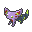

  ⬅️ <a href="https://avventureaditia.github.io/itia-wiki/pokemon/066-vipeon/"> 066 - Vipeon </a>
  <strong>067 - Baundeon</strong> 
  
  <a href="https://avventureaditia.github.io/itia-wiki/pokemon/068-eelandit/"> 068 - Eelandit </a> ➡️

  

  

    

        
Class

        

          
Rimorso

        

      

    

      
Types

      

        
        
      

    

    

      
Abilities

      

        <a href='' title="Moves that hit this Pokemon have a 30% chance of being Disabled afterward.">Cursed-body</a>
        
      

    

    

      
Hidden Ability

      

        
      

    

  

## Generali

=== "Descrizione Pokedex"
    ### Descrizione

    Si dice si sia evoluto da un ivi, abbandonato dal suo allenatore e lasciata a morire di stenti, legandolo nel bel mezzo di un bosco.  
    Grazie al particolare collo trasparente, la testa del Pokémon sembra staccata dal resto del corpo, ciò permette di allontanare il suo nemico naturale, Tendephant, del quale Baundeon è terrorizzato.  

    Per maggiori informazioni il [video completo](https://www.youtube.com/watch?v=bfACZZY0q-w&list=PLniAakFPn_t9I5zqlYAwZ_iSzJmgu5Nqd&index=10).

=== "Ispirazioni"

    ### Ispirazioni
    Le ispirazioni alla base di Baundeon sono:
    
    - **Leggenda del castello di Strozzavolpe**;
    - **Leggenda di Aci e Galatea**.

=== "Vincitore del contest"
    ### Vincitori

    I Vincitori di Itia che hanno dato origine a Baundeon sono **Davide** e **Valentina**.

## Base Stats
<table style="width: 100%">
  <tbody style="width: 100%;">
    <tr style="display: flex; align-items: center;">
      <th style="color: #737373;" >HP</th>
      <td style="border-top: none; width: 70px">60</td>
      <td style="width: 100%; min-width: 450px; border-top: none;">
        

        

      </td>
    </tr>
    <tr style="display: flex; align-items: center;">
      <th style="color: #737373;">Attack</th>
      <td style="border-top: none; width: 70px">65</td>
      <td style="width: 100%; min-width: 450px; border-top: none;">
        

        

      </td>
    </tr>
    <tr style="display: flex; align-items: center;">
      <th style="color: #737373;">Defense</th>
      <td style="border-top: none; width: 70px">65</td>
      <td style="width: 100%; min-width: 450px; border-top: none;">
        

        

      </td>
    </tr>
    <tr style="display: flex; align-items: center;">
      <th style="color: #737373;">SP Attack</th>
      <td style="border-top: none; width: 70px">110</td>
      <td style="width: 100%; min-width: 450px; border-top: none;">
        

        

      </td>
    </tr>
    <tr style="display: flex; align-items: center;">
      <th style="color: #737373;">SP Defense</th>
      <td style="border-top: none; width: 70px">130</td>
      <td style="width: 100%; min-width: 450px; border-top: none;">
        

        

      </td>
    </tr>
    <tr style="display: flex; align-items: center;">
      <th style="color: #737373;">Speed</th>
      <td style="border-top: none; width: 70px">95</td>
      <td style="width: 100%; min-width: 450px; border-top: none;">
        

        

      </td>
    </tr>
  </tbody>
</table>

## Moveset

=== "Level Up Moves"
    | Level | Name | Power | Accuracy | PP | Type | Damage Class |
        | -- | -- | -- | -- | -- | -- | -- |
        
        

=== "Machine Moves"
    | Machine | Name | Power | Accuracy | PP | Type | Damage Class |
        | -- | -- | -- | -- | -- | -- | -- |
        
        
