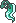
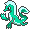
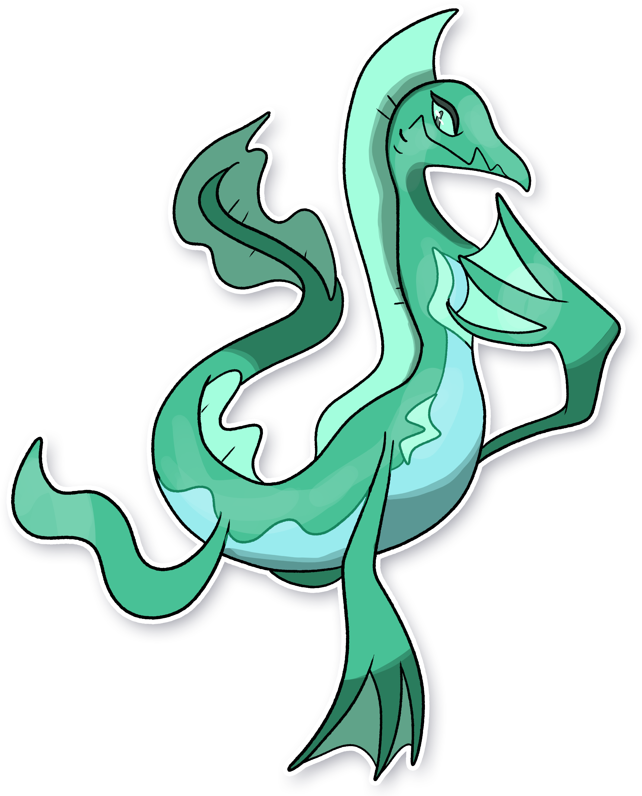
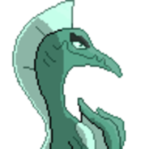
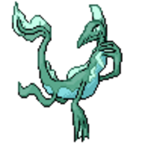
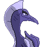
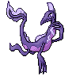

  ⬅️ <a href="https://avventureaditia.github.io/itia-wiki/pokemon/068-eelandit/"> 068 - Eelandit </a>
  <strong>069 - Eelazzle</strong> 
  
  <a href="https://avventureaditia.github.io/itia-wiki/pokemon/070-swarmub/"> 070 - Swarmub </a> ➡️

## Pokédex

=== "Tassonomia"
    

      
      

        

          
Class

          

            
Anguilla

          

        

        

          
Types

          

            
            
          

        

        

          
Ability

          

            <a href='' title="This Pokemon's Speed is doubled during rain.  This bonus does not count as a stat modifier.">Swift-swim</a>
          

        

        

          
Cry

          

            <audio controls>
              <source src="../../audio/eelazzle.mp3" type="audio/mpeg">
            </audio>
          

        

      

    

=== "Aspetto"
    

      
      

        

          
Height

          

            
0,96 m

          

        

        

          
Weight

          

            
9,16 kg

          

        

        

          
Pokédex Color

          

            
Blu

          

        

        

          
Shape

          

            
          

        

      

    

=== "Allevamento"
    

      
      

        

          

            
Catch rate

            

              
40

            

          

          

            
Gender Ratio

            

              
00.00%

              
/

              
100.00%

            

          

        

        

          

            
Egg Groups

            

              
Monster and Water 2

            

          

          

            
Hatch Time

            

              
20 Cycles

            

          

        

        

          

            
Base experience yield

            

              
189

            

          

          

            
Leveling rate

            

              
Medium Fast

            

          

        

        

          

            
Base friendship

            

              
70

            

          

          

            
EV yield

            

              
2 - Speed

            

          

        

      

    

## Generali

=== "Descrizione Pokedex"
    ### Descrizione

    Questo Pokémon incanta gli altri mostriciattoli con la sua voce e li attira nella sua tana per poi mangiarli.  
    Il suo verso ha le capacità di ipnotizzare chiunque lo ascolti, sia persone che Pokémon. Infatti, molto spesso si sente di gente caduta in mare per andare alla ricerca di bellissime creature simili a sirene.  
    Difficilmente si fanno vedere, contribuendo a creare un alone di mistero attorno alla loro esistenza.  

    Per maggiori informazioni il [video completo](https://www.youtube.com/watch?v=ZWUXvXQhTOk&list=PLniAakFPn_t9I5zqlYAwZ_iSzJmgu5Nqd&index=11).

=== "Ispirazioni"

    ### Ispirazioni
    Le ispirazioni alla base di Eelandit e della sua catena evolutiva sono:
    
    - **Anguille**;
    - **Murena helena**;
    - **Sirena Miti**.

=== "Vincitore del contest"
    ### Vincitore

    Il Vincitore di Itia che ha dato origine a Eelandit e la sua catena evolutiva è **Federico**.

## Base Stats
<table style="width: 100%">
  <tbody style="width: 100%;">
    <tr style="display: flex; align-items: center;">
      <th style="color: #737373;" >HP</th>
      <td style="border-top: none; width: 70px">68</td>
      <td style="width: 100%; min-width: 450px; border-top: none;">
        

        

      </td>
    </tr>
    <tr style="display: flex; align-items: center;">
      <th style="color: #737373;">Attack</th>
      <td style="border-top: none; width: 70px">64</td>
      <td style="width: 100%; min-width: 450px; border-top: none;">
        

        

      </td>
    </tr>
    <tr style="display: flex; align-items: center;">
      <th style="color: #737373;">Defense</th>
      <td style="border-top: none; width: 70px">50</td>
      <td style="width: 100%; min-width: 450px; border-top: none;">
        

        

      </td>
    </tr>
    <tr style="display: flex; align-items: center;">
      <th style="color: #737373;">SP Attack</th>
      <td style="border-top: none; width: 70px">111</td>
      <td style="width: 100%; min-width: 450px; border-top: none;">
        

        

      </td>
    </tr>
    <tr style="display: flex; align-items: center;">
      <th style="color: #737373;">SP Defense</th>
      <td style="border-top: none; width: 70px">60</td>
      <td style="width: 100%; min-width: 450px; border-top: none;">
        

        

      </td>
    </tr>
    <tr style="display: flex; align-items: center;">
      <th style="color: #737373;">Speed</th>
      <td style="border-top: none; width: 70px">117</td>
      <td style="width: 100%; min-width: 450px; border-top: none;">
        

        

      </td>
    </tr>
  </tbody>
</table>

## Aspetto di gioco

=== "Base"
    

      

        
      

      

        
      

    

=== "Shiny"
    

      

        
      

      

        
      

    

## Moveset

=== "Level Up Moves"
    | Level | Name | Power | Accuracy | PP | Type | Damage Class |
        | -- | -- | -- | -- | -- | -- | -- |
        
        

=== "Machine Moves"
    | Machine | Name | Power | Accuracy | PP | Type | Damage Class |
        | -- | -- | -- | -- | -- | -- | -- |
        
        
