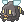
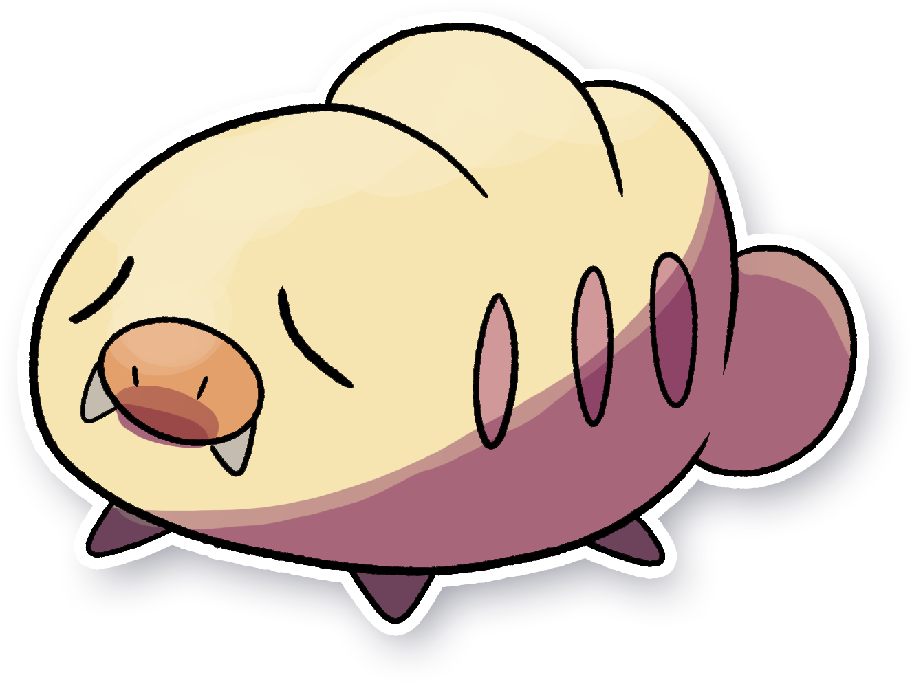

  ⬅️ <a href="https://avventureaditia.github.io/itia-wiki/pokemon/069-eelazzle/"> 069 - Eelazzle </a>
  <strong>070 - Swarmub</strong> 
  
  <a href="https://avventureaditia.github.io/itia-wiki/pokemon/071-piloswarm/"> 071 - Piloswarm </a> ➡️

  

  

    

        
Class

        

          
Porcellarva

        

      

    

      
Types

      

        
        
      

    

    

      
Abilities

      

        <a href='' title="This Pokemon's moves have 1.3x their accuracy.  This ability has no effect on the one-hit KO moves (fissure, guillotine, horn drill, and sheer cold).  Overworld: If the first Pokemon in the party has this ability, the chance of a wild Pokemon holding a particular item is raised from 50%, 5%, or 1% to 60%, 20%, or 5%, respectively.">Compound-eyes</a>
        
      

    

    

      
Hidden Ability

      

        
      

    

  

## Generali

=== "Descrizione Pokedex"
    ### Descrizione

    Pokémon dal comportamento passivo per natura preferisce stare sui rami degli alberi a mangiare le bacche anziché cacciare a causa della loro imprudenza.  
    Finiscono spesso prima di Pokemon più grandi e forti di loro, ma che difficilmente riescono a ferirli per via della loro pelle coriacea.  
    Hanno un ottimo olfatto, infatti vengono usati per trovare il meglio migliore della regione.  

    Per maggiori informazioni il [video completo](https://www.youtube.com/watch?v=ZWUXvXQhTOk&list=PLniAakFPn_t9I5zqlYAwZ_iSzJmgu5Nqd&index=11).

=== "Ispirazioni"

    ### Ispirazioni
    Le ispirazioni alla base di Swarmub e della sua catena evolutiva sono:
    
    - **Vespa mammut**;
    - **Mammuthus meridionalis**.

=== "Vincitore del contest"
    ### Vincitore

    Il Vincitore di Itia che ha dato origine a Swarmub e la sua catena evolutiva è **Federico**.

## Base Stats
<table style="width: 100%">
  <tbody style="width: 100%;">
    <tr style="display: flex; align-items: center;">
      <th style="color: #737373;" >HP</th>
      <td style="border-top: none; width: 70px">50</td>
      <td style="width: 100%; min-width: 450px; border-top: none;">
        

        

      </td>
    </tr>
    <tr style="display: flex; align-items: center;">
      <th style="color: #737373;">Attack</th>
      <td style="border-top: none; width: 70px">50</td>
      <td style="width: 100%; min-width: 450px; border-top: none;">
        

        

      </td>
    </tr>
    <tr style="display: flex; align-items: center;">
      <th style="color: #737373;">Defense</th>
      <td style="border-top: none; width: 70px">40</td>
      <td style="width: 100%; min-width: 450px; border-top: none;">
        

        

      </td>
    </tr>
    <tr style="display: flex; align-items: center;">
      <th style="color: #737373;">SP Attack</th>
      <td style="border-top: none; width: 70px">30</td>
      <td style="width: 100%; min-width: 450px; border-top: none;">
        

        

      </td>
    </tr>
    <tr style="display: flex; align-items: center;">
      <th style="color: #737373;">SP Defense</th>
      <td style="border-top: none; width: 70px">30</td>
      <td style="width: 100%; min-width: 450px; border-top: none;">
        

        

      </td>
    </tr>
    <tr style="display: flex; align-items: center;">
      <th style="color: #737373;">Speed</th>
      <td style="border-top: none; width: 70px">50</td>
      <td style="width: 100%; min-width: 450px; border-top: none;">
        

        

      </td>
    </tr>
  </tbody>
</table>

##Evolution Change
| Method | Item/Level/Note | Evolved Pokemon |
        | :--: | :--: | :--: |
        | Level Up | 33 | [Piloswarm](https://avventureaditia.github.io/itia-wiki/pokemon/071-piloswarm/) |
        

## Moveset

=== "Level Up Moves"
    | Level | Name | Power | Accuracy | PP | Type | Damage Class |
        | -- | -- | -- | -- | -- | -- | -- |
        
        

=== "Machine Moves"
    | Machine | Name | Power | Accuracy | PP | Type | Damage Class |
        | -- | -- | -- | -- | -- | -- | -- |
        
        
