

  ⬅️ <a href="https://avventureaditia.github.io/itia-wiki/pokemon/075-glemence/"> 075 - Glemence 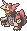</a>
  <strong>076 - Ghostmare</strong> 
  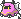
  <a href="https://avventureaditia.github.io/itia-wiki/pokemon/077-panpup/"> 077 - Panpup </a> ➡️

## Pokédex - Forma Base

=== "Tassonomia"
    

      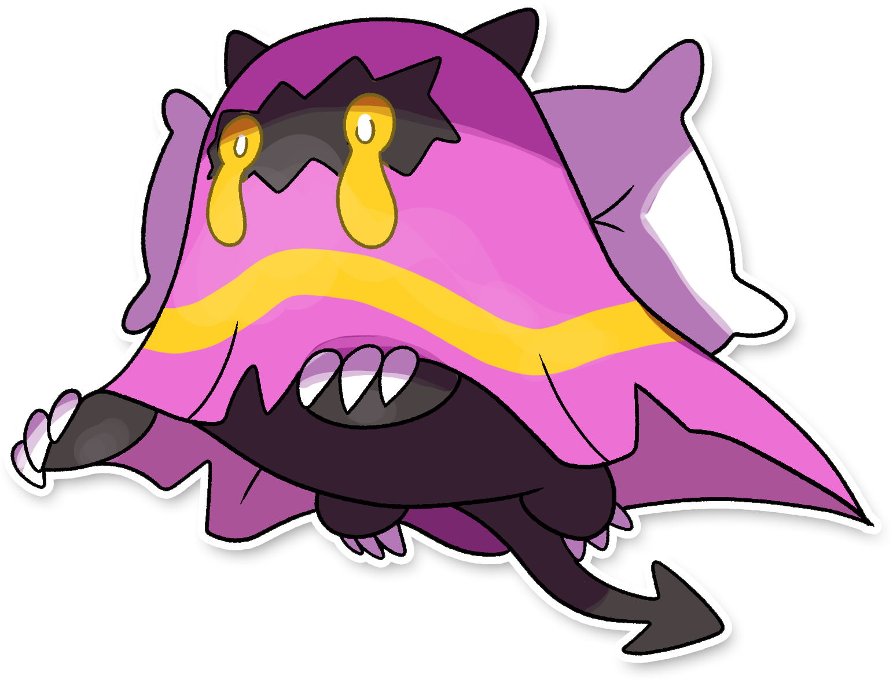
      

        

          
Class

          

            
Incubo

          

        

        

          
Types

          

            
            
          

        

        

          
Ability

          

            <a href='' title="Opposing Pokemon take 1/8 of their maximum HP in damage after each turn while they are asleep.">Bad-dreams</a> 
          

        

        

          
Cry

          

            <audio controls>
              <source src="../../audio/ghostmare.mp3" type="audio/mpeg">
            </audio>
          

        

      

    

=== "Aspetto"
    

      
      

        

          
Height

          

            
0,44 m

          

        

        

          
Weight

          

            
2,11 kg

          

        

        

          
Pokédex Color

          

            
Nero

          

        

        

          
Shape

          

            
          

        

      

    

=== "Allevamento"
    

      
      

        

          

            
Catch rate

            

              
45

            

          

          

            
Gender Ratio

            

              
50.0%

              
/

              
50.0%

            

          

        

        

          

            
Egg Groups

            

              
Amorphous and Monster

            

          

          

            
Hatch Time

            

              
40 Cycles

            

          

        

        

          

            
Base experience yield

            

              
155

            

          

          

            
Leveling rate

            

              
Slow

            

          

        

        

          

            
Base friendship

            

              
70

            

          

          

            
EV yield

            

              
2 - Sp.Defense

            

          

        

      

    

## Pokédex - Forma Incubo

=== "Tassonomia"
    

      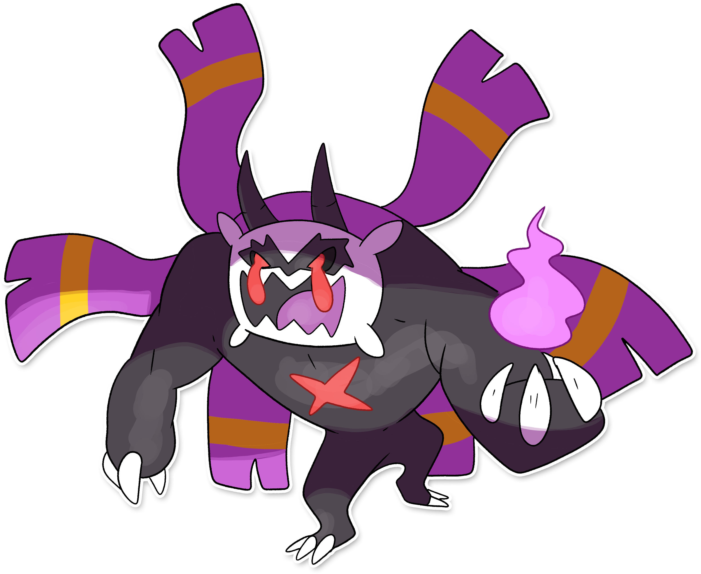
      

        

          
Class

          

            
Incubo

          

        

        

          
Types

          

            
            
          

        

        

          
Ability

          

            <a href='' title="Opposing Pokemon take 1/8 of their maximum HP in damage after each turn while they are asleep.">Bad-dreams</a> 
          

        

        

          
Cry

          

            <audio controls>
              <source src="../../audio/ghostmare.mp3" type="audio/mpeg">
            </audio>
          

        

      

    

=== "Aspetto"
    

      
      

        

          
Height

          

            
1,47 m

          

        

        

          
Weight

          

            
23,17 kg

          

        

        

          
Pokédex Color

          

            
Nero

          

        

        

          
Shape

          

            
          

        

      

    

=== "Allevamento"
    

      
      

        

          

            
Catch rate

            

              
45

            

          

          

            
Gender Ratio

            

              
50.0%

              
/

              
50.0%

            

          

        

        

          

            
Egg Groups

            

              
Amorphous and Monster

            

          

          

            
Hatch Time

            

              
40 Cycles

            

          

        

        

          

            
Base experience yield

            

              
155

            

          

          

            
Leveling rate

            

              
Slow

            

          

        

        

          

            
Base friendship

            

              
70

            

          

          

            
EV yield

            

              
2 - Sp.Defense

            

          

        

      

    

## Generali

=== "Descrizione Pokedex"
    ### Descrizione

    Questo piccolo Pokémon popola la regione di Itia sin dall'antichità, ma per via del suo aspetto poco gradevole, le popolazioni lo ritenevano l'incarnazione degli incubi e dunque veniva scacciato.  
    La coperta che ora porta sul corpo serve a nascondere il suo vero corpo, così da potersi avvicinare agli esseri umani senza spaventarli.  
    Addormentarsi sul cuscino che porta sulla schiena provoca sensazioni di ansia e paura.  
    Quando Ghostmare viene addormentato, soccombe hai propri poteri scatenando la sua vera forma, diventando l'incarnazione vera e propria degli incubi.  
    Incapace di controllarsi, modella la fiamma sulla sua zampa a seconda delle paure di chi gli sta di fronte, provocando terrore in chiunque provi a combatterlo.  

    Per maggiori informazioni il [video completo](https://www.youtube.com/watch?v=2pTDhRxb7-0&list=PLniAakFPn_t9I5zqlYAwZ_iSzJmgu5Nqd&index=13).

=== "Ispirazioni"

    ### Ispirazioni
    L'ispirazione alla base di Ghostmare è:
    
    - **Ammuntadore**.

=== "Vincitore del contest"
    ### Vincitore

    Il Vincitore di Itia che ha dato origine a Ghostmare è **Giovanni**.

## Base Stats

=== "Forma Base"
    ### Forma Celata
    <table style="width: 100%">
      <tbody style="width: 100%;">
        <tr style="display: flex; align-items: center;">
          <th style="color: #737373;" >HP</th>
          <td style="border-top: none; width: 70px">50</td>
          <td style="width: 100%; min-width: 450px; border-top: none;">
            

            

          </td>
        </tr>
        <tr style="display: flex; align-items: center;">
          <th style="color: #737373;">Attack</th>
          <td style="border-top: none; width: 70px">50</td>
          <td style="width: 100%; min-width: 450px; border-top: none;">
            

            

          </td>
        </tr>
        <tr style="display: flex; align-items: center;">
          <th style="color: #737373;">Defense</th>
          <td style="border-top: none; width: 70px">50</td>
          <td style="width: 100%; min-width: 450px; border-top: none;">
            

            

          </td>
        </tr>
        <tr style="display: flex; align-items: center;">
          <th style="color: #737373;">SP Attack</th>
          <td style="border-top: none; width: 70px">50</td>
          <td style="width: 100%; min-width: 450px; border-top: none;">
            

            

          </td>
        </tr>
        <tr style="display: flex; align-items: center;">
          <th style="color: #737373;">SP Defense</th>
          <td style="border-top: none; width: 70px">50</td>
          <td style="width: 100%; min-width: 450px; border-top: none;">
            

            

          </td>
        </tr>
        <tr style="display: flex; align-items: center;">
          <th style="color: #737373;">Speed</th>
          <td style="border-top: none; width: 70px">50</td>
          <td style="width: 100%; min-width: 450px; border-top: none;">
            

            

          </td>
        </tr>
      </tbody>
    </table>

=== "Forma Alternativa"
    ### Forma Incubo
    <table style="width: 100%">
      <tbody style="width: 100%;">
        <tr style="display: flex; align-items: center;">
          <th style="color: #737373;" >HP</th>
          <td style="border-top: none; width: 70px">100</td>
          <td style="width: 100%; min-width: 450px; border-top: none;">
            

            

          </td>
        </tr>
        <tr style="display: flex; align-items: center;">
          <th style="color: #737373;">Attack</th>
          <td style="border-top: none; width: 70px">120</td>
          <td style="width: 100%; min-width: 450px; border-top: none;">
            

            

          </td>
        </tr>
        <tr style="display: flex; align-items: center;">
          <th style="color: #737373;">Defense</th>
          <td style="border-top: none; width: 70px">50</td>
          <td style="width: 100%; min-width: 450px; border-top: none;">
            

            

          </td>
        </tr>
        <tr style="display: flex; align-items: center;">
          <th style="color: #737373;">SP Attack</th>
          <td style="border-top: none; width: 70px">120</td>
          <td style="width: 100%; min-width: 450px; border-top: none;">
            

            

          </td>
        </tr>
        <tr style="display: flex; align-items: center;">
          <th style="color: #737373;">SP Defense</th>
          <td style="border-top: none; width: 70px">50</td>
          <td style="width: 100%; min-width: 450px; border-top: none;">
            

            

          </td>
        </tr>
        <tr style="display: flex; align-items: center;">
          <th style="color: #737373;">Speed</th>
          <td style="border-top: none; width: 70px">100</td>
          <td style="width: 100%; min-width: 450px; border-top: none;">
            

            

          </td>
        </tr>
      </tbody>
    </table>

## Aspetto di gioco

=== "Forma base"
    

      

        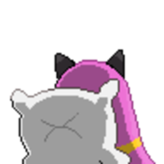
      

      

        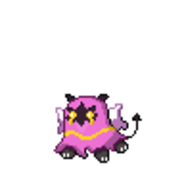
      

    

=== "Forma base Shiny"
    

      

        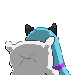
      

      

        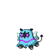
      

    

=== "Forma Incubo"
    

      

        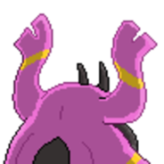
      

      

        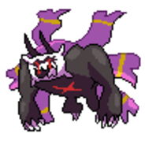
      

    

=== "Forma Incubo Shiny"
    

      

        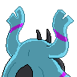
      

      

        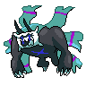
      

    

## Moveset

=== "Level Up Moves"
    | Level | Name | Power | Accuracy | PP | Type | Damage Class |
        | -- | -- | -- | -- | -- | -- | -- |
        
        

=== "Machine Moves"
    | Machine | Name | Power | Accuracy | PP | Type | Damage Class |
        | -- | -- | -- | -- | -- | -- | -- |
        
        
